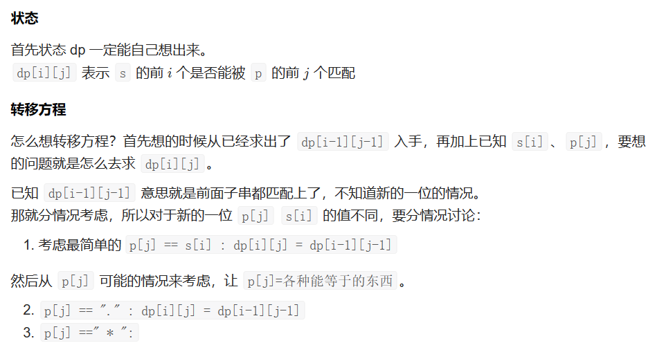

# [10.正则表达式匹配](https://leetcode.cn/problems/regular-expression-matching/)

`时间：2023.6.24`

## 题目

给你一个字符串 `s` 和一个字符规律 `p`，请你来实现一个支持 `'.'` 和 `'*'` 的正则表达式匹配。

- `'.'` 匹配任意单个字符
- `'*'` 匹配零个或多个前面的那一个元素

所谓匹配，是要涵盖 **整个** 字符串 `s`的，而不是部分字符串。


**示例1：**

```
输入：s = "aa", p = "a"
输出：false
解释："a" 无法匹配 "aa" 整个字符串。
```

**示例2：**

```
输入：s = "aa", p = "a*"
输出：true
解释：因为 '*' 代表可以匹配零个或多个前面的那一个元素, 在这里前面的元素就是 'a'。因此，字符串 "aa" 可被视为 'a' 重复了一次。
```

**示例3：**

```
输入：s = "ab", p = ".*"
输出：true
解释：".*" 表示可匹配零个或多个（'*'）任意字符（'.'）。
```

## 代码

#### 方法：动态规划

##### 思路



- 如果是负数则一定不是回文数，直接返回 `false`
- 如果是正数，则将其倒序数值计算出来，然后比较和原数值是否相等
- 如果是回文数则相等返回 `true`，如果不是则不相等 `false`
- 比如 `123` 的倒序 `321`，不相等；`121` 的倒序 `121`，相等

##### 代码

```java
class Solution {
    public boolean isMatch(String s, String p) {
        int m = s.length();
        int n = p.length();
        boolean[][] f = new boolean[m + 1][n + 1];
        for (int i = 0; i <= m; i++)
            for (int j = 0; j <= n; j++)
                f[i][j] = false;
        // 解决a*b*这种问题
        for (int i = 1; i < n; i += 2) {
            if (p.charAt(i) == '*')
                f[0][i + 1] = true;
            else
                break;
        }
        f[0][0] = true;
        for (int i = 1; i <= m; i++) {
            for (int j = 1; j <= n; j++) {
                if ((s.charAt(i - 1) == p.charAt(j - 1)) || p.charAt(j - 1) == '.')
                    f[i][j] = f[i - 1][j - 1];
                else if (p.charAt(j - 1) == '*') {
                    if (s.charAt(i - 1) != p.charAt(j - 2) && p.charAt(j - 2) != '.')
                        f[i][j] = f[i][j - 2];
                    else
                        f[i][j] = f[i][j - 1] || f[i][j - 2] || f[i - 1][j];
                }
            }
        }

        return f[m][n];
    }

    public static void main(String[] args) {
        Solution sol = new Solution();
        String s = "aab", p = "c*a*b";
        System.out.println(sol.isMatch(s, p));
    }
}
```
