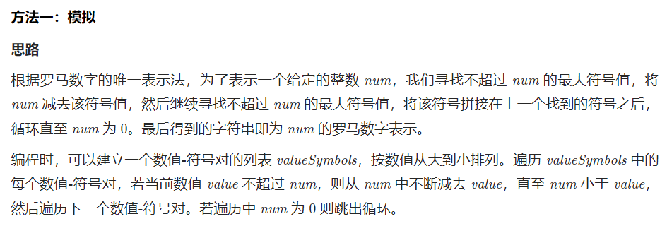
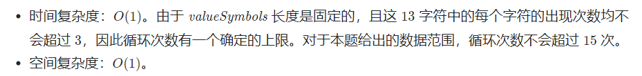

# [12.整数转罗马数字](https://leetcode.cn/problems/regular-expression-matching/)

`时间：2023.6.25`

## 题目

给你一个字符串 `s` 和一个字符规律 `p`，请你来实现一个支持 `'.'` 和 `'*'` 的正则表达式匹配。

- `'.'` 匹配任意单个字符
- `'*'` 匹配零个或多个前面的那一个元素

给你一个整数，将其转为罗马数字。


**示例1：**

```
输入: num = 3
输出: "III"
```

**示例2：**

```
输入: num = 4
输出: "IV"
```

**示例3：**

```
输入: num = 9
输出: "IX"
```

**示例4：**

```
输入: num = 58
输出: "LVIII"
解释: L = 50, V = 5, III = 3.
```

**示例5：**

```
输入: num = 1994
输出: "MCMXCIV"
解释: M = 1000, CM = 900, XC = 90, IV = 4.
```

## 代码

#### 方法：贪心算法

##### 思路






##### 代码

```java
class Solution {
    // 贪心算法
    public String intToRoman(int num) {
        int[] values = {1000, 900, 500, 400, 100, 90, 50, 40, 10, 9, 5, 4, 1};
        String[] symbols = {"M", "CM", "D", "CD", "C", "XC", "L", "XL", "X", "IX", "V", "IV", "I"};
        StringBuilder result = new StringBuilder();
        for (int i = 0; i < values.length; i++) {
            while (num >= values[i]) {
                result.append(symbols[i]);
                num -= values[i];
            }
            if (num == 0)
                break;
        }
        return result.toString();
    }

    public static void main(String[] args) {
        Solution sol = new Solution();
        String result = sol.intToRoman(3);
        System.out.println("result = " + result);
    }
}
```
