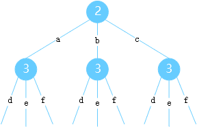

# [17.最接近的三数之和](https://leetcode.cn/problems/letter-combinations-of-a-phone-number/)

`时间：2023.7.3`

## 题目

给定一个仅包含数字 `2-9` 的字符串，返回所有它能表示的字母组合。答案可以按 **任意顺序** 返回。

给出数字到字母的映射如下（与电话按键相同）。注意 1 不对应任何字母。

**示例1：**

```
输入：digits = "23"
输出：["ad","ae","af","bd","be","bf","cd","ce","cf"]
```

**示例2：**

```
输入：digits = ""
输出：[]
```

**示例3：**

```
输入：digits = "2"
输出：["a","b","c"]
```

## 代码

#### 方法：树+回溯+递归

##### 思路

- 这是个排列组合问题对吧？这个排列组合可以用树的形式表示出来；
- 当给定了输入字符串，比如："23"，那么整棵树就构建完成了，如下：



- 问题转化成了从根节点到空节点一共有多少条路径；

首先使用哈希表存储每个数字对应的所有可能的字母，然后进行回溯操作。

回溯过程中维护一个字符串，表示已有的字母排列（如果未遍历完电话号码的所有数字，则已有的字母排列是不完整的）。该字符串初始为空。每次取电话号码的一位数字，从哈希表中获得该数字对应的所有可能的字母，并将其中的一个字母插入到已有的字母排列后面，然后继续处理电话号码的后一位数字，直到处理完电话号码中的所有数字，即得到一个完整的字母排列。然后进行回退操作，遍历其余的字母排列。

回溯算法用于寻找所有的可行解，如果发现一个解不可行，则会舍弃不可行的解。在这道题中，由于每个数字对应的每个字母都可能进入字母组合，因此不存在不可行的解，直接穷举所有的解即可。

##### 代码

```java
import java.util.List;
import java.util.ArrayList;
import java.util.HashMap;
import java.util.Map;

class Solution {
    private Map<Character, String> phoneMap = new HashMap<Character, String>() {{
        put('2', "abc");
        put('3', "def");
        put('4', "ghi");
        put('5', "jkl");
        put('6', "mno");
        put('7', "pqrs");
        put('8', "tuv");
        put('9', "wxyz");
    }};

    public List<String> letterCombinations(String digits) {
        List<String> combinations = new ArrayList<String>();
        if (digits.length() == 0)
            return combinations;
        StringBuilder sb = new StringBuilder();
        backtrace(combinations, digits, 0, sb);
        return combinations;
    }

    public void backtrace(List<String> combinations, String digits, int index, StringBuilder combination) {
        if (index == digits.length())
            combinations.add(combination.toString());
        else {
            char digit = digits.charAt(index);
            String letters = phoneMap.get(digit);
            for (int i = 0; i < letters.length(); i++) {
                combination.append(letters.charAt(i));
                backtrace(combinations, digits, index + 1, combination);
                combination.deleteCharAt(index);
            }
            
        }
    }

    public static void main(String[] args) {
        Solution sol = new Solution();
        List<String> combinations = sol.letterCombinations("23456");
        for (int i = 0; i < combinations.size(); i++) {
            System.out.println(combinations.get(i));
        }
    }
}
```

##### 复杂度分析

- 时间复杂度：O(3^m * 4^n)。
- 空间复杂度：O(n)，n为digits字符串的长度。