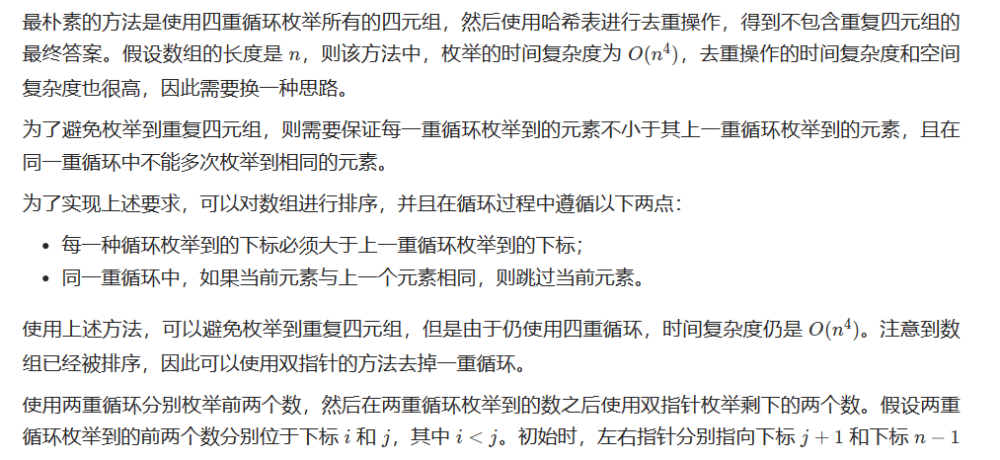
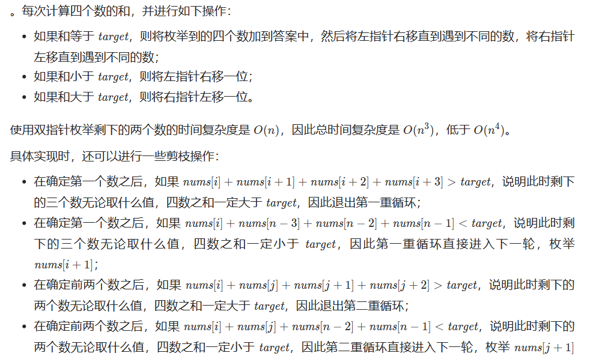

# [18.四数之和](https://leetcode.cn/problems/4sum/)

`时间：2023.7.4`

## 题目

给你一个长度为 `n` 的整数数组 `nums` 和一个目标值 `target` 。请你找出并返回满足下述全部条件且 **不重复** 的四元组 `[nums[a], nums[b], nums[c], nums[d]]` （若两个四元组元素一一对应，则认为两个四元组重复）：

你可以按 **任意顺序** 返回答案 。

**示例1：**

```
输入：nums = [1,0,-1,0,-2,2], target = 0
输出：[[-2,-1,1,2],[-2,0,0,2],[-1,0,0,1]]
```

**示例2：**

```
输入：nums = [2,2,2,2,2], target = 8
输出：[[2,2,2,2]]
```

## 代码

#### 方法：排序+双指针

##### 思路





##### 代码

```java
import java.util.List;
import java.util.Arrays;
import java.util.ArrayList;

class Solution {
    // 与三数之和类似：排序+双指针
    public List<List<Integer>> fourSum(int[] nums, int target) {
        Arrays.sort(nums);
        int length = nums.length;
        List<List<Integer>> result = new ArrayList<List<Integer>>();
        if (nums == null || nums.length < 4) {
            return result;
        }
        for (int i = 0; i < length - 3; i++) {
            if (i > 0 && nums[i] == nums[i - 1]) {
                continue;
            }
            if ((long)nums[i] + nums[i + 1] + nums[i + 2] + nums[i + 3] > target) {
                break;
            }
            if ((long)nums[i] + nums[length - 1] + nums[length - 2] + nums[length - 3] < target) {
                continue;
            }
            for (int j = i + 1; j < length - 2; j++) {
                if (j > i + 1 && nums[j] == nums[j - 1]) {
                    continue;
                }
                if ((long)nums[i] + nums[j] + nums[j + 1] + nums[j + 2] > target) {
                    break;
                }
                if ((long)nums[i] + nums[j] + nums[length - 1] + nums[length - 2] < target) {
                    continue;
                }
                int left = j + 1, right = length - 1;
                while (left < right) {
                    long sum = (long)nums[i] + nums[j] + nums[left] + nums[right];
                    if (sum == target) {
                        result.add(Arrays.asList(nums[i], nums[j], nums[left], nums[right]));
                        while (left < right && nums[left] == nums[left + 1]) {
                            left++;
                        }
                        left++;
                        while (left < right && nums[right] == nums[right - 1]) {
                            right--;
                        }
                        right--;
                    }
                    else if (sum > target) {
                        right--;
                    }
                    else {
                        left++;
                    }
                }
            }
        }
        return result;
    }

    public static void main(String[] args) {
        int[] nums = {1, 0, -1, 0, -2, 2};
        int target = 0;
        Solution sol = new Solution();
        List<List<Integer>> result = sol.fourSum(nums, target);

        System.out.println("Output:");
        for (List<Integer> quadruplet : result) {
            System.out.println(quadruplet);
        }
    }
}
```

##### 复杂度分析

- 时间复杂度：O(N^3)，其中N是数组nums的长度。排序的时间复杂度是O(nlogn)，枚举四元组的时间复杂度是O(n^3)。
- 空间复杂度：O(1)。