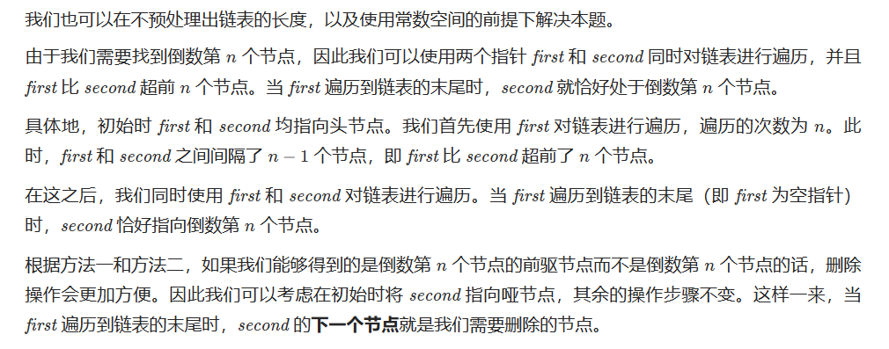

# [19.删除链表的倒数第N个结点](https://leetcode.cn/problems/remove-nth-node-from-end-of-list/)

`时间：2023.7.4`

## 题目

给你一个链表，删除链表的倒数第 `n` 个结点，并且返回链表的头结点。

**示例1：**

```
输入：head = [1,2,3,4,5], n = 2
输出：[1,2,3,5]
```

**示例2：**

```
输入：head = [1], n = 1
输出：[]
```

**示例3：**

```
输入：head = [1,2], n = 1
输出：[1]
```

## 代码

#### 方法：双指针单次遍历

##### 思路




##### 代码

```java
/**
 * Definition for singly-linked list.
 * public class ListNode {
 *     int val;
 *     ListNode next;
 *     ListNode() {}
 *     ListNode(int val) { this.val = val; }
 *     ListNode(int val, ListNode next) { this.val = val; this.next = next; }
 * }
 */
class Solution {
    // 双指针＋哑节点
    public ListNode removeNthFromEnd(ListNode head, int n) {
        ListNode dummy = new ListNode(0, head);
        ListNode first = head;
        ListNode second = dummy;
        for (int i = 0; i < n; i++) {
            first = first.next;
        }
        while (first != null) {
            first = first.next;
            second = second.next;
        }
        second.next = second.next.next;
        return dummy.next;
    }

    public static void main(String[] args) {
        // 创建测试链表 [1, 2, 3, 4, 5]
        ListNode head = new ListNode(1);
        head.next = new ListNode(2);
        head.next.next = new ListNode(3);
        head.next.next.next = new ListNode(4);
        head.next.next.next.next = new ListNode(5);
        int n = 2;
        Solution solution = new Solution();
        ListNode result = solution.removeNthFromEnd(head, n);

        // 输出结果链表
        StringBuilder sb = new StringBuilder();
        while (result != null) {
            sb.append(result.val).append(" -> ");
            result = result.next;
        }
        sb.append("null");
        System.out.println(sb.toString());
    }
}
```

##### 复杂度分析

- 时间复杂度：O(L)，其中L是链表的长度。
- 空间复杂度：O(1)。