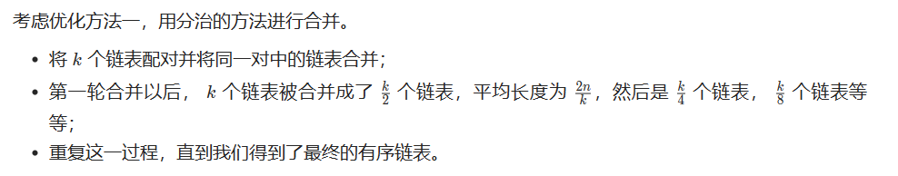
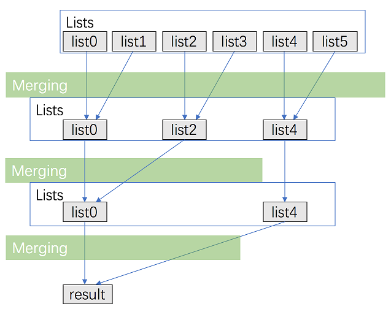
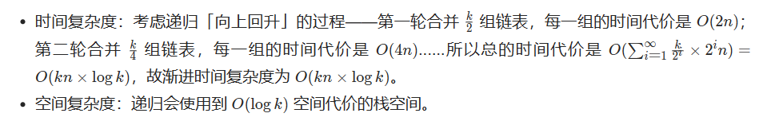

# [23.合并K个升序链表](https://leetcode.cn/problems/merge-k-sorted-lists/)

`时间：2023.7.5`

## 题目

给你一个链表数组，每个链表都已经按升序排列。

请你将所有链表合并到一个升序链表中，返回合并后的链表。

**示例1：**

```
输入：lists = [[1,4,5],[1,3,4],[2,6]]
输出：[1,1,2,3,4,4,5,6]
解释：链表数组如下：
[
  1->4->5,
  1->3->4,
  2->6
]
将它们合并到一个有序链表中得到。
1->1->2->3->4->4->5->6
```

**示例2：**

```
输入：lists = []
输出：[]
```

**示例3：**

```
输入：lists = [[]]
输出：[]
```

## 代码

#### 方法一：优先队列合并

##### 思路

我们需要维护当前每个链表没有被合并的元素的最前面一个，k个链表就最多有k个满足这样条件的元素，每次在这些元素里面选取val属性最小的元素合并到答案中。在选取最小元素的时候，我们可以用优先队列来优化这个过程。

##### 代码

```java
import java.util.PriorityQueue;

/**
 * Definition for singly-linked list.
 * public class ListNode {
 *     int val;
 *     ListNode next;
 *     ListNode() {}
 *     ListNode(int val) { this.val = val; }
 *     ListNode(int val, ListNode next) { this.val = val; this.next = next; }
 * }
 */
class Solution {
    // 法一：优先队列PriorityQueue
    public ListNode mergeKLists(ListNode[] lists) {
        PriorityQueue<ListNode> pq = new PriorityQueue<>((v1, v2) -> v1.val - v2.val);
        for (ListNode node : lists) {
            if (node != null) {
                pq.offer(node);
            }
        }
        ListNode dummyHead = new ListNode(0);
        ListNode tail = dummyHead;
        while (!pq.isEmpty()) {
            ListNode minNode = pq.poll();
            tail.next = minNode;
            tail = minNode;
            if (minNode.next != null) {
                pq.offer(minNode.next);
            }
        }
        return dummyHead.next;
    }

    public static void main(String[] args) {
        Solution solution = new Solution();

        // 创建测试输入
        ListNode[] lists = new ListNode[3];

        ListNode list1 = new ListNode(1);
        list1.next = new ListNode(4);
        list1.next.next = new ListNode(5);
        lists[0] = list1;

        ListNode list2 = new ListNode(1);
        list2.next = new ListNode(3);
        list2.next.next = new ListNode(4);
        lists[1] = list2;

        ListNode list3 = new ListNode(2);
        list3.next = new ListNode(6);
        lists[2] = list3;

        // 调用方法进行合并
        ListNode mergedList = solution.mergeKLists(lists);

        // 打印合并后的链表
        printList(mergedList);
    }

    // 辅助方法：打印链表的值
    private static void printList(ListNode head) {
        ListNode current = head;
        while (current != null) {
            System.out.print(current.val + " ");
            current = current.next;
        }
        System.out.println();
    }
}
```

##### 复杂度分析

- 时间复杂度：考虑优先队列中的元素不超过k个，考虑优先队列中的元素不超过O(logk)，这里最多有kn个点，对于每个点都被插入删除各一次，故总的时间代价即渐进时间复杂度为O(kn * logk)。
- 空间复杂度：这里用了优先队列，优先队列中的元素不超过k个，故渐进空间复杂度为O(k)。

#### 方法二：分治合并

##### 思路





##### 代码

```java
import java.util.PriorityQueue;

/**
 * Definition for singly-linked list.
 * public class ListNode {
 *     int val;
 *     ListNode next;
 *     ListNode() {}
 *     ListNode(int val) { this.val = val; }
 *     ListNode(int val, ListNode next) { this.val = val; this.next = next; }
 * }
 */
class Solution {
    // 法二：分治合并
    public ListNode mergeKLists(ListNode[] lists) {
        return merge(lists, 0, lists.length - 1);
    }

    public ListNode merge(ListNode[] lists, int l, int r) {
        if (l == r) {
            return lists[l];
        }
        if (l > r) {
            return null;
        }
        int mid = (l + r) / 2;
        return mergeTwoLists(merge(lists, l, mid), merge(lists, mid + 1, r));
    }

    public ListNode mergeTwoLists(ListNode a, ListNode b) {
        ListNode prehead = new ListNode(0);
        ListNode prev = prehead;
        while (a != null && b != null) {
            if (a.val < b.val) {
                prev.next = a;
                a = a.next;
            }
            else {
                prev.next = b;
                b = b.next;
            }
            prev = prev.next;
        }
        prev.next = a == null ? b : a;
        return prehead.next;
    }

    public static void main(String[] args) {
        Solution solution = new Solution();

        // 创建测试输入
        ListNode[] lists = new ListNode[3];

        ListNode list1 = new ListNode(1);
        list1.next = new ListNode(4);
        list1.next.next = new ListNode(5);
        lists[0] = list1;

        ListNode list2 = new ListNode(1);
        list2.next = new ListNode(3);
        list2.next.next = new ListNode(4);
        lists[1] = list2;

        ListNode list3 = new ListNode(2);
        list3.next = new ListNode(6);
        lists[2] = list3;

        // 调用方法进行合并
        ListNode mergedList = solution.mergeKLists(lists);

        // 打印合并后的链表
        printList(mergedList);
    }

    // 辅助方法：打印链表的值
    private static void printList(ListNode head) {
        ListNode current = head;
        while (current != null) {
            System.out.print(current.val + " ");
            current = current.next;
        }
        System.out.println();
    }
}
```

##### 复杂度分析

