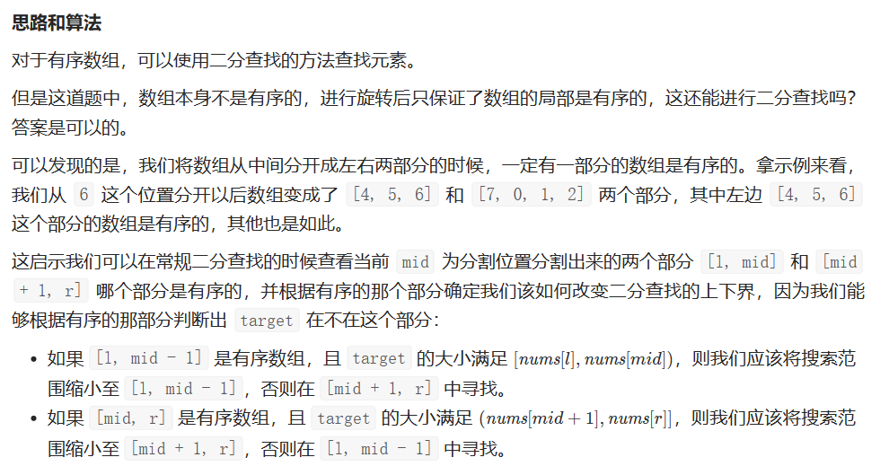

# [33.搜索旋转排序数组](https://leetcode.cn/problems/search-in-rotated-sorted-array/)

`时间：2023.7.7`

## 题目

整数数组 `nums` 按升序排列，数组中的值 **互不相同** 。

在传递给函数之前，`nums` 在预先未知的某个下标 `k（0 <= k < nums.length）`上进行了 旋转，使数组变为 `[nums[k], nums[k+1], ..., nums[n-1], nums[0], nums[1], ..., nums[k-1]]`（下标 **从 0 开始** 计数）。例如， `[0,1,2,4,5,6,7]` 在下标 `3` 处经旋转后可能变为 `[4,5,6,7,0,1,2]` 。

给你 **旋转后** 的数组 `nums` 和一个整数 `target` ，如果 `nums` 中存在这个目标值 `target` ，则返回它的下标，否则返回 `-1` 。

你必须设计一个时间复杂度为 `O(log n)` 的算法解决此问题。

**示例1：**

```
输入：nums = [4,5,6,7,0,1,2], target = 0
输出：4
```

**示例2：**

```
输入：nums = [4,5,6,7,0,1,2], target = 3
输出：-1
```

**示例3：**

```
输入：nums = [1], target = 0
输出：-1
```

## 代码

#### 方法：二分查找：红蓝边界，B站方法

##### 思路

强烈推荐！！：https://www.bilibili.com/video/BV1d54y1q7k7/?spm_id_from=333.337.search-card.all.click&vd_source=7f6ba21197bdeac9f512077e3b57e148

官方题解：https://leetcode.cn/problems/search-in-rotated-sorted-array/solution/sou-suo-xuan-zhuan-pai-xu-shu-zu-by-leetcode-solut/




需要注意的是，二分的写法有很多种，所以在判断 `target` 大小与有序部分的关系的时候可能会出现细节上的差别。

##### 代码

```java
class Solution {
    public int search(int[] nums, int target) {
        int left = -1, right = nums.length;
        while (left + 1 != right) {
            int mid = (left + right) / 2;
            if (nums[mid] == target) {
                return mid;
            }
            // 0—mid有序
            if (nums[0] <= nums[mid]) {
                // 夹在有序那串中间
                if (target >= nums[0] && target <= nums[mid]) {
                    right = mid;
                }
                else {
                    left = mid;
                }
            }
            // mid—nums.length-1有序
            else {
                // 夹在有序那串中间
                if (target >= nums[mid] && target <= nums[nums.length - 1]) {
                    left = mid;
                }
                else {
                    right = mid;
                }
            }
        }
        return -1;
    }

    public static void main(String[] args) {
        Solution solution = new Solution();
        int[] nums = {4, 5, 6, 7, 0, 1, 2};
        int target = 0;
        int result = solution.search(nums, target);
        System.out.println("输出：" + result); // 输出：4
    }
}
```

##### 复杂度分析

- 时间复杂度：O(log N)。
- 空间复杂度：O(1)。