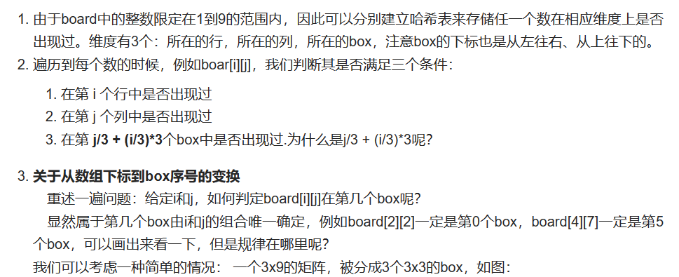
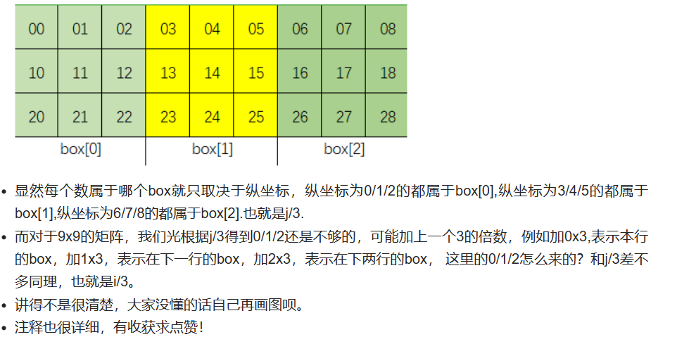

# [36.搜索插入位置](https://leetcode.cn/problems/valid-sudoku/)

`时间：2023.7.9`

## 题目

请你判断一个 `9 x 9` 的数独是否有效。只需要 **根据以下规则** ，验证已经填入的数字是否有效即可。

数字 `1-9` 在每一行只能出现一次。
数字 `1-9` 在每一列只能出现一次。
数字 `1-9` 在每一个以粗实线分隔的 `3x3` 宫内只能出现一次。（请参考示例图）

**注意：**

- 一个有效的数独（部分已被填充）不一定是可解的。
- 只需要根据以上规则，验证已经填入的数字是否有效即可。
- 空白格用 `'.'` 表示。

**示例1：**

```
输入：board = 
[["5","3",".",".","7",".",".",".","."]
,["6",".",".","1","9","5",".",".","."]
,[".","9","8",".",".",".",".","6","."]
,["8",".",".",".","6",".",".",".","3"]
,["4",".",".","8",".","3",".",".","1"]
,["7",".",".",".","2",".",".",".","6"]
,[".","6",".",".",".",".","2","8","."]
,[".",".",".","4","1","9",".",".","5"]
,[".",".",".",".","8",".",".","7","9"]]
输出：true
```

**示例2：**

```
输入：board = 
[["8","3",".",".","7",".",".",".","."]
,["6",".",".","1","9","5",".",".","."]
,[".","9","8",".",".",".",".","6","."]
,["8",".",".",".","6",".",".",".","3"]
,["4",".",".","8",".","3",".",".","1"]
,["7",".",".",".","2",".",".",".","6"]
,[".","6",".",".",".",".","2","8","."]
,[".",".",".","4","1","9",".",".","5"]
,[".",".",".",".","8",".",".","7","9"]]
输出：false
解释：除了第一行的第一个数字从 5 改为 8 以外，空格内其他数字均与 示例1 相同。 但由于位于左上角的 3x3 宫内有两个 8 存在, 因此这个数独是无效的。
```

## 代码

#### 方法：一次遍历即可

##### 思路

强烈推荐！！：[36. 简单想法，最优思路：就按照从左往右、从上往下的顺序遍历一次board，完成3个条件的检验 - 有效的数独 - 力扣（LeetCode）](https://leetcode.cn/problems/valid-sudoku/solution/36-jiu-an-zhao-cong-zuo-wang-you-cong-shang-wang-x/)





##### 代码

```java
class Solution {
    public boolean isValidSudoku(char[][] board) {
        // 哈希表存储每一行的每个数是否出现过，默认初始情况下，每一行每一个数都没有出现过
        // 整个board有9行，第二维的维数10是为了让下标有9，和数独中的数字9对应。
        int [][]row = new int[9][10];
        // 整个board有9行，第二维的维数10是为了让下标有9，和数独中的数字9对应。
        int [][]col = new int[9][10];
        // 存储每一个box的每个数是否出现过，默认初始情况下，在每个box中，每个数都没有出现过。整个board有9个box。
        int [][]box = new int[9][10];
        for (int i = 0; i < 9; i++) {
            // 遍历到第i行第j列的那个数,我们要判断这个数在其所在的行有没有出现过，
            // 同时判断这个数在其所在的列有没有出现过
            // 同时判断这个数在其所在的box中有没有出现过
            for (int j = 0; j < 9; j++) {
                if (board[i][j] == '.') {
                    continue;
                }
                int curNum = board[i][j] - '0';
                if (row[i][curNum] == 1) {
                    return false;
                }
                if (col[j][curNum] == 1) {
                    return false;
                }
                if (box[(i / 3) * 3 + j / 3][curNum] == 1) {
                    return false;
                }
                // 之前都没出现过，现在出现了，就给它置为1，下次再遇见就能够直接返回false了。
                row[i][curNum] = 1;
                col[j][curNum] = 1;
                box[(i / 3) * 3 + j / 3][curNum] = 1;
            }
        }
        return true;
    }

    public static void main(String[] args) {
        Solution solution = new Solution();
    
        char[][] board = {
            {'5','3','.','.','7','.','.','.','.'},
            {'6','.','.','1','9','5','.','.','.'},
            {'.','9','8','.','.','.','.','6','.'},
            {'8','.','.','.','6','.','.','.','3'},
            {'4','.','.','8','.','3','.','.','1'},
            {'7','.','.','.','2','.','.','.','6'},
            {'.','6','.','.','.','.','2','8','.'},
            {'.','.','.','4','1','9','.','.','5'},
            {'.','.','.','.','8','.','.','7','9'}
        };
        
        boolean result = solution.isValidSudoku(board);
        System.out.println(result);  // 输出：true
    }
}
```

##### 复杂度分析

- 时间复杂度：O(1)。数独共有81个单元格，只需要对每个单元格遍历一次即可。
- 空间复杂度：O(1)。由于数独的大小固定，因此哈希表的空间也是固定的。