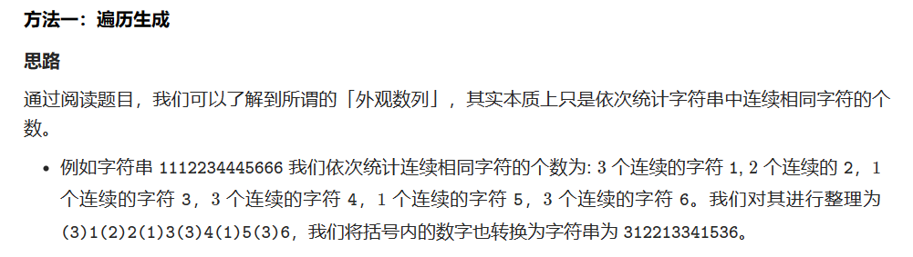
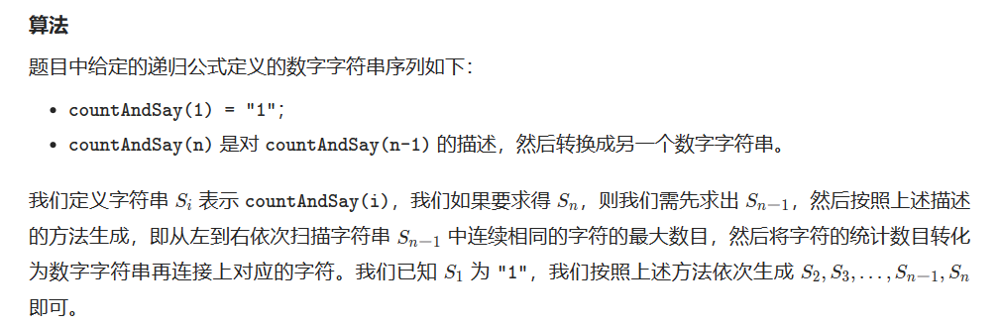

# [38.外观数列](https://leetcode.cn/problems/count-and-say/)

`时间：2023.7.10`

## 题目

给定一个正整数 `n` ，输出外观数列的第 `n` 项。

「外观数列」是一个整数序列，从数字 1 开始，序列中的每一项都是对前一项的描述。

你可以将其视作是由递归公式定义的数字字符串序列：

- `countAndSay(1) = "1"`
- `countAndSay(n)` 是对 `countAndSay(n-1)` 的描述，然后转换成另一个数字字符串。

前五项如下：

```
1.     1
2.     11
3.     21
4.     1211
5.     111221
第一项是数字 1 
描述前一项，这个数是 1 即 “ 一 个 1 ”，记作 "11"
描述前一项，这个数是 11 即 “ 二 个 1 ” ，记作 "21"
描述前一项，这个数是 21 即 “ 一 个 2 + 一 个 1 ” ，记作 "1211"
描述前一项，这个数是 1211 即 “ 一 个 1 + 一 个 2 + 二 个 1 ” ，记作 "111221"
```

要 **描述** 一个数字字符串，首先要将字符串分割为 **最小** 数量的组，每个组都由连续的最多 **相同字符** 组成。然后对于每个组，先描述字符的数量，然后描述字符，形成一个描述组。要将描述转换为数字字符串，先将每组中的字符数量用数字替换，再将所有描述组连接起来。

**示例1：**

```
输入：n = 1
输出："1"
解释：这是一个基本样例。
```

**示例2：**

```
输入：n = 4
输出："1211"
解释：
countAndSay(1) = "1"
countAndSay(2) = 读 "1" = 一 个 1 = "11"
countAndSay(3) = 读 "11" = 二 个 1 = "21"
countAndSay(4) = 读 "21" = 一 个 2 + 一 个 1 = "12" + "11" = "1211"
```

## 代码

#### 方法：一次遍历即可

##### 思路





##### 代码

```java
class Solution {
    public String countAndSay(int n) {
        String str = "1";
        for (int i = 2; i <= n; i++) {
            StringBuilder sb = new StringBuilder();
            int start = 0;
            int currloc = 0;

            while (currloc < str.length()) {
                while (currloc < str.length() && str.charAt(currloc) == str.charAt(start)) {
                    currloc++;
                }
                sb.append(Integer.toString(currloc - start)).append(str.charAt(start));
                start = currloc;
            }
            str = sb.toString();
        }
        return str;
    }

    public static void main(String[] args) {
        Solution sol = new Solution();
        String result = sol.countAndSay(5);
        System.out.println(result);
    }
}
```

##### 复杂度分析

- 时间复杂度：O(N * M)。N为给定的正整数，M为生成的字符串中的最大长度。
- 空间复杂度：O(M)。其中M为生成的字符串中的最大长度。