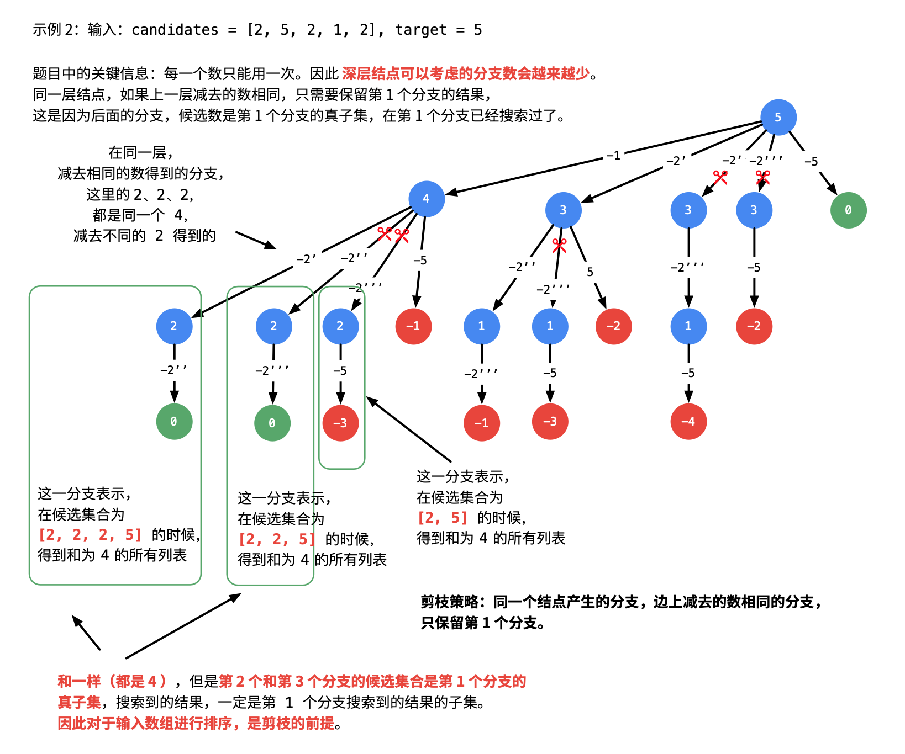

# [40.组合总和II](https://leetcode.cn/problems/combination-sum-ii/)

`时间：2023.7.11`

## 题目

给定一个候选人编号的集合 `candidates` 和一个目标数 `target` ，找出 `candidates` 中所有可以使数字和为 `target` 的组合。

`candidates` 中的每个数字在每个组合中只能使用 **一次** 。

注意：解集不能包含重复的组合。 

**示例1：**

```
输入: candidates = [10,1,2,7,6,1,5], target = 8,
输出:
[
[1,1,6],
[1,2,5],
[1,7],
[2,6]
]
```

**示例2：**

```
输入: candidates = [2,5,2,1,2], target = 5,
输出:
[
[1,2,2],
[5]
]
```

## 代码

#### 方法：回溯算法 + 剪枝

##### 思路

强烈推荐！！：https://leetcode.cn/problems/combination-sum/solution/hui-su-suan-fa-jian-zhi-python-dai-ma-java-dai-m-2/





##### 代码

```java
import java.util.ArrayList;
import java.util.Arrays;
import java.util.List;
import java.util.Stack;

class Solution {
    public List<List<Integer>> combinationSum2(int[] candidates, int target) {
        int len = candidates.length;
        List<List<Integer>> result = new ArrayList<>();
        if (len == 0) {
            return result;
        }
        // 排序是剪枝的前提
        Arrays.sort(candidates);

        Stack<Integer> stack = new Stack<Integer>();
        DFS(candidates, 0, len, target, stack, result);
        return result;
    }

    /**
     * @param candidates 候选数组
     * @param begin      搜索起点
     * @param len        冗余变量，是 candidates 里的属性，可以不传
     * @param target     每减去一个元素，目标值变小
     * @param path       从根结点到叶子结点的路径，是一个栈
     * @param res        结果集列表
     */
    private void DFS(int[] candidates, int begin, int len, int target, Stack<Integer> stack, List<List<Integer>> result) {
        // 符合要求
        if (target == 0) {
            result.add(new ArrayList<>(stack));
            return;
        }
        // target 为负数和 0 的时候不再产生新的孩子结点
        if (target < 0) {
            return;
        }

        // 重点理解这里从 begin 开始搜索的语意
        for (int i = begin; i < len; i++) {
            // 重点理解这里剪枝，前提是候选数组已经有序
            if (target - candidates[i] < 0) {
                break;
            }
            if (i > begin && candidates[i] == candidates[i - 1]) {
                continue;
            }
            stack.push(candidates[i]);
            // 注意：由于每一个元素可以重复使用，下一轮搜索的起点依然是 i，这里非常容易弄错
            DFS(candidates, i + 1, len, target - candidates[i], stack, result);
            // 状态重置
            stack.pop();
        }
    }

    public static void main(String[] args) {
        Solution solution = new Solution();
        int[] candidates = {2, 3, 5};
        int target = 8;
        List<List<Integer>> result = solution.combinationSum2(candidates, target);
        System.out.println("Output: " + result);
    }
}
```

##### 复杂度分析

