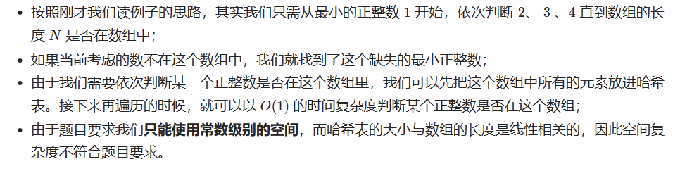
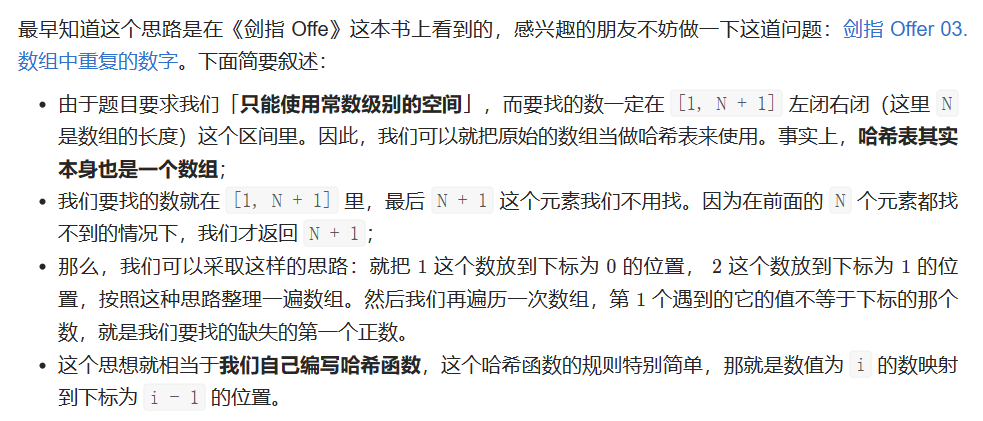

# [41.缺失的第一个正数](https://leetcode.cn/problems/first-missing-positive/)

`时间：2023.7.10`

## 题目

给你一个未排序的整数数组 `nums` ，请你找出其中没有出现的最小的正整数。

请你实现时间复杂度为 `O(n)` 并且只使用常数级别额外空间的解决方案。

**示例1：**

```
输入：nums = [1,2,0]
输出：3
```

**示例2：**

```
输入：nums = [3,4,-1,1]
输出：2
```

**示例3：**

```
输入：nums = [7,8,9,11,12]
输出：1
```

## 代码

#### 方法一：哈希表

##### 思路



##### 代码

```java
import java.util.HashSet;

class Solution {
    // 法一：哈希表 空间O(n) 不符合空间复杂度要求
    public int firstMissingPositive(int[] nums) {
        int length = nums.length;

        HashSet<Integer> hashset = new HashSet<Integer>();
        for (int i = 0; i < length; i++) {
            hashset.add(nums[i]);
        }
        for (int i = 1; i <= length; i++) {
            if (!hashset.contains(i)) {
                return i;
            }
        }
        return length + 1;
    }

    public static void main(String[] args) {
        Solution solution = new Solution();
    
        int[] nums = {1, 2, 0};
        int result = solution.firstMissingPositive(nums);
        System.out.println("输出: " + result);
    }
}
```

##### 复杂度分析

- 时间复杂度：O(N)。
- 空间复杂度：O(N)。

#### 方法二：原地哈希操作

##### 思路



##### 代码

```java
import java.util.HashSet;

class Solution {
    // 法二：原地哈希，将数组视为哈希表
    public int firstMissingPositive(int[] nums) {
        int length = nums.length;
        for (int i = 0; i < length; i++) {
            while (nums[i] > 0 && nums[i] <= length && nums[nums[i] - 1] != nums[i]) {
                // 满足在指定范围内、并且没有放在正确的位置上，才交换
                int temp = nums[nums[i] - 1];
                nums[nums[i] - 1] = nums[i];
                nums[i] = temp;
            }
        }

        // 判断数组中的值不等于下标的那个数
        for (int i = 0; i < length; i++) {
            if (nums[i] != i + 1) {
                return i + 1;
            }
        }

        // 都正确则返回数组长度 + 1
        return length + 1;
    }

    public static void main(String[] args) {
        Solution solution = new Solution();
    
        int[] nums = {1, 2, 0};
        int result = solution.firstMissingPositive(nums);
        System.out.println("输出: " + result);
    }
}
```

##### 复杂度分析

- 时间复杂度：O(N)。
- 空间复杂度：O(1)。