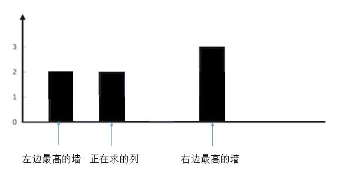

# [42.接雨水](https://leetcode.cn/problems/trapping-rain-water/)

`时间：2023.7.11`

## 题目

给定 `n` 个非负整数表示每个宽度为 `1` 的柱子的高度图，计算按此排列的柱子，下雨之后能接多少雨水。

**示例1：**


```
输入：height = [0,1,0,2,1,0,1,3,2,1,2,1]
输出：6
解释：上面是由数组 [0,1,0,2,1,0,1,3,2,1,2,1] 表示的高度图，在这种情况下，可以接 6 个单位的雨水（蓝色部分表示雨水）。 
```

**示例2：**

```
输入：height = [4,2,0,3,2,5]
输出：9
```

## 代码

#### 方法一：按列求

##### 思路


求每一列的水，我们只需要关注当前列，以及左边最高的墙，右边最高的墙就够了。

装水的多少，当然根据木桶效应，我们只需要看左边最高的墙和右边最高的墙中较矮的一个就够了。

所以，根据较矮的那个墙和当前列的墙的高度可以分为三种情况。

- 较矮的墙的高度大于当前列的墙的高度


把正在求的列左边最高的墙和右边最高的墙确定后，然后为了方便理解，我们把无关的墙去掉。


这样就很清楚了，现在想象一下，往两边最高的墙之间注水。正在求的列会有多少水？

很明显，较矮的一边，也就是左边的墙的高度，减去当前列的高度就可以了，也就是 2 - 1 = 1，可以存一个单位的水。

- 较矮的墙的高度小于当前列的墙的高度


同样的，我们把其他无关的列去掉。


想象下，往两边最高的墙之间注水。正在求的列会有多少水？

正在求的列不会有水，因为它大于了两边较矮的墙。

- 较矮的墙的高度等于当前列的墙的高度

和上一种情况是一样的，不会有水。



明白了这三种情况，程序就很好写了，遍历每一列，然后分别求出这一列两边最高的墙。找出较矮的一端，和当前列的高度比较，结果就是上边的三种情况。


##### 代码

```java
class Solution {
    // 法一：按列求和
    public int trap(int[] height) {
        int sum = 0;
        // 最两端的列不用考虑，因为一定不会有水。所以下标从 1 到 length - 2
        for (int i = 1; i < height.length - 1; i++) {
            int max_left = 0;
            // 找出左边最高
            for (int j = i - 1; j >= 0; j--) {
                if (height[j] > max_left) {
                    max_left = height[j];
                }
            }
            int max_right = 0;
            // 找出右边最高
            for (int j = i + 1; j < height.length; j++) {
                if (height[j] > max_right) {
                    max_right = height[j];
                }
            }
            // 找出两端较小的
            int min = Math.min(max_left, max_right);
            // 只有较小的一段大于当前列的高度才会有水，其他情况不会有水
            if (min > height[i]) {
                sum += min - height[i];
            }
        }
        return sum;
    }

    public static void main(String[] args) {
        Solution solution = new Solution();

        int[] height = {4, 2, 0, 3, 2, 5};
        int result = solution.trap(height);
        System.out.println("Output: " + result); // Expected output: 9
    }
}
```

##### 复杂度分析

- 时间复杂度：O(n^2)。遍历每一列需要 n ，找出左边最高和右边最高的墙加起来刚好又是一个 n，所以是n^2。
- 空间复杂度：O(1)。

#### 方法二：动态规划（法一的改进）

##### 思路

我们注意到，解法二中。对于每一列，我们求它左边最高的墙和右边最高的墙，都是重新遍历一遍所有高度，这里我们可以优化一下。

首先用两个数组，`max_left [i] `代表第 `i` 列左边最高的墙的高度，`max_right[i]` 代表第 `i` 列右边最高的墙的高度。（一定要注意下，第 `i` 列左（右）边最高的墙，是不包括自身的，和 leetcode 上边的讲的有些不同）

对于 `max_left` 我们其实可以这样求。

`max_left [i] = Max(max_left [i-1],height[i-1])`。它前边的墙的左边的最高高度和它前边的墙的高度选一个较大的，就是当前列左边最高的墙了。

对于 `max_right` 我们可以这样求。

`max_right[i] = Max(max_right[i+1],height[i+1])` 。它后边的墙的右边的最高高度和它后边的墙的高度选一个较大的，就是当前列右边最高的墙了。

这样，我们再利用解法二的算法，就不用在 for 循环里每次重新遍历一次求 `max_left` 和 `max_right` 了。

##### 代码

```java
class Solution {
    // 法二：动态规划（法一的改进）
    public int trap(int[] height) {
        int sum = 0;
        int[] max_left = new int[height.length];
        int[] max_right = new int[height.length];
        // 求左边最高列，从左到右
        for (int i = 1; i < height.length - 1; i++) {
            max_left[i] = Math.max(max_left[i - 1], height[i - 1]);
        }
        // 求右边最高列，从右到左
        for (int i = height.length - 2; i >= 0; i--) {
            max_right[i] = Math.max(max_right[i + 1], height[i + 1]);
        }
        for (int i = 1; i < height.length - 1; i++) {
            int min = Math.min(max_left[i], max_right[i]);
            if (min > height[i]) {
                sum += min - height[i];
            }
        }
        return sum;
    }

    public static void main(String[] args) {
        Solution solution = new Solution();

        int[] height = {4, 2, 0, 3, 2, 5};
        int result = solution.trap(height);
        System.out.println("Output: " + result); // Expected output: 9
    }
}
```

##### 复杂度分析

- 时间复杂度：O(N)。
- 空间复杂度：O(N)。用来保存每一列左边最高的墙和右边最高的墙。