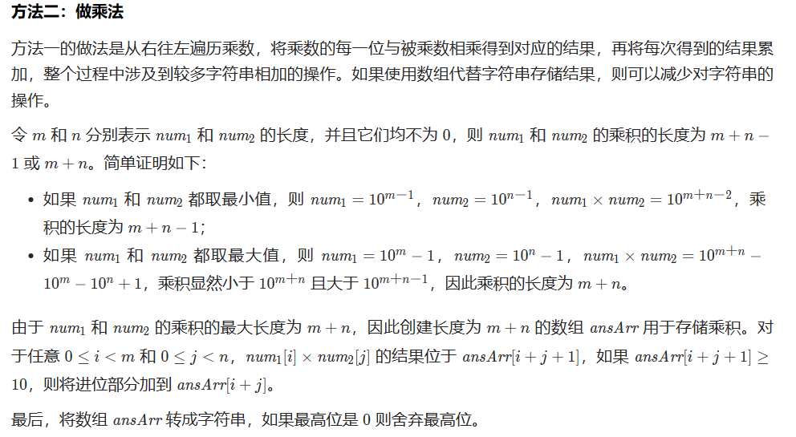

# [43.字符串相乘](https://leetcode.cn/problems/multiply-strings/)

`时间：2023.7.11`

## 题目

给定两个以字符串形式表示的非负整数 `num1` 和 `num2`，返回 `num1` 和 `num2` 的乘积，它们的乘积也表示为字符串形式。

**注意：**不能使用任何内置的 `BigInteger` 库或直接将输入转换为整数。

**示例1：**

```
输入: num1 = "2", num2 = "3"
输出: "6" 
```

**示例2：**

```
输入: num1 = "123", num2 = "456"
输出: "56088"
```

## 代码

#### 方法：做乘法

##### 思路




##### 代码

```java
class Solution {
    public String multiply(String num1, String num2) {
        if (num1.equals("0") || num2.equals("0")) {
            return "0";
        }
        int m = num1.length();
        int n = num2.length();
        int[] ansArr = new int[m + n];
        for (int i = m - 1; i >= 0; i--) {
            int x = num1.charAt(i) - '0';
            for (int j = n - 1; j >= 0; j--) {
                int y = num2.charAt(j) - '0';
                ansArr[i + j + 1] += x * y;
            }
        }
        for (int i = m + n - 1; i > 0; i--) {
            ansArr[i - 1] += ansArr[i] / 10;
            ansArr[i] %= 10;
        }
        int index = ansArr[0] == 0 ? 1 : 0;
        StringBuilder sb = new StringBuilder();
        while (index < m + n) {
            sb.append(ansArr[index]);
            index++;
        }

        return sb.toString();
    }

    public static void main(String[] args) {
        Solution solution = new Solution();
        String num1 = "123";
        String num2 = "456";
        String result = solution.multiply(num1, num2);
        System.out.println("Output: " + result); // 期望输出: "56088"
    }
}
```

##### 复杂度分析

