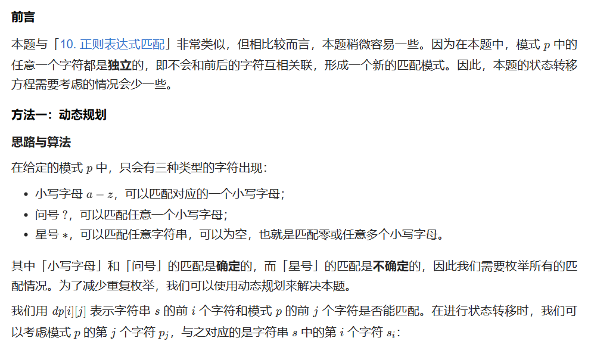
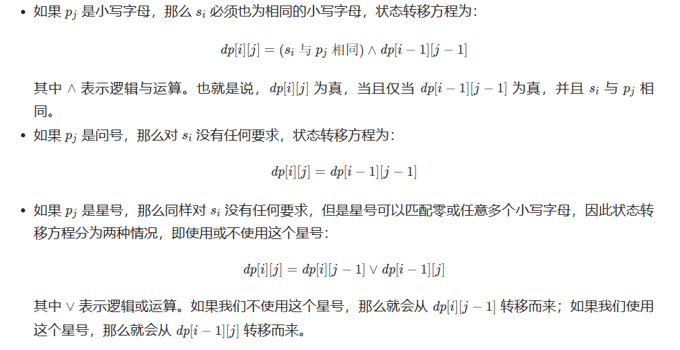
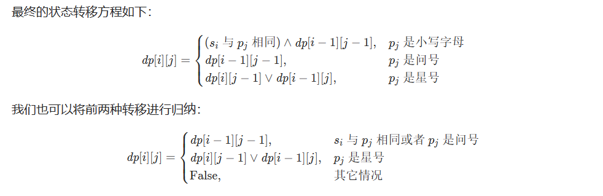
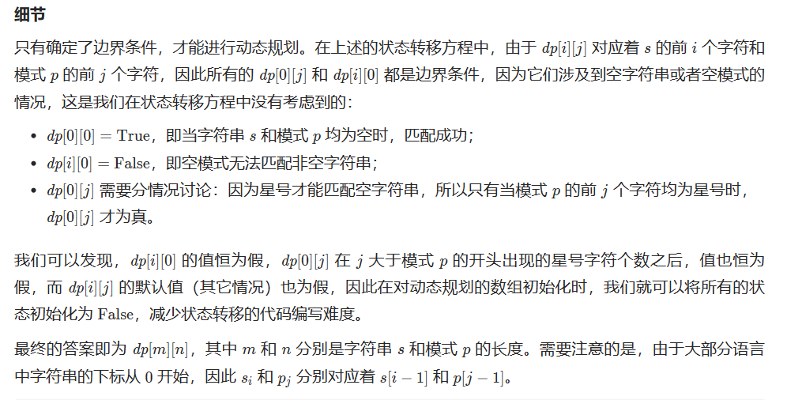
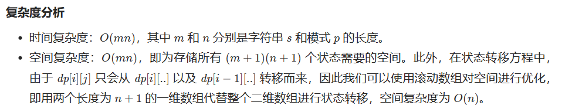

# [44.通配符匹配](https://leetcode.cn/problems/wildcard-matching/)

`时间：2023.7.13`

## 题目

给你一个输入字符串 (`s`) 和一个字符模式 (`p`) ，请你实现一个支持 `'?'` 和 `'*'` 匹配规则的通配符匹配：

- `'?'` 可以匹配任何单个字符。

- `'*'` 可以匹配任意字符序列（包括空字符序列）。

判定匹配成功的充要条件是：字符模式必须能够 **完全匹配** 输入字符串（而不是部分匹配）。

**示例1：**

```
输入：s = "aa", p = "a"
输出：false
解释："a" 无法匹配 "aa" 整个字符串。
```

**示例2：**

```
输入：s = "aa", p = "*"
输出：true
解释：'*' 可以匹配任意字符串。
```

**示例3：**

```
输入：s = "cb", p = "?a"
输出：false
解释：'?' 可以匹配 'c', 但第二个 'a' 无法匹配 'b'。
```

## 代码

#### 方法：动态规划

##### 思路

强烈推荐：[一个棋盘看懂动态规划(DP)思路；附Python代码 - 通配符匹配 - 力扣（LeetCode）](https://leetcode.cn/problems/wildcard-matching/solution/yi-ge-qi-pan-kan-dong-dong-tai-gui-hua-dpsi-lu-by-/)









##### 代码

```java
class Solution {
    // 方法：动态规划
    public boolean isMatch(String s, String p) {
        int m = s.length();
        int n = p.length();
        boolean[][] dp = new boolean[m + 1][n + 1];
        dp[0][0] = true;
        for (int i = 1; i <= n; i++) {
            if (p.charAt(i - 1) == '*') {
                dp[0][i] = true;
            }
            else {
                break;
            }
        }
        for (int i = 1; i <= m; i++) {
            for (int j = 1; j <= n; j++) {
                if (p.charAt(j - 1) == '*') {
                    dp[i][j] = dp[i - 1][j] || dp[i][j - 1];
                }
                else if (p.charAt(j - 1) == '?' || s.charAt(i - 1) == p.charAt(j - 1)) {
                    dp[i][j] = dp[i - 1][j - 1];
                }
            }
        }
        return dp[m][n];
    }

    public static void main(String[] args) {
        Solution sol = new Solution();
        String s1 = "aa";
        String p1 = "a";
        boolean result1 = sol.isMatch(s1, p1);
        System.out.println("Input: s = " + s1 + ", p = " + p1);
        System.out.println("Output: " + result1);
        System.out.println();
        
        String s2 = "aa";
        String p2 = "*";
        boolean result2 = sol.isMatch(s2, p2);
        System.out.println("Input: s = " + s2 + ", p = " + p2);
        System.out.println("Output: " + result2);
        System.out.println();
        
        String s3 = "cb";
        String p3 = "?a";
        boolean result3 = sol.isMatch(s3, p3);
        System.out.println("Input: s = " + s3 + ", p = " + p3);
        System.out.println("Output: " + result3);
        System.out.println();
        
        String s4 = "adceb";
        String p4 = "*a*b";
        boolean result4 = sol.isMatch(s4, p4);
        System.out.println("Input: s = " + s4 + ", p = " + p4);
        System.out.println("Output: " + result4);
        System.out.println();
    }
}
```

##### 复杂度分析

