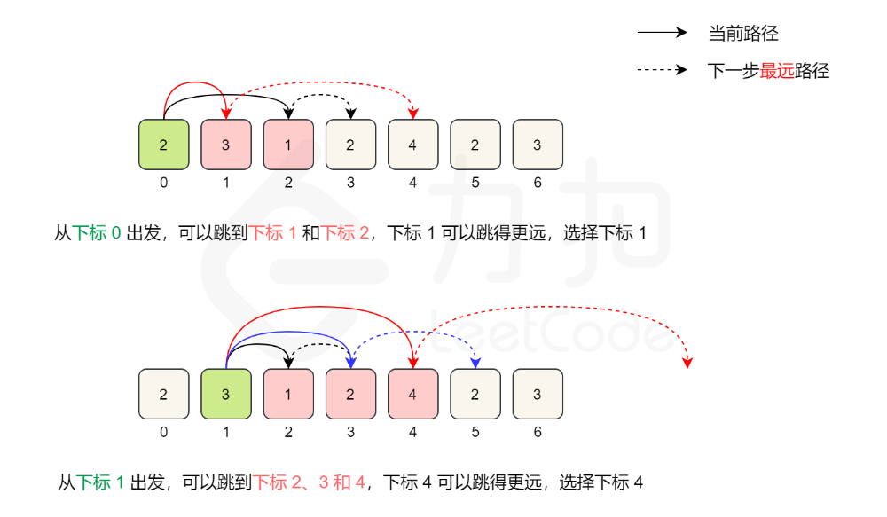

# [45.跳跃游戏 II](https://leetcode.cn/problems/jump-game-ii/)

`时间：2023.7.13`

## 题目

给定一个长度为 `n` 的 **0 索引**整数数组 `nums`。初始位置为 `nums[0]`。

每个元素 `nums[i]` 表示从索引 `i` 向前跳转的最大长度。换句话说，如果你在 `nums[i]` 处，你可以跳转到任意 `nums[i + j]` 处:

- `0 <= j <= nums[i]`
- `i + j < n`

返回到达 `nums[n - 1]` 的最小跳跃次数。生成的测试用例可以到达 `nums[n - 1]`。

**示例1：**

```
输入: nums = [2,3,1,1,4]
输出: 2
解释: 跳到最后一个位置的最小跳跃数是 2。
     从下标为 0 跳到下标为 1 的位置，跳 1 步，然后跳 3 步到达数组的最后一个位置。
```

**示例2：**

```
输入: nums = [2,3,0,1,4]
输出: 2
```

## 代码

#### 方法：贪心算法

##### 思路





##### 代码

```java
import java.util.Arrays;

class Solution {
    // 贪心算法
    public int jump(int[] nums) {
        int length = nums.length;
        int end = 0;
        int maxPosition = 0;
        int steps = 0;
        for (int i = 0; i < length - 1; i++) {
            maxPosition = Math.max(maxPosition, i + nums[i]);
            if (i == end) {
                end = maxPosition;
                steps += 1;
            }
        }
        return steps;
    }

    public static void main(String[] args) {
        Solution solution = new Solution();
    
        int[] nums1 = {2, 3, 1, 1, 4};
        int result1 = solution.jump(nums1);
        System.out.println("Input: nums = " + Arrays.toString(nums1));
        System.out.println("Output: " + result1);
    }
}
```

##### 复杂度分析

- 时间复杂度：O(N)。其中N是数组长度。
- 空间复杂度：O(1)。