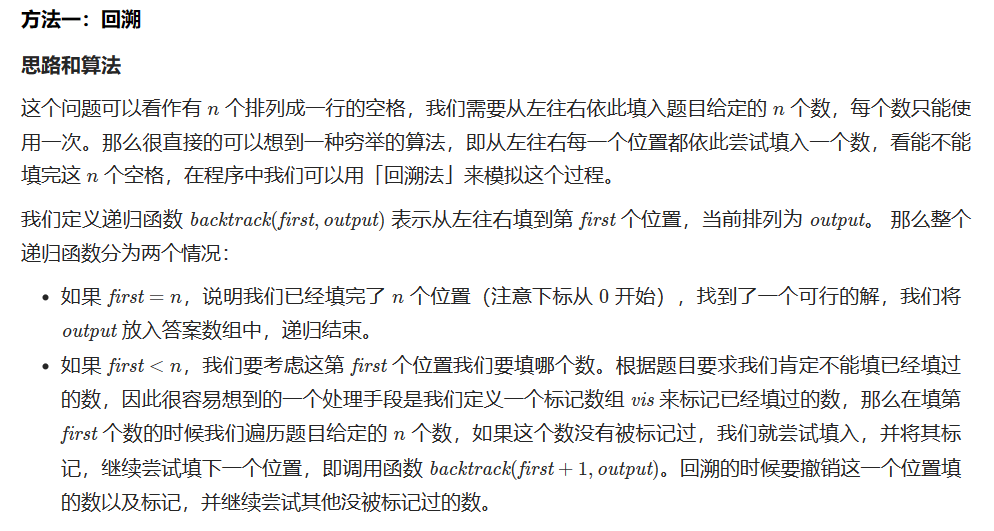
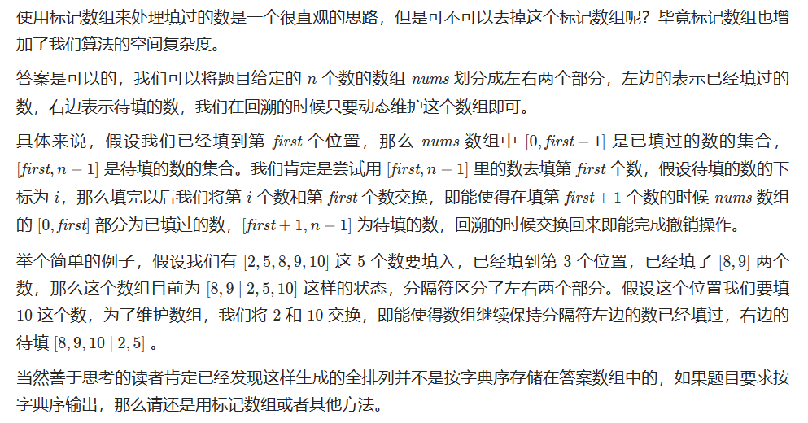
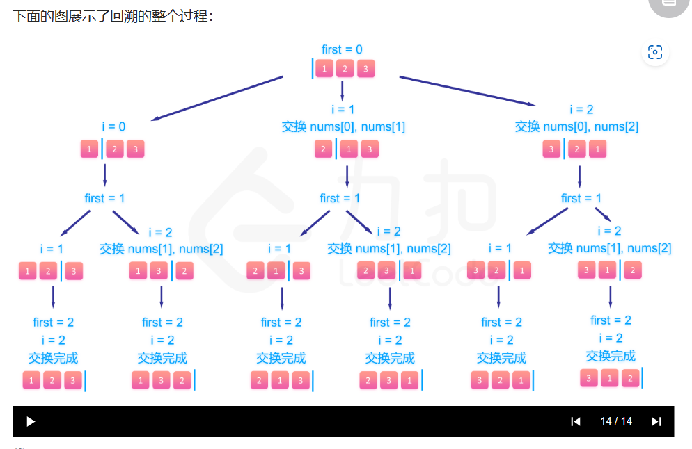
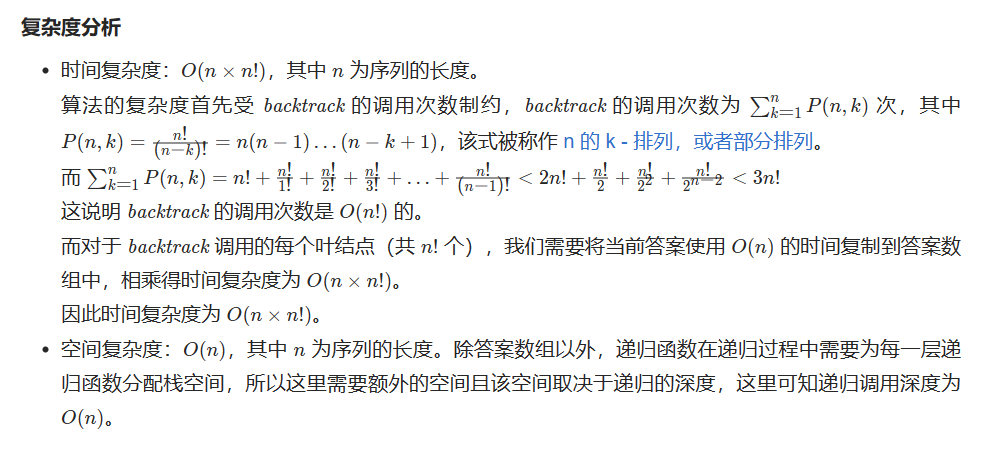

# [46.全排列](https://leetcode.cn/problems/permutations/)

`时间：2023.7.13`

## 题目

给定一个不含重复数字的数组 `nums` ，返回其所有可能的全排列。你可以 **按任意顺序** 返回答案。

**示例1：**

```
输入：nums = [1,2,3]
输出：[[1,2,3],[1,3,2],[2,1,3],[2,3,1],[3,1,2],[3,2,1]]
```

**示例2：**

```
输入：nums = [0,1]
输出：[[0,1],[1,0]]
```

**示例3：**

```
输入：nums = [1]
输出：[[1]]
```

## 代码

#### 方法：回溯法 递归

##### 思路







##### 代码

```java
import java.util.ArrayList;
import java.util.Collections;
import java.util.List;

class Solution {
    public List<List<Integer>> permute(int[] nums) {
        List<List<Integer>> result = new ArrayList<List<Integer>>();
        List<Integer> output = new ArrayList<Integer>();
        for (int num : nums) {
            output.add(num);
        }
        backtrack(nums.length, output, result, 0);
        return result;
    }

    public void backtrack(int n, List<Integer> output, List<List<Integer>> result, int first) {
        // 所有数都填完了
        if (first == n) {
            result.add(new ArrayList<Integer>(output));
        }
        for (int i = first; i < n; i++) {
            // 动态维护数组
            Collections.swap(output, first, i);
            // 继续递归填下一个数
            backtrack(n, output, result, first + 1);
            // 撤销操作
            Collections.swap(output, first, i);
        }
    }

    public static void main(String[] args) {
        Solution solution = new Solution();
        int[] nums = {1, 2, 3};
        List<List<Integer>> permutations = solution.permute(nums);
        System.out.println(permutations);
    }
}
```

##### 复杂度分析

