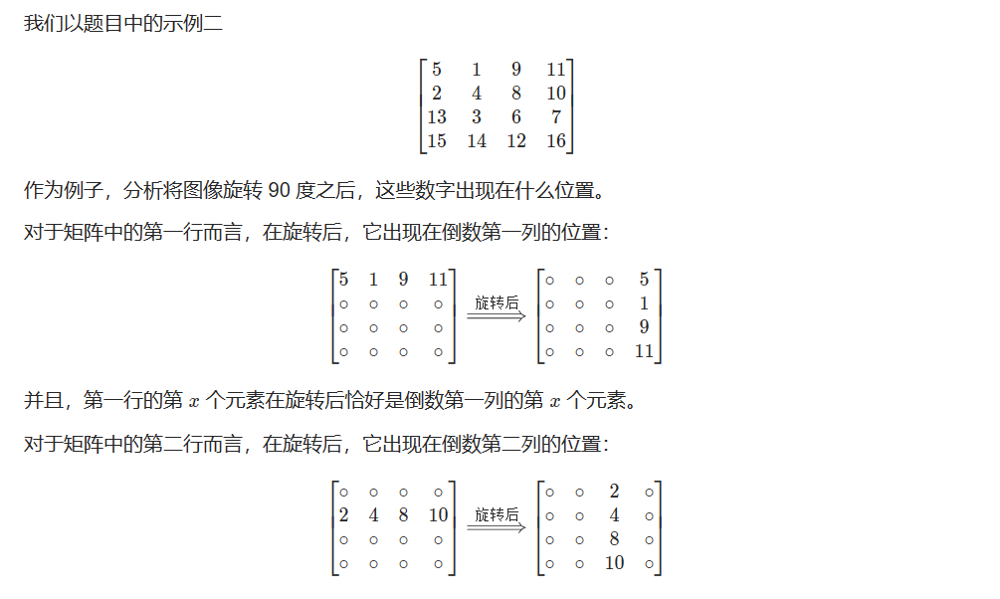

# [48.旋转图像](https://leetcode.cn/problems/rotate-image/)

`时间：2023.7.14`

## 题目

给定一个 `n × n` 的二维矩阵 `matrix` 表示一个图像。请你将图像顺时针旋转 90 度。

你必须在 **原地** 旋转图像，这意味着你需要直接修改输入的二维矩阵。**请不要** 使用另一个矩阵来旋转图像。

**示例1：**


```
输入：matrix = [[1,2,3],[4,5,6],[7,8,9]]
输出：[[7,4,1],[8,5,2],[9,6,3]]
```

**示例2：**


```
输入：matrix = [[5,1,9,11],[2,4,8,10],[13,3,6,7],[15,14,12,16]]
输出：[[15,13,2,5],[14,3,4,1],[12,6,8,9],[16,7,10,11]]
```

## 代码

#### 方法一：使用辅助数组

##### 思路




##### 代码

```java
class Solution {
    // 方法一：使用辅助数组
    public void rotate(int[][] matrix) {
        int length = matrix.length;
        int[][] matrix_new = new int[length][length];
        for (int i = 0; i < length; i++) {
            for (int j = 0; j < length; j++) {
                matrix_new[j][length - i - 1] = matrix[i][j];
            }
        }
        for (int i = 0; i < length; i++) {
            for (int j = 0; j < length; j++) {
                matrix[i][j] = matrix_new[i][j];
            }
        }
    }

    public static void main(String[] args) {
        Solution solution = new Solution();

        int[][] matrix = {
            {5, 1, 9, 11},
            {2, 4, 8, 10},
            {13, 3, 6, 7},
            {15, 14, 12, 16}
        };
        System.out.println("原始矩阵:");
        printMatrix(matrix);
        solution.rotate(matrix);
        System.out.println("旋转后的矩阵:");
        printMatrix(matrix);
    }

    // 辅助方法，用于打印矩阵
    private static void printMatrix(int[][] matrix) {
        for (int[] row : matrix) {
            for (int num : row) {
                System.out.print(num + " ");
            }
            System.out.println();
        }
        System.out.println();
    }
}
```

##### 复杂度分析

- 时间复杂度：O(N^2)。
- 空间复杂度：O(N^2)。

#### 方法二：用翻转代替旋转

##### 思路


##### 代码

```java
class Solution {
    // 方法二：用翻转代替旋转
    public void rotate(int[][] matrix) {
        int length = matrix.length;
        // 水平翻转
        for (int i = 0; i < length / 2; i++) {
            for (int j = 0; j < length; j++) {
                int temp = matrix[i][j];
                matrix[i][j] = matrix[length - i - 1][j];
                matrix[length - i - 1][j] = temp;
            }
        }
        // 主对角线翻转
        for (int i = 0; i < length; i++) {
            for (int j = 0; j < i; j++) {
                int temp = matrix[i][j];
                matrix[i][j] = matrix[j][i];
                matrix[j][i] = temp;
            }
        }
    }

    public static void main(String[] args) {
        Solution solution = new Solution();

        int[][] matrix = {
            {5, 1, 9, 11},
            {2, 4, 8, 10},
            {13, 3, 6, 7},
            {15, 14, 12, 16}
        };
        System.out.println("原始矩阵:");
        printMatrix(matrix);
        solution.rotate(matrix);
        System.out.println("旋转后的矩阵:");
        printMatrix(matrix);
    }

    // 辅助方法，用于打印矩阵
    private static void printMatrix(int[][] matrix) {
        for (int[] row : matrix) {
            for (int num : row) {
                System.out.print(num + " ");
            }
            System.out.println();
        }
        System.out.println();
    }
}
```

##### 复杂度分析

