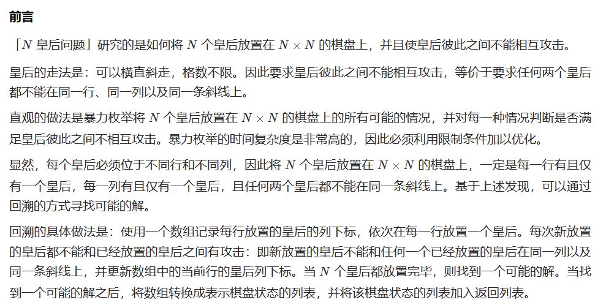
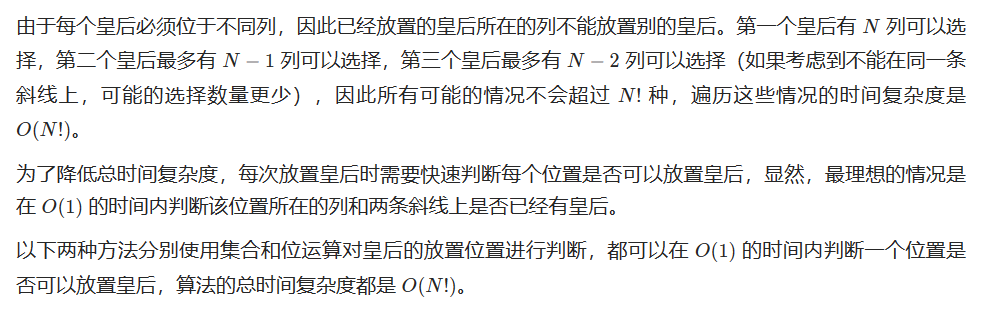
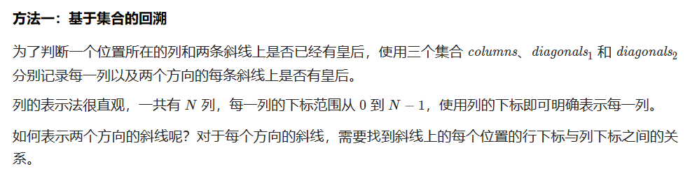
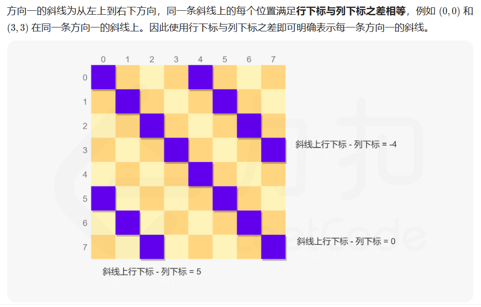
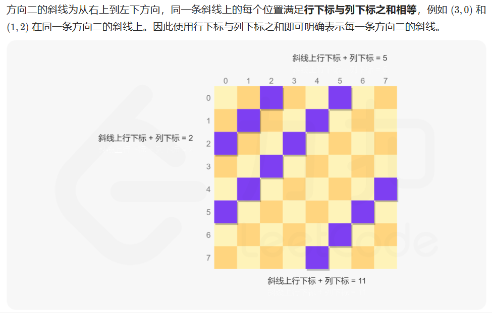

# [51.N皇后](https://leetcode.cn/problems/n-queens/)

`时间：2023.7.15`

## 题目

按照国际象棋的规则，皇后可以攻击与之处在同一行或同一列或同一斜线上的棋子。

**n 皇后问题** 研究的是如何将 `n` 个皇后放置在 `n×n` 的棋盘上，并且使皇后彼此之间不能相互攻击。

给你一个整数 `n` ，返回所有不同的 **n 皇后问题** 的解决方案。

每一种解法包含一个不同的 **n 皇后问题** 的棋子放置方案，该方案中 `'Q'` 和 `'.'` 分别代表了皇后和空位。

**示例1：**


```
输入：n = 4
输出：[[".Q..","...Q","Q...","..Q."],["..Q.","Q...","...Q",".Q.."]]
解释：如上图所示，4 皇后问题存在两个不同的解法。
```

**示例2：**

```
输入：n = 1
输出：[["Q"]]
```

## 代码

#### 方法：回溯法，列、主、副对角线三个集合

##### 思路











每次放置皇后时，对于每个位置判断其是否在三个集合中，如果三个集合都不包含当前位置，则当前位置是可以放置皇后的位置。

##### 代码

```java
import java.util.List;
import java.util.ArrayList;
import java.util.Arrays;
import java.util.Set;
import java.util.HashSet;

class Solution {
    // 回溯法，列、主、副对角线三个集合
    public List<List<String>> solveNQueens(int n) {
        List<List<String>> solutions = new ArrayList<List<String>>();
        int[] queens = new int[n];
        Arrays.fill(queens, -1);
        Set<Integer> columns = new HashSet<Integer>();
        Set<Integer> diagonals1 = new HashSet<Integer>();
        Set<Integer> diagonals2 = new HashSet<Integer>();
        backtrack(solutions, queens, n, 0, columns, diagonals1, diagonals2);
        return solutions;
    }

    public void backtrack(List<List<String>> solutions, int[] queens, int n, int row, Set<Integer> columns, Set<Integer> diagonals1, Set<Integer> diagonals2) {
        if (row == n) {
            List<String> board = generateBoard(queens, n);
            solutions.add(board);
        }
        else {
            for (int i = 0; i < n; i++) {
                if (columns.contains(i)) {
                    continue;
                }
                int diagonal1 = row - i;
                if (diagonals1.contains(diagonal1)) {
                    continue;
                }
                int diagonal2 = row + i;
                if (diagonals2.contains(diagonal2)) {
                    continue;
                }
                queens[row] = i;
                columns.add(i);
                diagonals1.add(diagonal1);
                diagonals2.add(diagonal2);
                backtrack(solutions, queens, n, row + 1, columns, diagonals1, diagonals2);
                queens[row] = -1;
                columns.remove(i);
                diagonals1.remove(diagonal1);
                diagonals2.remove(diagonal2);
            }
        }
    }

    public List<String> generateBoard(int[] queens, int n) {
        List<String> board = new ArrayList<String>();
        for (int i = 0; i < n; i++) {
            char[] row = new char[n];
            Arrays.fill(row, '.');
            row[queens[i]] = 'Q';
            board.add(new String(row));
        }
        return board;
    }

    public static void main(String[] args) {
        Solution solution = new Solution();
        int n = 4;
        List<List<String>> solutions = solution.solveNQueens(n);
        
        System.out.println("Input: n = " + n);
        System.out.println("Output: " + solutions);
    }
}
```

##### 复杂度分析

- 时间复杂度：O(N!)。其中N是皇后的数量。
- 空间复杂度：O(N)。