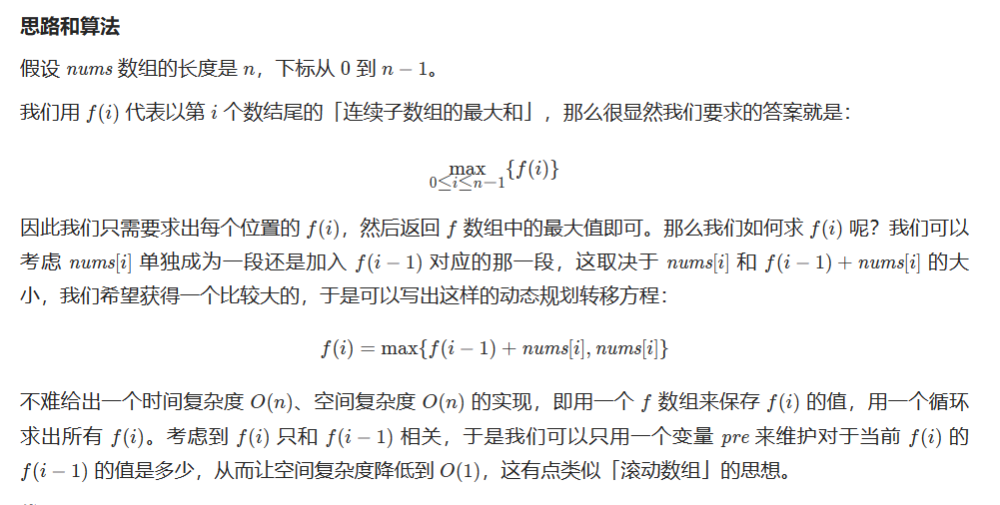

# [53.最大子数组和](https://leetcode.cn/problems/maximum-subarray/)

`时间：2023.7.15`

## 题目

给你一个整数数组 `nums` ，请你找出一个具有最大和的连续子数组（子数组最少包含一个元素），返回其最大和。

**子数组** 是数组中的一个连续部分。

**示例1：**



```
输入：nums = [-2,1,-3,4,-1,2,1,-5,4]
输出：6
解释：连续子数组 [4,-1,2,1] 的和最大，为 6 。
```

**示例2：**

```
输入：nums = [1]
输出：1
```

**示例3：**

```
输入：nums = [5,4,-1,7,8]
输出：23
```

## 代码

#### 方法：动态规划

##### 思路


##### 代码

```java
import java.util.Arrays;

class Solution {
    // 动态规划
    public int maxSubArray(int[] nums) {
        int length = nums.length;
        int[] dp = new int[length];
        dp[0] = nums[0];
        int result = nums[0];
        for (int i = 1; i < length; i++) {
            dp[i] = Math.max(dp[i - 1] + nums[i], nums[i]);
            result = Math.max(result, dp[i]);
        }
        return result;
    }

    public static void main(String[] args) {
        Solution solution = new Solution();
        int[] nums = {-2, 1, -3, 4, -1, 2, 1, -5, 4};
        int result = solution.maxSubArray(nums);
        
        System.out.println("Input: nums = " + Arrays.toString(nums));
        System.out.println("Output: " + result);
    }
}
```

##### 复杂度分析

- 时间复杂度：O(N)。N为nums数组的长度。我们只需要遍历一遍数组即可求得答案。
- 空间复杂度：O(1)。我们只需要常数空间存放若干变量。