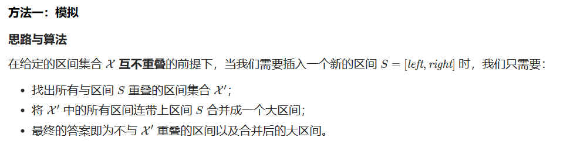
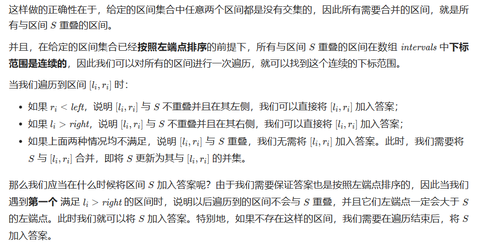

# [57.插入区间](https://leetcode.cn/problems/insert-interval/)

`时间：2023.7.19`

## 题目

给你一个 **无重叠的** ，按照区间起始端点排序的区间列表。

在列表中插入一个新的区间，你需要确保列表中的区间仍然有序且不重叠（如果有必要的话，可以合并区间）。

**示例1：**

```
输入：intervals = [[1,3],[6,9]], newInterval = [2,5]
输出：[[1,5],[6,9]]
```

**示例2：**

```
输入：intervals = [[1,2],[3,5],[6,7],[8,10],[12,16]], newInterval = [4,8]
输出：[[1,2],[3,10],[12,16]]
解释：这是因为新的区间 [4,8] 与 [3,5],[6,7],[8,10] 重叠。
```

**示例3：**

```
输入：intervals = [], newInterval = [5,7]
输出：[[5,7]]
```

**示例4：**

```
输入：intervals = [[1,5]], newInterval = [2,3]
输出：[[1,5]]
```

**示例5：**

```
输入：intervals = [[1,5]], newInterval = [2,7]
输出：[[1,7]]
```

## 代码

#### 方法：指针模拟

##### 思路






##### 代码

```java
import java.util.List;
import java.util.ArrayList;
import java.util.Arrays;

class Solution {
    public int[][] insert(int[][] intervals, int[] newInterval) {
        int left = newInterval[0];
        int right = newInterval[1];
        boolean placed = false;
        List<int[]> ansList = new ArrayList<int[]>();
        for (int i = 0; i < intervals.length; i++) {
            // 当前块在插入区间的左侧且无交集
            if (intervals[i][1] < left) {
                ansList.add(intervals[i]);
            }
            // 当前块在插入区间的右侧且无交集
            else if (intervals[i][0] > right) {
                if (!placed) {
                    ansList.add(new int[]{left, right});
                    placed = true;
                }
                ansList.add(intervals[i]);
            }
            // 与插入区间有交集，计算它们的并集更新插入块左右边界
            else {
                left = Math.min(left, intervals[i][0]);
                right = Math.max(right, intervals[i][1]);
            }
        }
        // 插入块在最右侧
        if (!placed) {
            ansList.add(new int[]{left, right});
        }
        return ansList.toArray(new int[ansList.size()][]);
    }

    public static void main(String[] args) {
        Solution solution = new Solution();

        int[][] intervals = {{1, 3}, {6, 9}};
        int[] newInterval = {2, 5};

        int[][] mergedIntervals = solution.insert(intervals, newInterval);

        System.out.println("Merged Intervals:");
        for (int[] interval : mergedIntervals) {
            System.out.println(Arrays.toString(interval));
        }
    }
}
```

##### 复杂度分析

- 时间复杂度：O(n)。n是数组长度，即给定区间个数。
- 空间复杂度：O(1)。