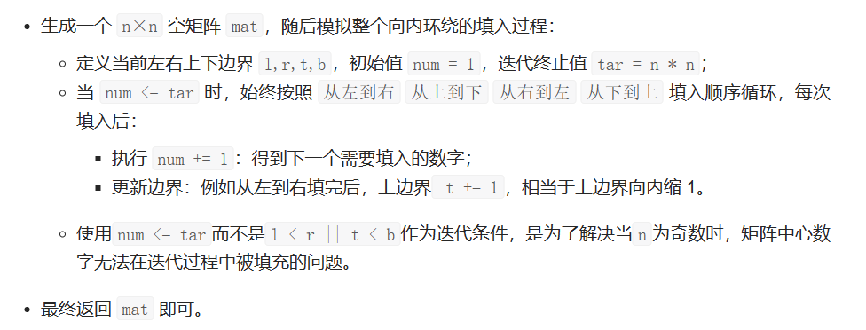

# [59.螺旋矩阵 II](https://leetcode.cn/problems/spiral-matrix-ii/)

`时间：2023.7.19`

## 题目

给你一个正整数 `n` ，生成一个包含 `1` 到 `n x n` 所有元素，且元素按顺时针顺序螺旋排列的 `n x n` 正方形矩阵 `matrix` 。

**示例1：**


```
输入：n = 3
输出：[[1,2,3],[8,9,4],[7,6,5]]
```

**示例2：**

```
输入：n = 1
输出：[[1]]
```

## 代码

#### 方法：指针模拟

##### 思路




##### 代码

```java
import java.util.Arrays;

class Solution {
    public int[][] generateMatrix(int n) {
        int left = 0, right = n - 1;
        int top = 0, down = n - 1;
        int[][] result = new int[n][n];
        int num = 1, target = n * n;
        while (num <= target) {
            for (int i = left; i <= right; i++) result[top][i] = num++;     // left to right
            top++;
            for (int i = top; i <= down; i++) result[i][right] = num++;     // top to down
            right--;
            for (int i = right; i >= left; i--) result[down][i] = num++;    // right to left
            down--;
            for (int i = down; i >= top; i--) result[i][left] = num++;      // down to top
            left++;
        }
        return result;
    }

    public static void main(String[] args) {
        Solution solution = new Solution();

        int n = 3;
        int[][] matrix = solution.generateMatrix(n);

        System.out.println("Generated Matrix:");
        for (int[] row : matrix) {
            System.out.println(Arrays.toString(row));
        }
    }
}
```

##### 复杂度分析

- 时间复杂度：O(n * n)。
- 空间复杂度：O(n * n)。