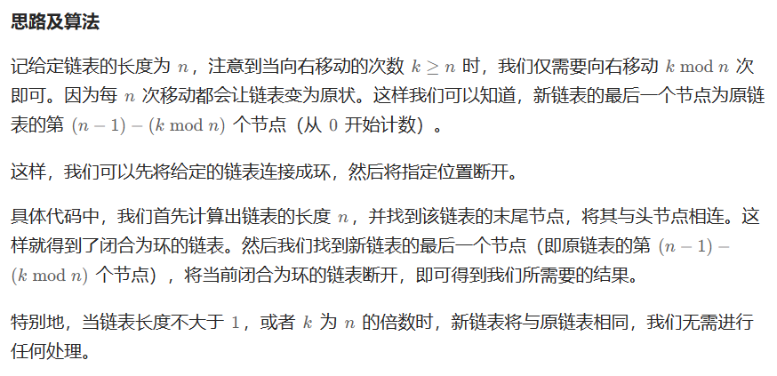

# [61.旋转链表](https://leetcode.cn/problems/rotate-list/)

`时间：2023.7.24`

## 题目

给你一个链表的头节点 `head` ，旋转链表，将链表每个节点向右移动 `k` 个位置。

**示例1：**


```
输入：head = [1,2,3,4,5], k = 2
输出：[4,5,1,2,3]
```

**示例2：**


```
输入：head = [0,1,2], k = 4
输出：[2,0,1]
```

## 代码

#### 方法：快慢指针，连接成环，交界处断开

##### 思路



##### 代码

```java
/**
 * Definition for singly-linked list.
 * public class ListNode {
 *     int val;
 *     ListNode next;
 *     ListNode() {}
 *     ListNode(int val) { this.val = val; }
 *     ListNode(int val, ListNode next) { this.val = val; this.next = next; }
 * }
 */
class Solution {
    // 快慢指针，连接成环，交界处断开
    public ListNode rotateRight(ListNode head, int k) {
        if (head == null || head.next == null || k == 0) {
            return head;
        }
        ListNode cur = head;
        // 统计链表长度
        int len = 0;
        while (cur != null) {
            len++;
            cur = cur.next;
        }
        // 对k取模简化
        k %= len;
        if (k == 0) {
            return head;
        }
        // 快指针fast先走k步
        ListNode fast = head;
        for (int i = 0; i < k; i++) {
            fast = fast.next;
        }
        // 快慢指针再一起同步前进，直至fast走到尾节点停
        ListNode slow = head;
        while (fast.next != null) {
            fast = fast.next;
            slow = slow.next;
        }
        // 此时的慢指针slow的下一个节点就是旋转后的新头，原尾节点fast串连到老头head上
        ListNode newHead = slow.next;
        slow.next = null;
        fast.next = head;
        return newHead;
    }

    public static void main(String[] args) {
        Solution solution = new Solution();
        // Create the linked list: head = [1, 2, 3, 4, 5]
        ListNode head = new ListNode(1);
        head.next = new ListNode(2);
        head.next.next = new ListNode(3);
        head.next.next.next = new ListNode(4);
        head.next.next.next.next = new ListNode(5);
        int k = 2;
        ListNode result = solution.rotateRight(head, k);
        // Print the output linked list: [4, 5, 1, 2, 3]
        while (result != null) {
            System.out.print(result.val + " -> ");
            result = result.next;
        }
        System.out.println("null");
    }
}
```

##### 复杂度分析

- 时间复杂度：O(n)，最坏情况下，我们需要遍历该链表两次。
- 空间复杂度：O(1)，我们只需要常数的空间存储若干变量。