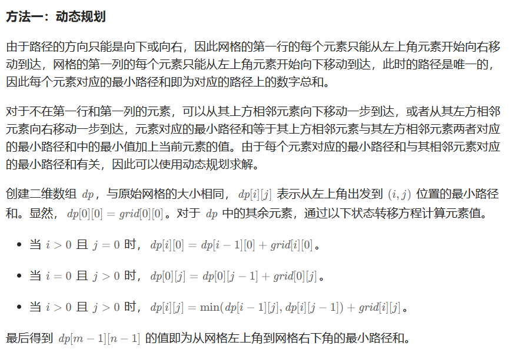

# [64.最小路径和](https://leetcode.cn/problems/minimum-path-sum/)

`时间：2023.7.24`

## 题目

给定一个包含非负整数的 `m x n` 网格 `grid` ，请找出一条从左上角到右下角的路径，使得路径上的数字总和为最小。

**说明**：每次只能向下或者向右移动一步。

**示例1：**


```
输入：grid = [[1,3,1],[1,5,1],[4,2,1]]
输出：7
解释：因为路径 1→3→1→1→1 的总和最小。
```

**示例2：**

```
输入：grid = [[1,2,3],[4,5,6]]
输出：12
```

## 代码

#### 方法：动态规划

##### 思路



##### 代码

```java
class Solution {
    public int minPathSum(int[][] grid) {
        if (grid == null || grid.length == 0) {
            return 0;
        }
        int m = grid.length, n = grid[0].length;
        int[][] dp = new int[m][n];
        // 初始化
        dp[0][0] = grid[0][0];
        for (int i = 1; i < m; i++) {
            dp[i][0] = dp[i - 1][0] + grid[i][0];
        }
        for (int i = 1; i < n; i++) {
            dp[0][i] = dp[0][i - 1] + grid[0][i];
        }
        for (int i = 1; i < m; i++) {
            for (int j = 1; j < n; j++) {
                dp[i][j] = Math.min(dp[i - 1][j], dp[i][j - 1]) + grid[i][j];
            }
        }
        return dp[m - 1][n - 1];
    }

    public static void main(String[] args) {
        Solution solution = new Solution();
        // Create the input matrix: grid = [[1,3,1],[1,5,1],[4,2,1]]
        int[][] grid = {
            {1, 3, 1},
            {1, 5, 1},
            {4, 2, 1}
        };
        int result = solution.minPathSum(grid);
        System.out.println("Output: " + result);
    }
}
```

##### 复杂度分析

