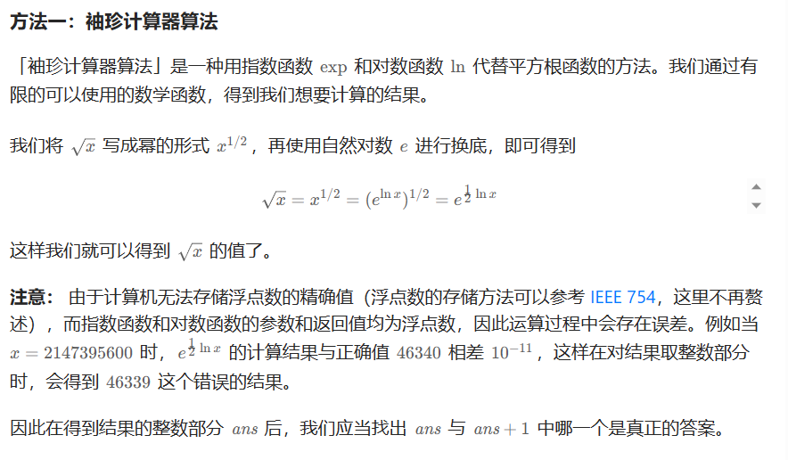
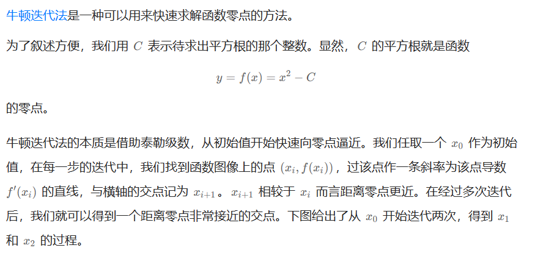
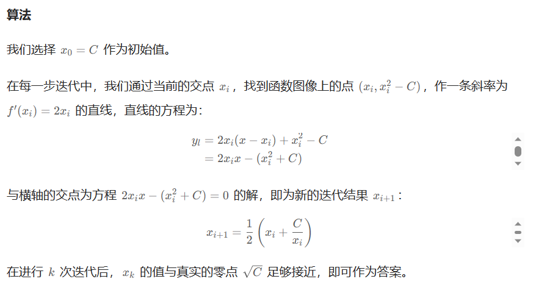

# [69.x 的平方根](https://leetcode.cn/problems/sqrtx/)

`时间：2023.7.27`

## 题目

给你一个非负整数 `x` ，计算并返回 `x` 的 **算术平方根** 。

由于返回类型是整数，结果只保留 **整数部分** ，小数部分将被 **舍去** 。

**注意：**不允许使用任何内置指数函数和算符，例如 `pow(x, 0.5)` 或者 `x ** 0.5` 。

**示例1：**

```
输入：x = 4
输出：2
```

**示例2：**

```
输入：x = 8
输出：2
解释：8 的算术平方根是 2.82842..., 由于返回类型是整数，小数部分将被舍去。
```

## 代码

#### 方法一：袖珍计算器算法

##### 思路



##### 代码

```java
class Solution {
    // 法一：袖珍计算器算法
    public int mySqrt(int x) {
        if (x == 0) {
            return x;
        }
        int ans = (int) Math.exp(0.5 * Math.log(x));
        return (long) (ans + 1) * (ans + 1) <= x ? ans + 1 : ans;
    }

    public static void main(String[] args) {
        Solution sol = new Solution();
        int result = sol.mySqrt(16);
        System.out.println("result = " + result);
    }
}
```

##### 复杂度分析

- 时间复杂度：O(1)。
- 空间复杂度：O(1)。

#### 方法二：牛顿法迭代

##### 思路






##### 代码

```java
class Solution {
    // 法二：牛顿法
    public int mySqrt(int x) {
        if (x == 0) {
            return 0;
        }
        double C = x, x0 = x;
        while (true) {
            double xi = 0.5 * (x0 + C / x0);
            if (Math.abs(x0 - xi) < 1e-7) {
                break;
            }
            x0 = xi;
        }
        return (int) x0;
    }

    public static void main(String[] args) {
        Solution sol = new Solution();
        int result = sol.mySqrt(16);
        System.out.println("result = " + result);
    }
}
```

##### 复杂度分析

- 时间复杂度：O(logn)。
- 空间复杂度：O(1)。