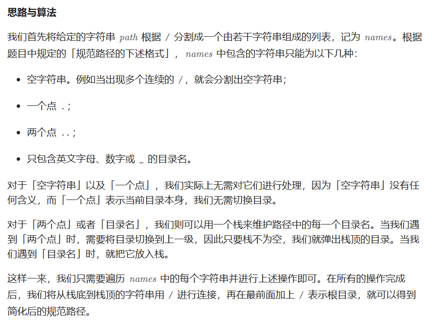

# [71.简化路径](https://leetcode.cn/problems/simplify-path/)

`时间：2023.7.27`

## 题目

给你一个字符串 `path` ，表示指向某一文件或目录的 Unix 风格 **绝对路径** （以 `'/'` 开头），请你将其转化为更加简洁的规范路径。

在 Unix 风格的文件系统中，一个点（`.`）表示当前目录本身；此外，两个点 （`..`） 表示将目录切换到上一级（指向父目录）；两者都可以是复杂相对路径的组成部分。任意多个连续的斜杠（即，`'//'`）都被视为单个斜杠 `'/'` 。 对于此问题，任何其他格式的点（例如，`'...'`）均被视为文件/目录名称。

请注意，返回的 **规范路径** 必须遵循下述格式：

- 始终以斜杠 `'/'` 开头。
- 两个目录名之间必须只有一个斜杠 `'/'` 。
- 最后一个目录名（如果存在）**不能** 以 `'/'` 结尾。
- 此外，路径仅包含从根目录到目标文件或目录的路径上的目录（即，不含 `'.'` 或 `'..'`）。
- 返回简化后得到的 **规范路径** 。

**示例1：**

```
输入：path = "/home/"
输出："/home"
解释：注意，最后一个目录名后面没有斜杠。 
```

**示例2：**

```
输入：path = "/../"
输出："/"
解释：从根目录向上一级是不可行的，因为根目录是你可以到达的最高级。
```

**示例3：**

```
输入：path = "/home//foo/"
输出："/home/foo"
解释：在规范路径中，多个连续斜杠需要用一个斜杠替换。
```

**示例4：**

```
输入：path = "/a/./b/../../c/"
输出："/c"
```

## 代码

#### 方法：栈

##### 思路



##### 代码

```java
import java.util.Deque;
import java.util.ArrayDeque;

class Solution {
    // 栈法，抵消
    public String simplifyPath(String path) {
        String[] names = path.split("/");
        Deque<String> stack = new ArrayDeque<String>();
        for (String name : names) {
            if ("..".equals(name)) {
                if (!stack.isEmpty()) {
                    stack.pop();
                }
            }
            else if (name.length() > 0 && !".".equals(name)) {
                stack.push(name);
            }
        }
        StringBuilder sb = new StringBuilder();
        if (stack.isEmpty()) {
            sb.append("/");
        }
        else {
            // 最后需要从栈底部开始到顶部取元素
            // 所以用deque
            while (!stack.isEmpty()) {
                sb.append("/");
                sb.append(stack.peekLast());
                stack.removeLast();
            }
        }

        return sb.toString();
    }

    public static void main(String[] args) {
        Solution sol = new Solution();
        sol.simplifyPath("/home/");
    }
}
```

##### 复杂度分析

- 时间复杂度：O(n)。n是字符串path的长度。
- 空间复杂度：O(n)。我们需要O(n)的空间存储names中的所有字符串。