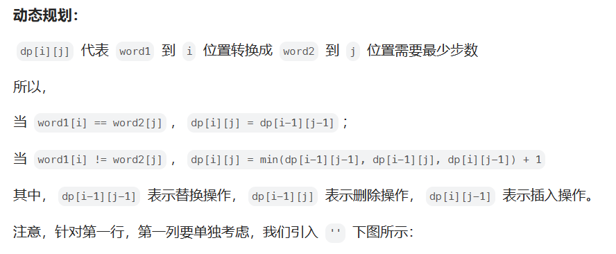

# [72.编辑距离](https://leetcode.cn/problems/edit-distance/)

`时间：2023.7.28`

## 题目

给你两个单词 `word1` 和 `word2`， 请返回将 `word1` 转换成 `word2` 所使用的最少操作数。

你可以对一个单词进行如下三种操作：

- 插入一个字符
- 删除一个字符
- 替换一个字符

**示例1：**

```
输入：word1 = "horse", word2 = "ros"
输出：3
解释：
horse -> rorse (将 'h' 替换为 'r')
rorse -> rose (删除 'r')
rose -> ros (删除 'e') 
```

**示例2：**

```
输入：word1 = "intention", word2 = "execution"
输出：5
解释：
intention -> inention (删除 't')
inention -> enention (将 'i' 替换为 'e')
enention -> exention (将 'n' 替换为 'x')
exention -> exection (将 'n' 替换为 'c')
exection -> execution (插入 'u')
```

## 代码

#### 方法：动态规划

##### 思路




##### 代码

```java
class Solution {
    // 动态规划算法
    public int minDistance(String word1, String word2) {
        int len1 = word1.length();
        int len2 = word2.length();
        int[][] dp = new int[len1 + 1][len2 + 1];
        // 定临界值
        dp[0][0] = 0;
        // 第一列
        for (int i = 1; i <= len1; i++)
            dp[i][0] = dp[i - 1][0] + 1;
        // 第一行
        for (int i = 1; i <= len2; i++)
            dp[0][i] = dp[0][i - 1] + 1;
        // 动态规划
        for (int i = 1; i <= len1; i++) {
            for (int j = 1; j <= len2; j++) {
                if (word1.charAt(i - 1) == word2.charAt(j - 1)) {
                    dp[i][j] = dp[i - 1][j - 1];
                }
                else {
                    dp[i][j] = Math.min(Math.min(dp[i - 1][j - 1], dp[i][j - 1]), dp[i - 1][j]) + 1;
                }
            }
        }
        return dp[len1][len2];
    }

    public static void main(String[] args) {
        Solution solution = new Solution();
        String word1 = "horse";
        String word2 = "ros";
        int result = solution.minDistance(word1, word2);
        System.out.println("Output: " + result);
    }
}
```

##### 复杂度分析

- 时间复杂度：O(mn)。m是word1的长度，n是word2的长度。
- 空间复杂度：O(mn)。