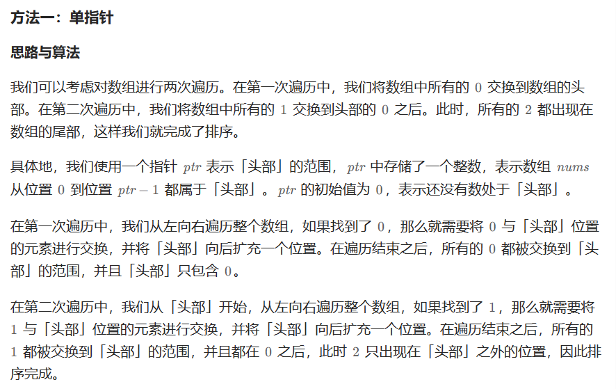
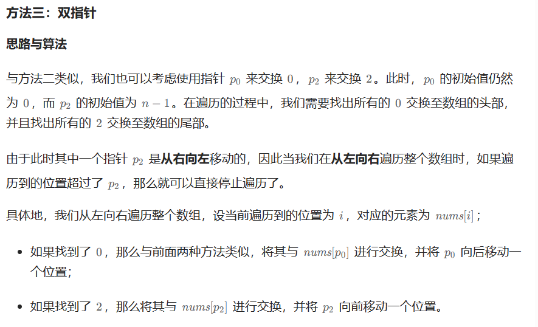
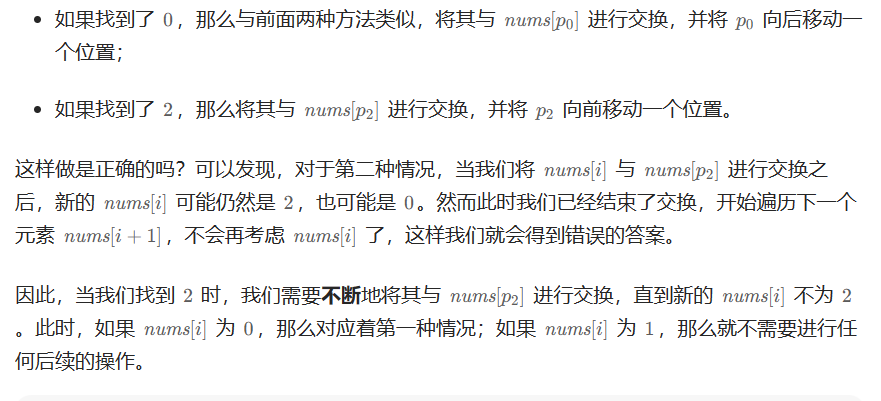

# [75.颜色分类](https://leetcode.cn/problems/sort-colors/)

`时间：2023.7.28`

## 题目

给定一个包含红色、白色和蓝色、共 `n` 个元素的数组 `nums` ，**原地**对它们进行排序，使得相同颜色的元素相邻，并按照红色、白色、蓝色顺序排列。

我们使用整数 `0`、 `1` 和 `2` 分别表示红色、白色和蓝色。

必须在不使用库内置的 `sort` 函数的情况下解决这个问题。

**示例1：**

```
输入：nums = [2,0,2,1,1,0]
输出：[0,0,1,1,2,2]
```

**示例2：**

```
输入：nums = [2,0,1]
输出：[0,1,2]
```

## 代码

#### 方法一：单指针 两次遍历

##### 思路



##### 代码

```java
import java.util.Arrays;

class Solution {
    // 法一：单指针 两次遍历
    public void sortColors(int[] nums) {
        int n = nums.length;
        int ptr = 0;
        for (int i = 0; i < n; i++) {
            if (nums[i] == 0) {
                int temp = nums[i];
                nums[i] = nums[ptr];
                nums[ptr] = temp;
                ptr++;
            }
        }
        for (int i = ptr; i < n; i++) {
            if (nums[i] == 1) {
                int temp = nums[i];
                nums[i] = nums[ptr];
                nums[ptr] = temp;
                ptr++;
            }
        }
    }

    public static void main(String[] args) {
        Solution solution = new Solution();
        int[] nums = {2, 0, 2, 1, 1, 0};
        System.out.println("Input: " + Arrays.toString(nums));
        solution.sortColors(nums);
        System.out.println("Output: " + Arrays.toString(nums));
    }
}
```

##### 复杂度分析

- 时间复杂度：O(n)。其中n是数组的长度。
- 空间复杂度：O(1)。

#### 方法二：双指针 单次遍历，ptr0指头，ptr2指尾

##### 思路





##### 代码

```java
import java.util.Arrays;

class Solution {
    // 法二：双指针 单次遍历，ptr0指头，ptr2指尾
    public void sortColors(int[] nums) {
        int n = nums.length;
        int ptr0 = 0, ptr2 = n - 1;
        for (int i = 0; i <= ptr2; i++) {
            if (nums[i] == 2) {
                while (i <= ptr2 && nums[ptr2] == 2) {
                    ptr2--;
                }
                if (i <= ptr2) {
                    int temp = nums[i];
                    nums[i] = nums[ptr2];
                    nums[ptr2] = temp;
                    ptr2--;
                }
            }
            if (nums[i] == 0) {
                int temp = nums[i];
                nums[i] = nums[ptr0];
                nums[ptr0] = temp;
                ptr0++;
            }
        }
    }

    public static void main(String[] args) {
        Solution solution = new Solution();
        int[] nums = {2, 0, 2, 1, 1, 0};
        System.out.println("Input: " + Arrays.toString(nums));
        solution.sortColors(nums);
        System.out.println("Output: " + Arrays.toString(nums));
    }
}
```

##### 复杂度分析

- 时间复杂度：O(n)。其中n是数组的长度。
- 空间复杂度：O(1)。