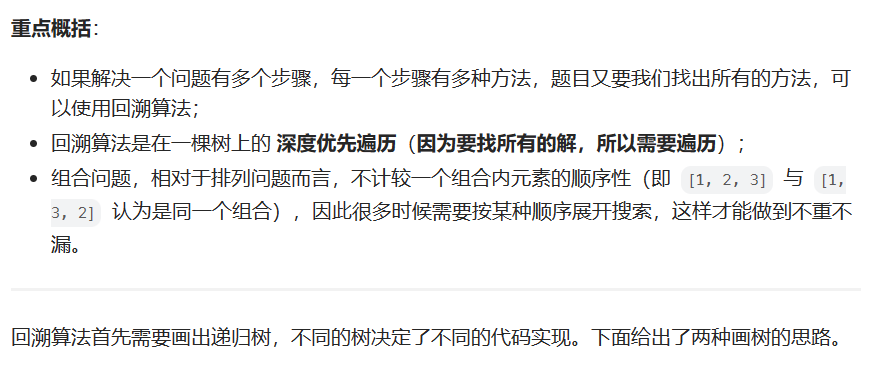
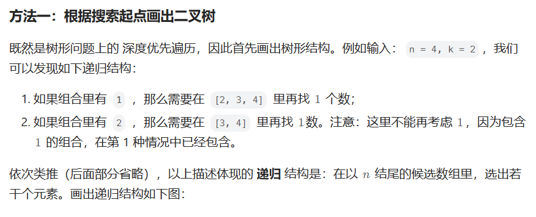
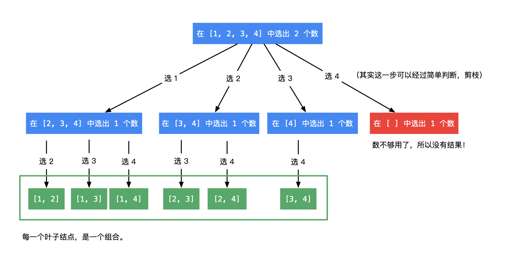
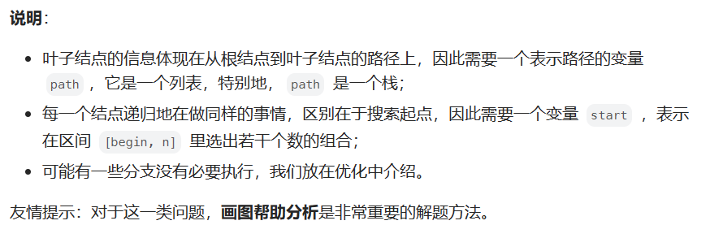
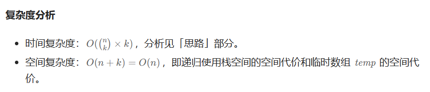

# [77.颜色分类](https://leetcode.cn/problems/combinations/)

`时间：2023.7.30`

## 题目

给定两个整数 `n` 和 `k`，返回范围 `[1, n]` 中所有可能的 `k` 个数的组合。

你可以按 **任何顺序** 返回答案。

**示例1：**

```
输入：n = 4, k = 2
输出：
[
  [2,4],
  [3,4],
  [2,3],
  [1,2],
  [1,3],
  [1,4],
]
```

**示例2：**

```
输入：n = 1, k = 1
输出：[[1]]
```

## 代码

#### 方法一：递归回溯算法 + 剪枝

##### 思路









##### 代码

```java
import java.util.List;
import java.util.ArrayList;
import java.util.Deque;
import java.util.ArrayDeque;

class Solution {
    public List<List<Integer>> combine(int n, int k) {
        List<List<Integer>> res = new ArrayList<>();
        if (k <= 0 || n < k) {
            return res;
        }
        // 从1开始是题目的设定
        Deque<Integer> path = new ArrayDeque<>();
        dfs(n, k, 1, path, res);
        return res;
    }

    private void dfs(int n, int k, int begin, Deque<Integer> path, List<List<Integer>> res) {
        // 终止条件：path长度为k
        if (path.size() == k) {
            res.add(new ArrayList<>(path));
            return;
        }
        // 遍历可能的搜索起点
        for (int i = begin; i <= n; i++) {
            // 向路径变量里添加一个数
            path.addLast(i);
            // 下一轮搜索，设置的搜索起点要加1，因为组合数理不允许出现重复的元素
            dfs(n, k, i + 1, path, res);
            // 重点理解这里：深度优先遍历有回头的过程，因此递归之前做了什么，递归之后需要做相同操作的逆向操作
            path.removeLast();
        }
    }
    
    public static void main(String[] args) {
        Solution solution = new Solution();
        int n = 4;
        int k = 2;
        List<List<Integer>> result = solution.combine(n, k);
        System.out.println("Input n: " + n + ", k: " + k);
        System.out.println("Output: ");
        for (List<Integer> combination : result) {
            System.out.println(combination);
        }
    }
}
```

##### 复杂度分析

