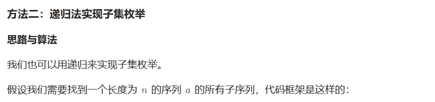
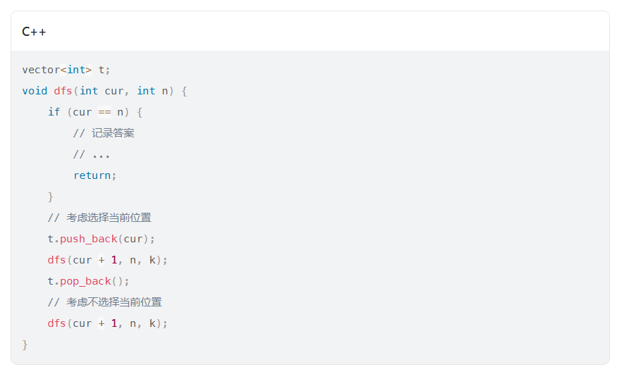
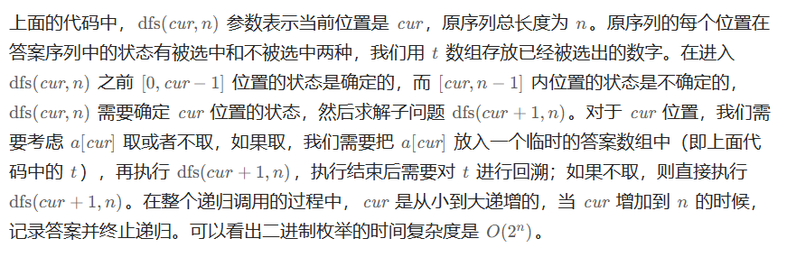
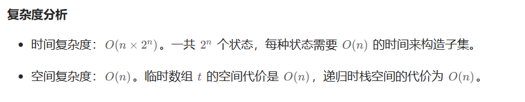

# [78.子集](https://leetcode.cn/problems/subsets/)

`时间：2023.7.31`

## 题目

给你一个整数数组 `nums` ，数组中的元素 **互不相同** 。返回该数组所有可能的子集（幂集）。

解集 **不能** 包含重复的子集。你可以按 **任意顺序** 返回解集。

**示例1：**

```
输入：nums = [1,2,3]
输出：[[],[1],[2],[1,2],[3],[1,3],[2,3],[1,2,3]]
```

**示例2：**

```
输入：nums = [0]
输出：[[],[0]]
```

## 代码

#### 方法：

##### 思路







##### 代码

```java
import java.util.List;
import java.util.ArrayList;
import java.util.Arrays;

class Solution {
    public List<List<Integer>> subsets(int[] nums) {
        List<List<Integer>> res = new ArrayList<>();
        List<Integer> temp = new ArrayList<>();
        dfs(res, temp, 0, nums);
        return res;
    }

    private void dfs(List<List<Integer>> res, List<Integer> temp, int cur, int[] nums) {
        if (cur == nums.length) {
            res.add(new ArrayList<>(temp));
            return;
        }
        // 考虑选择当前位置
        temp.add(nums[cur]);
        dfs(res, temp, cur + 1, nums);
        temp.remove(temp.size() - 1);
        // 考虑不选择当前位置
        dfs(res, temp, cur + 1, nums);
    }
    
    public static void main(String[] args) {
        Solution solution = new Solution();
        int[] nums = {1, 2, 3};
        List<List<Integer>> result = solution.subsets(nums);
        System.out.println("Input: nums = " + Arrays.toString(nums));
        System.out.println("Output: " + result);
    }
}
```

##### 复杂度分析

