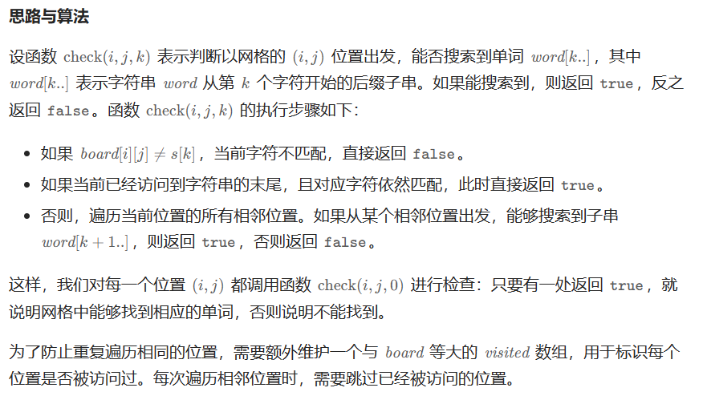
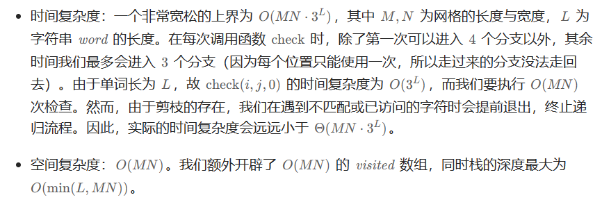

# [79.单词搜索](https://leetcode.cn/problems/word-search/)

`时间：2023.8.1`

## 题目

给定一个 `m x n` 二维字符网格 `board` 和一个字符串单词 `word` 。如果 `word` 存在于网格中，返回 `true` ；否则，返回 `false` 。

单词必须按照字母顺序，通过相邻的单元格内的字母构成，其中“相邻”单元格是那些水平相邻或垂直相邻的单元格。同一个单元格内的字母不允许被重复使用。

**示例1：**


```
输入：board = [["A","B","C","E"],["S","F","C","S"],["A","D","E","E"]], word = "ABCCED"
输出：true
```

**示例2：**


```
输入：board = [["A","B","C","E"],["S","F","C","S"],["A","D","E","E"]], word = "SEE"
输出：true
```

**示例3：**


```
输入：board = [["A","B","C","E"],["S","F","C","S"],["A","D","E","E"]], word = "ABCB"
输出：false
```

## 代码

#### 方法：递归回溯

##### 思路



##### 代码

```java
class Solution {
    public boolean exist(char[][] board, String word) {
        int h = board.length, w = board[0].length;
        boolean[][] visited = new boolean[h][w];
        for (int i = 0; i < h; i++) {
            for (int j = 0; j < w; j++) {
                boolean flag = check(board, word, visited, i, j, 0);
                if (flag) {
                    return true;
                }
            }
        }
        return false;
    }

    private boolean check(char[][] board, String word, boolean[][] visited, int i, int j, int k) {
        if (board[i][j] != word.charAt(k)) {
            return false;
        }
        else if (k == word.length() - 1) {
            return true;
        }
        visited[i][j] = true;
        int[][] directions = {{0, 1}, {0, -1}, {1, 0}, {-1, 0}};
        boolean result = false;
        for (int[] dir : directions) {
            int newi = i + dir[0], newj = j + dir[1];
            if (newi >= 0 && newi < board.length && newj >= 0 && newj < board[0].length) {
                if (!visited[newi][newj]) {
                    boolean flag = check(board, word, visited, newi, newj, k + 1);
                    if (flag) {
                        result = true;
                        break;
                    }
                }
            }
        }
        visited[i][j] = false;
        return result;
    }

    public static void main(String[] args) {
        Solution solution = new Solution();
        char[][] board = {
            {'A', 'B', 'C', 'E'},
            {'S', 'F', 'C', 'S'},
            {'A', 'D', 'E', 'E'}
        };
        String word = "ABCCED";
        boolean result = solution.exist(board, word);
        System.out.println("Output: " + result);
    }
}
```

##### 复杂度分析

