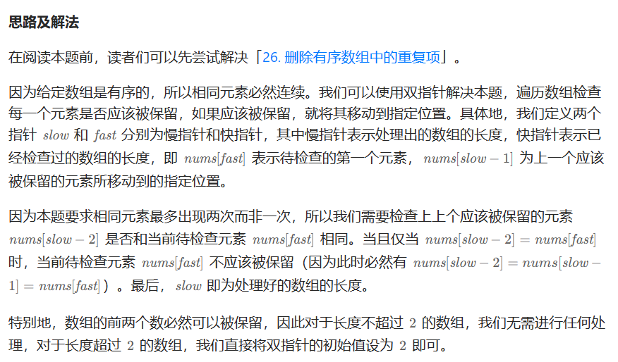

# [80.删除有序数组中的重复项 II](https://leetcode.cn/problems/remove-duplicates-from-sorted-array-ii/)

`时间：2023.8.1`

## 题目

给你一个有序数组 `nums` ，请你 **原地** 删除重复出现的元素，使得出现次数超过两次的元素**只出现两次** ，返回删除后数组的新长度。

不要使用额外的数组空间，你必须在 **原地** **修改输入数组** 并在使用 O(1) 额外空间的条件下完成。

**示例1：**

```
输入：nums = [1,1,1,2,2,3]
输出：5, nums = [1,1,2,2,3]
解释：函数应返回新长度 length = 5, 并且原数组的前五个元素被修改为 1, 1, 2, 2, 3 。 不需要考虑数组中超出新长度后面的元素。
```

**示例2：**

```
输入：nums = [0,0,1,1,1,1,2,3,3]
输出：7, nums = [0,0,1,1,2,3,3]
解释：函数应返回新长度 length = 7, 并且原数组的前五个元素被修改为 0, 0, 1, 1, 2, 3, 3 。 不需要考虑数组中超出新长度后面的元素。
```

## 代码

#### 方法：双指针

##### 思路



若改为通用的，k个重复，则将slow、fast改为k即可，条件改为nums[slow - k] != nums[fast]。

##### 代码

```java
class Solution {
    public int removeDuplicates(int[] nums) {
        int n = nums.length;
        int slow = 2, fast = 2;
        while (fast < n) {
            if (nums[slow - 2] != nums[fast]) {
                nums[slow] = nums[fast];
                slow++;
            }
            fast++;
        }
        return slow;
    }

    public static void main(String[] args) {
        int[] nums = {1, 1, 1, 1, 2, 2, 2, 2, 3, 4, 5, 5, 5, 5};
        Solution sol = new Solution();
        int slow = sol.removeDuplicates(nums);
        for (int i = 0; i < slow; i++) {
            System.out.println(nums[i]);
        }
    }
}
```

##### 复杂度分析

- 时间复杂度：O(n)。n为数组长度，我们最多遍历该数组一次。
- 空间复杂度：O(1)。我们只需要常数的空间存储若干变量。