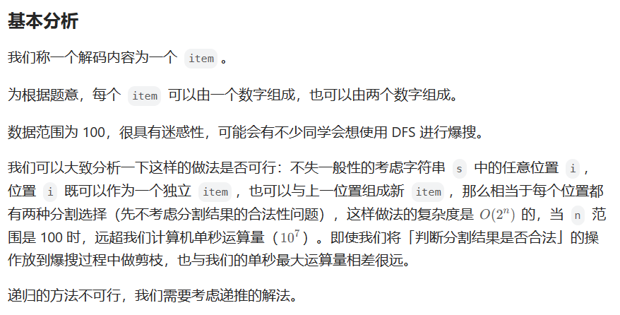
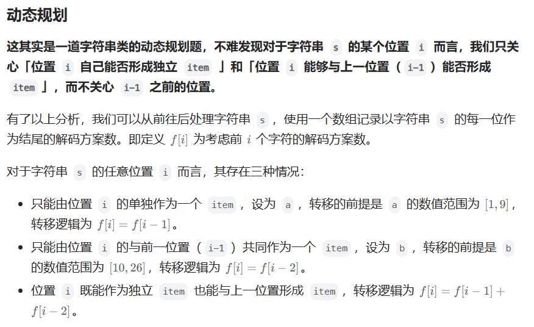
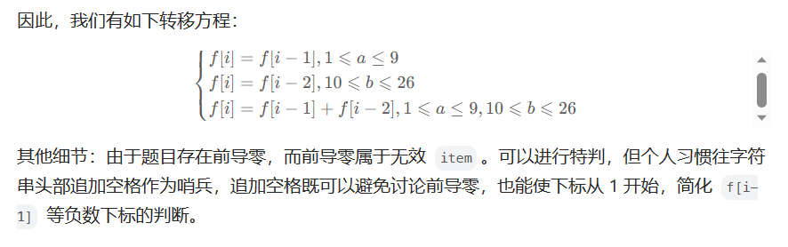

# [91.解码方法](https://leetcode.cn/problems/decode-ways/)

`时间：2023.8.4`

## 题目

一条包含字母 `A-Z` 的消息通过以下映射进行了 **编码** ：

```
'A' -> "1"
'B' -> "2"
...
'Z' -> "26"
```

要 **解码** 已编码的消息，所有数字必须基于上述映射的方法，反向映射回字母（可能有多种方法）。例如，`"11106"` 可以映射为：

- `"AAJF"` ，将消息分组为 `(1 1 10 6)`
- `"KJF"` ，将消息分组为 `(11 10 6)`

注意，消息不能分组为 `(1 11 06)` ，因为 `"06"` 不能映射为 `"F"` ，这是由于 `"6"` 和 `"06"` 在映射中并不等价。

给你一个只含数字的 **非空** 字符串 `s` ，请计算并返回 **解码** 方法的 **总数** 。

题目数据保证答案肯定是一个 **32 位** 的整数。

**示例1：**

```
输入：s = "12"
输出：2
解释：它可以解码为 "AB"（1 2）或者 "L"（12）。
```

**示例2：**

```
输入：s = "226"
输出：3
解释：它可以解码为 "BZ" (2 26), "VF" (22 6), 或者 "BBF" (2 2 6) 。
```

**示例3：**

```
输入：s = "06"
输出：0
解释："06" 无法映射到 "F" ，因为存在前导零（"6" 和 "06" 并不等价）。
```

**提示：**

- `1 <= s.length <= 100`
- `s` 只包含数字，并且可能包含前导零。

## 代码

#### 方法：动态规划

##### 思路

强烈推荐！！！！：[91. 解码方法 - 力扣（LeetCode）](https://leetcode.cn/problems/decode-ways/solutions/730937/gong-shui-san-xie-gen-ju-shu-ju-fan-wei-ug3dd/)







##### 代码

```java
class Solution {
    public int numDecodings(String s) {
        // 前导0失效，返回0
        if (s.charAt(0) == '0') {
            return 0;
        }
        int len = s.length();
        int[] dp = new int[len + 1];
        // 初始状态
        dp[0] = 1;
        dp[1] = 1;
        char[] chs = s.toCharArray();
        for (int i = 2; i <= len; i++) {
            // dp[i]对应于s.charAt(i - 1)
            // nowOne表示当前一位代表的数字
            int nowOne = chs[i - 1] - '0';
            // nowTwo表示当前位置以及前一位置组成的两位数
            int nowTwo = (chs[i - 2] - '0') * 10 + chs[i - 1] - '0';
            if (nowOne > 0 && nowOne <= 9) {
                dp[i] = dp[i - 1];
            }
            if (nowTwo >= 10 && nowTwo <= 26) {
                dp[i] += dp[i - 2];
            }
        }
        return dp[len];
    }

    public static void main(String[] args) {
        Solution sol = new Solution();
        String s = "226";
        int result = sol.numDecodings(s);
        System.out.println("result = " + result);
    }
}
```

##### 复杂度分析

- 时间复杂度：O(n)。共有n个状态需要被转移。
- 空间复杂度：O(n)。