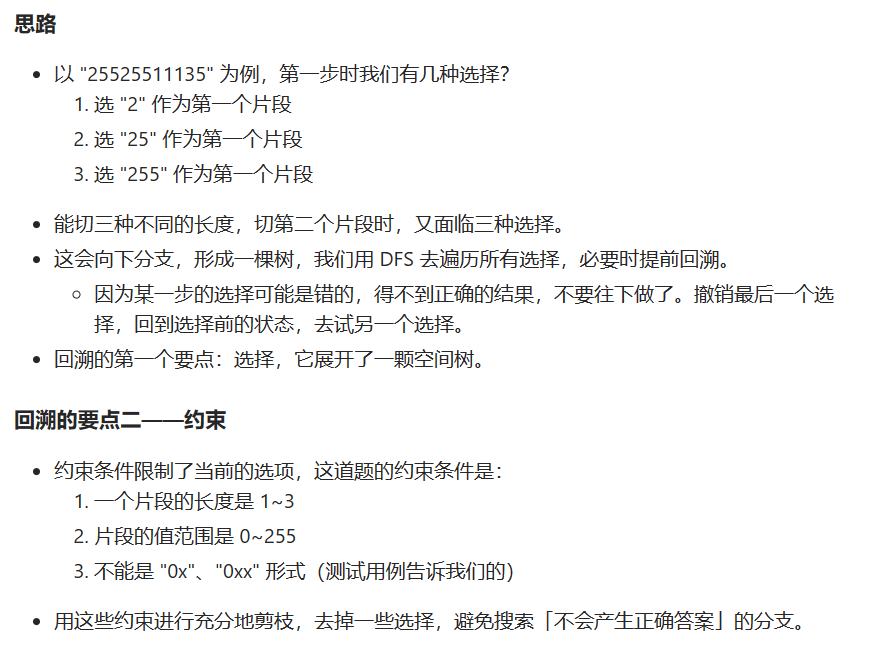
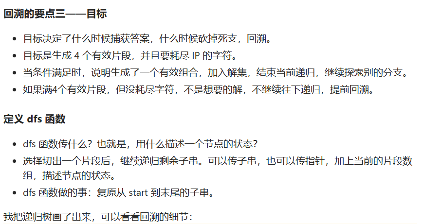
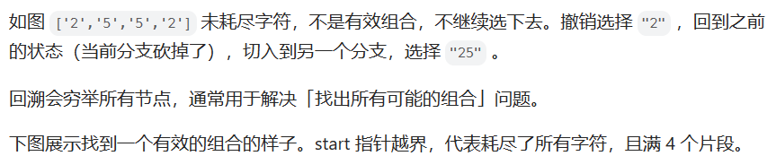

# [93.复原 IP 地址](https://leetcode.cn/problems/restore-ip-addresses/)

`时间：2023.8.6`

## 题目

**有效 IP 地址** 正好由四个整数（每个整数位于 `0` 到 `255` 之间组成，且不能含有前导 `0`），整数之间用 `'.'` 分隔。

- 例如：`"0.1.2.201"` 和 `"192.168.1.1"` 是 **有效** IP 地址，但是 `"0.011.255.245"`、`"192.168.1.312"` 和 `"192.168@1.1"` 是 **无效** IP 地址。

给定一个只包含数字的字符串 `s` ，用以表示一个 IP 地址，返回所有可能的**有效 IP 地址**，这些地址可以通过在 `s` 中插入 `'.'` 来形成。你 **不能** 重新排序或删除 `s` 中的任何数字。你可以按 **任何** 顺序返回答案。

**示例1：**

```
输入：s = "25525511135"
输出：["255.255.11.135","255.255.111.35"]
```

**示例2：**

```
输入：s = "0000"
输出：["0.0.0.0"]
```

**示例3：**

```
输入：s = "101023"
输出：["1.0.10.23","1.0.102.3","10.1.0.23","10.10.2.3","101.0.2.3"]
```

**提示：**

- `1 <= s.length <= 20`
- `s` 只包含数字。

## 代码

#### 方法：动态规划

##### 思路

强烈推荐！！！！：[93. 复原 IP 地址 - 力扣（LeetCode）](https://leetcode.cn/problems/restore-ip-addresses/solutions/366627/shou-hua-tu-jie-huan-yuan-dfs-hui-su-de-xi-jie-by-/)









##### 代码

```java
import java.util.List;
import java.util.ArrayList;

class Solution {
    public List<String> restoreIpAddresses(String s) {
        List<String> result = new ArrayList<>();
        // temp用于将原字符串截取分成四段
        List<String> temp = new ArrayList<>();
        int len = s.length();
        if (len <= 3 || len >= 13) {
            return result;
        }
        dfs(s, 0, result, temp);
        return result;
    }

    public void dfs(String s, int begin, List<String> result, List<String> temp) {
        // 满足要求：到字符串末尾 && 四个字符串
        if (begin == s.length() && temp.size() == 4) {
            StringBuilder sb = new StringBuilder();
            sb.append(temp.get(0));
            for (int i = 1; i < 4; i++) {
                sb.append(".").append(temp.get(i));
            }
            result.add(sb.toString());
        }
        // 未满足：四个字符串 && 未到达末尾
        if (begin < s.length() && temp.size() == 4) {
            return;
        }

        for (int len = 1; len <= 3; len++) {
            // 保证字符串未越界
            if (begin + len - 1 >= s.length()) {
                return;
            }
            // 剔除不合法的前导0
            if (len != 1 && s.charAt(begin) == '0') {
                return;
            }
            // 截取字符串
            String nowStr = s.substring(begin, begin + len);
            // 截取的字符串长度为3时，大小不能超过255
            if (len == 3 && Integer.parseInt(nowStr) > 255) {
                return;
            }
            temp.add(nowStr);
            dfs(s, begin + len, result, temp);
            temp.remove(temp.size() - 1);
        }
    }

    public static void main(String[] args) {
        Solution sol = new Solution();
        String str = "25525511135";
        List<String> result = sol.restoreIpAddresses(str);
        System.out.println(result);
    }
}
```

##### 复杂度分析

- 时间复杂度：O(much)。
- 空间复杂度：O(n)。