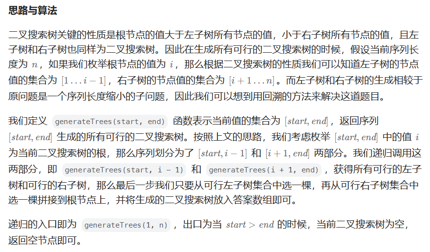
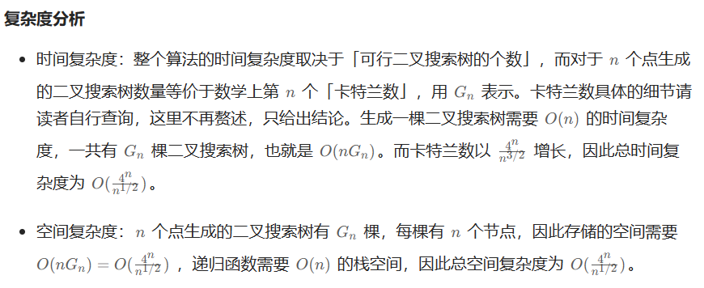

# [95.不同的二叉搜索树 II](https://leetcode.cn/problems/restore-ip-addresses/)

`时间：2023.8.6`

## 题目

给你一个整数 `n` ，请你生成并返回所有由 `n` 个节点组成且节点值从 `1` 到 `n` 互不相同的不同 **二叉搜索树** 。可以按 **任意顺序** 返回答案。

**示例1：**


```
输入：n = 3
输出：[[1,null,2,null,3],[1,null,3,2],[2,1,3],[3,1,null,null,2],[3,2,null,1]]
```

**示例2：**

```
输入：n = 1
输出：[[1]]
```

**提示：**

- `1 <= n <= 8`

## 代码

#### 方法：回溯

##### 思路

强烈推荐！！！！：[95. 不同的二叉搜索树 II - 力扣（LeetCode）](https://leetcode.cn/problems/unique-binary-search-trees-ii/solutions/339143/bu-tong-de-er-cha-sou-suo-shu-ii-by-leetcode-solut/)



##### 代码

```java
/**
 * Definition for a binary tree node.
 * public class TreeNode {
 *     int val;
 *     TreeNode left;
 *     TreeNode right;
 *     TreeNode() {}
 *     TreeNode(int val) { this.val = val; }
 *     TreeNode(int val, TreeNode left, TreeNode right) {
 *         this.val = val;
 *         this.left = left;
 *         this.right = right;
 *     }
 * }
 */
import java.util.List;
import java.util.ArrayList;

class Solution {
    public List<TreeNode> generateTrees(int n) {
        if (n == 0) {
            return new ArrayList<>();
        }
        return helper(1, n);
    }

    public List<TreeNode> helper(int start, int end) {
        List<TreeNode> allTrees = new ArrayList<>();
        if (start > end) {
            allTrees.add(null);
            return allTrees;
        }

        // 枚举可行根节点
        for (int i = start; i <= end; i++) {
            // 获得所有可行的左子树集合
            List<TreeNode> leftTrees = helper(start, i - 1);
            // 获得所有可行的右子树集合
            List<TreeNode> rightTrees = helper(i + 1, end);
            // 从左子树集合中选出一棵左子树，从右子树集合中选出一棵右子树，拼接到根节点上
            for (TreeNode left : leftTrees) {
                for (TreeNode right : rightTrees) {
                    TreeNode currTree = new TreeNode(i);
                    currTree.left = left;
                    currTree.right = right;
                    allTrees.add(currTree);
                }
            }
        }

        return allTrees;
    }

    public static void main(String[] args) {
        Solution solution = new Solution();
        int n = 3;
        List<TreeNode> result = solution.generateTrees(n);
        // 打印输出
        System.out.println("输出：");
        System.out.println(result);
    }
}
```

##### 复杂度分析

