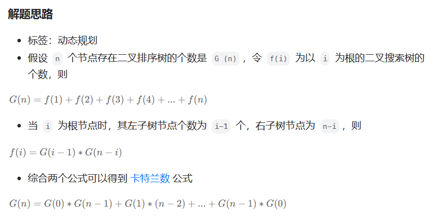
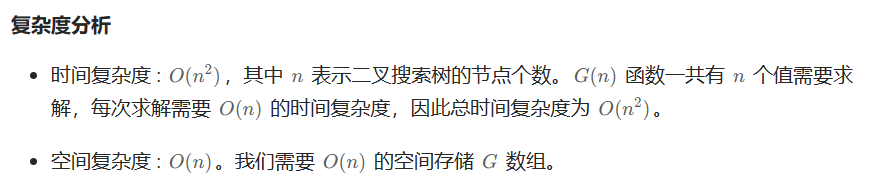

# [96.不同的二叉搜索树](https://leetcode.cn/problems/unique-binary-search-trees/)

`时间：2023.8.6`

## 题目

给你一个整数 `n` ，求恰由 `n` 个节点组成且节点值从 `1` 到 `n` 互不相同的 **二叉搜索树** 有多少种？返回满足题意的二叉搜索树的种数。

**示例1：**


```
输入：n = 3
输出：5
```

**示例2：**

```
输入：n = 1
输出：1
```

**提示：**

- `1 <= n <= 19`

## 代码

#### 方法：动态规划

##### 思路

强烈推荐！！！！：[96. 不同的二叉搜索树 - 力扣（LeetCode）](https://leetcode.cn/problems/unique-binary-search-trees/solutions/6693/hua-jie-suan-fa-96-bu-tong-de-er-cha-sou-suo-shu-b/)



##### 代码

```java
class Solution {
    public int numTrees(int n) {
        int[] dp = new int[n + 1];
        dp[0] = 1;
        dp[1] = 1;
        for (int i = 2; i <= n; i++) {
            for (int j = 0; j < i; j++) {
                dp[i] += dp[j] * dp[i - 1 - j];
            }
        }
        return dp[n];
    }

    public static void main(String[] args) {
        Solution sol = new Solution();
        int result = sol.numTrees(10);
        System.out.println("result = " + result);
    }
}
```

##### 复杂度分析

