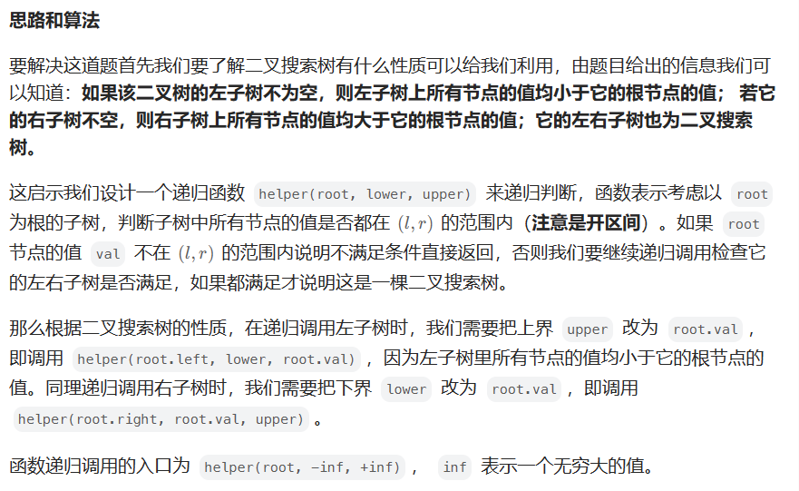

# [98.验证二叉搜索树](https://leetcode.cn/problems/validate-binary-search-tree/)

`时间：2023.8.7`

## 题目

给你一个二叉树的根节点 `root` ，判断其是否是一个有效的二叉搜索树。

**有效** 二叉搜索树定义如下：

- 节点的左子树只包含 **小于** 当前节点的数。
- 节点的右子树只包含 **大于** 当前节点的数。
- 所有左子树和右子树自身必须也是二叉搜索树。

**示例1：**


```
输入：root = [2,1,3]
输出：true
```

**示例2：**


```
输入：root = [5,1,4,null,null,3,6]
输出：false
解释：根节点的值是 5 ，但是右子节点的值是 4 。
```

## 代码

#### 方法一：递归法

##### 思路



##### 代码

```java
/**
 * Definition for a binary tree node.
 * public class TreeNode {
 *     int val;
 *     TreeNode left;
 *     TreeNode right;
 *     TreeNode() {}
 *     TreeNode(int val) { this.val = val; }
 *     TreeNode(int val, TreeNode left, TreeNode right) {
 *         this.val = val;
 *         this.left = left;
 *         this.right = right;
 *     }
 * }
 */
import java.util.List;
import java.util.ArrayList;

class Solution {
    // 法一：递归法
    public boolean isValidBST(TreeNode root) {
        return helper(root, Long.MIN_VALUE, Long.MAX_VALUE);
    }

    public boolean helper(TreeNode root, long lower, long upper) {
        if (root == null) {
            return true;
        }
        if (root.val <= lower || root.val >= upper) {
            return false;
        }
        return helper(root.left, lower, root.val) && helper(root.right, root.val, upper);
    }

    public void InOrder(TreeNode root, List<Integer> result) {
        if (root == null) {
            return;
        }
        InOrder(root.left, result);
        result.add(root.val);
        InOrder(root.right, result);
    }
}
```

##### 复杂度分析

- 时间复杂度：O(n)。其中n为二叉树的节点个数。在递归调用的时候二叉树的每个节点最多被访问一次。
- 空间复杂度：O(n)。其中n为二叉树的节点个数。递归函数在递归过程中需要为每一层递归函数分配栈空间，所以这里需要额外的空间且该空间取决于递归的深度，即二叉树的高度。

#### 方法二：中序遍历法

##### 思路

基于方法一中提及的性质，我们可以进一步知道二叉搜索树「中序遍历」得到的值构成的序列一定是升序的，这启示我们在中序遍历的时候实时检查当前节点的值是否大于前一个中序遍历到的节点的值即可。如果均大于说明这个序列是升序的，整棵树是二叉搜索树，否则不是，下面的代码我们使用栈来模拟中序遍历的过程。

##### 代码

```java
/**
 * Definition for a binary tree node.
 * public class TreeNode {
 *     int val;
 *     TreeNode left;
 *     TreeNode right;
 *     TreeNode() {}
 *     TreeNode(int val) { this.val = val; }
 *     TreeNode(int val, TreeNode left, TreeNode right) {
 *         this.val = val;
 *         this.left = left;
 *         this.right = right;
 *     }
 * }
 */
import java.util.List;
import java.util.ArrayList;

class Solution {
    // 法二：中序遍历法
    public boolean isValidBST(TreeNode root) {
        List<Integer> result = new ArrayList<>();
        InOrder(root, result);
        for (int i = 0; i < result.size() - 1; i++) {
            if (result.get(i) >= result.get(i + 1)) {
                return false;
            }
        }
        return true;
    }

    public void InOrder(TreeNode root, List<Integer> result) {
        if (root == null) {
            return;
        }
        InOrder(root.left, result);
        result.add(root.val);
        InOrder(root.right, result);
    }
}
```

##### 复杂度分析

- 时间复杂度：O(n)。其中 n 为二叉树的节点个数。二叉树的每个节点最多被访问一次。
- 空间复杂度：O(n)。其中n为二叉树的节点个数。二叉树的每个节点最多被访问一次，栈最多存储n个节点。