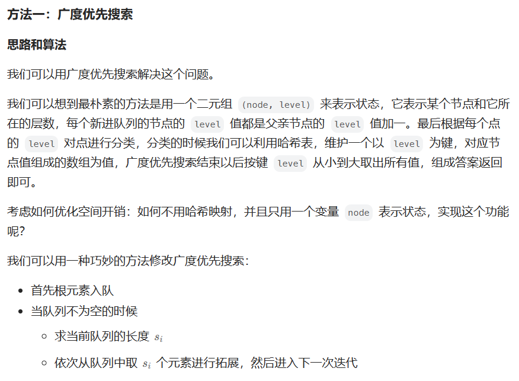
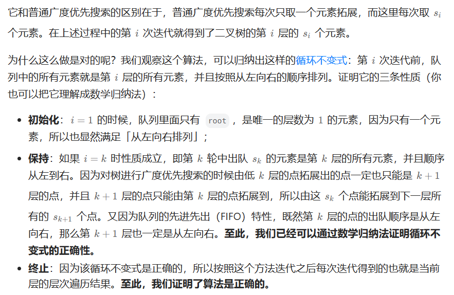

# [102.二叉树的层序遍历](https://leetcode.cn/problems/binary-tree-level-order-traversal/)

`时间：2023.8.9`

## 题目

给你二叉树的根节点 `root` ，返回其节点值的 **层序遍历** 。 （即逐层地，从左到右访问所有节点）。

**示例1：**


```
输入：root = [3,9,20,null,null,15,7]
输出：[[3],[9,20],[15,7]]
```

**示例2：**

```
输入：root = [1]
输出：[[1]]
```

**示例3：**

```
输入：root = []
输出：[]
```

## 代码

#### 方法：BFS广度优先搜索

##### 思路





##### 代码

```java
/**
 * Definition for a binary tree node.
 * public class TreeNode {
 *     int val;
 *     TreeNode left;
 *     TreeNode right;
 *     TreeNode() {}
 *     TreeNode(int val) { this.val = val; }
 *     TreeNode(int val, TreeNode left, TreeNode right) {
 *         this.val = val;
 *         this.left = left;
 *         this.right = right;
 *     }
 * }
 */
import java.util.List;
import java.util.ArrayList;
import java.util.Deque;
import java.util.ArrayDeque;

class Solution {
    public List<List<Integer>> levelOrder(TreeNode root) {
        List<List<Integer>> result = new ArrayList<>();
        if (root == null) {
            return result;
        }
        Deque<TreeNode> myqueue = new ArrayDeque<>();
        myqueue.offer(root);
        while (!myqueue.isEmpty()) {
            List<Integer> temp = new ArrayList<>();
            int size = myqueue.size();
            for (int i = 0; i < size; i++) {
                TreeNode nownode = myqueue.poll();
                temp.add(nownode.val);
                if (nownode.left != null) {
                    myqueue.offer(nownode.left);
                }
                if (nownode.right != null) {
                    myqueue.offer(nownode.right);
                }
            }
            result.add(temp);
        }
        return result;
    }
}
```

##### 复杂度分析

- 时间复杂度：O(n)。每个点进队出队各一次，故渐进时间复杂度为O(n)。
- 空间复杂度：O(n)。队列中元素的个数不超过n个，故渐进空间复杂度为O(n)。