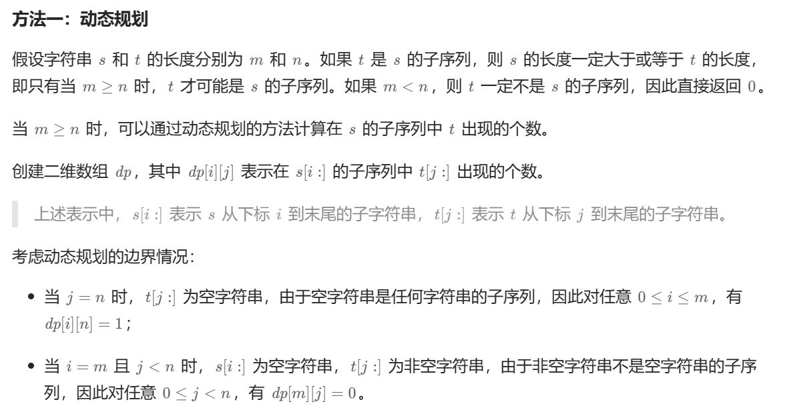
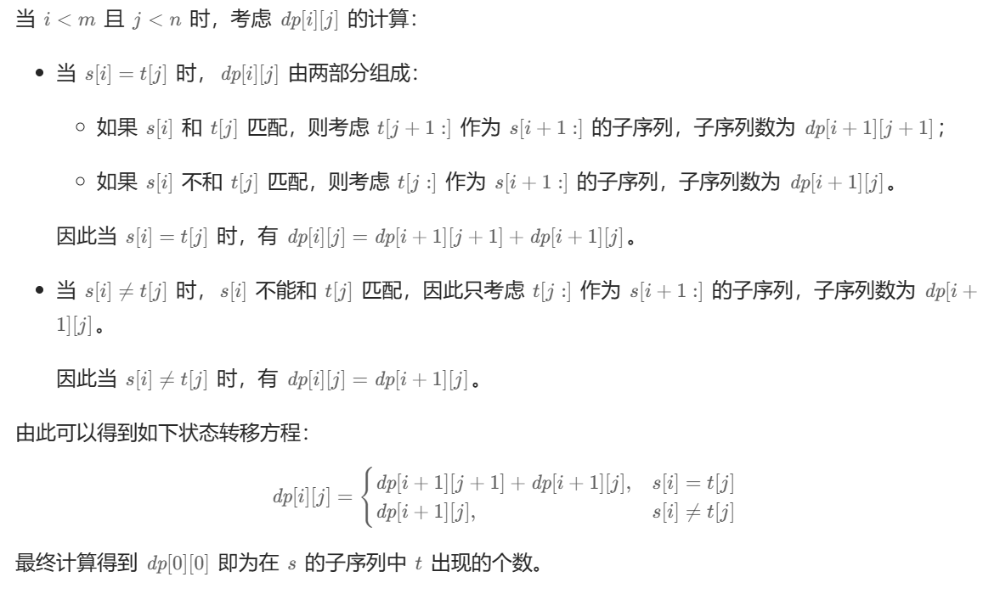
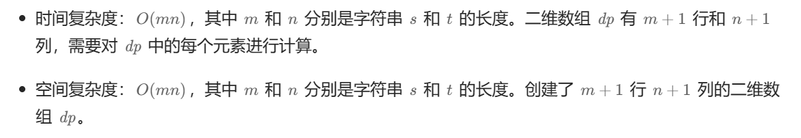

# [0114.不同的子序列](https://leetcode.cn/problems/distinct-subsequences/)

`时间：2023.11.5`

## 题目

给你两个字符串 `s` 和 `t` ，统计并返回在 `s` 的 **子序列** 中 `t` 出现的个数，结果需要对 10^9 + 7 取模。

**示例1：**

```
输入：s = "rabbbit", t = "rabbit"
输出：3
解释：
如下所示, 有 3 种可以从 s 中得到 "rabbit" 的方案。
rabbbit
rabbbit
rabbbit
```

**示例2：**

```
输入：s = "babgbag", t = "bag"
输出：5
解释：
如下所示, 有 5 种可以从 s 中得到 "bag" 的方案。 
babgbag
babgbag
babgbag
babgbag
babgbag
```

## 代码

#### 方法：动态规划

##### 思路

详见[115. 不同的子序列 - 力扣（LeetCode）](https://leetcode.cn/problems/distinct-subsequences/solutions/661122/bu-tong-de-zi-xu-lie-by-leetcode-solutio-urw3/)





##### 代码

```c++
#include <iostream>
#include <vector>

using namespace std;

class Solution {
public:
    // 动态规划算法
    int numDistinct(string s, string t) {
        int m = s.length(), n = t.length();
        if (m < n) {
            return 0;
        }
        vector<vector<int>> dp(m + 1, vector<int>(n + 1));
        for (int i = 0; i <= m; i++) {
            dp[i][n] = 1;
        }
        for (int j = 0; j < n; j++) {
            dp[m][j] = 0;
        }
        for (int i = m - 1; i >= 0; i--) {
            char sChar = s[i];
            for (int j = n - 1; j >= 0; j--) {
                char tChar = t[j];
                if (sChar == tChar) {
                    cout << "sChar = " << sChar << ", tChar = " << tChar << endl;
                    dp[i][j] = dp[i + 1][j] + dp[i + 1][j + 1];
                }
                else {
                    dp[i][j] = dp[i + 1][j];
                }
            }
        }
        return dp[0][0];
    }
};

int main() {
    Solution solution;
    string s = "babgbag";
    string t = "bag";
    int result = solution.numDistinct(s, t);
    cout << "result = " << result << endl;
    system("pause");
    return 0;
}
```

##### 复杂度分析

