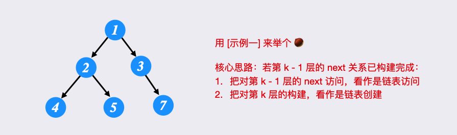
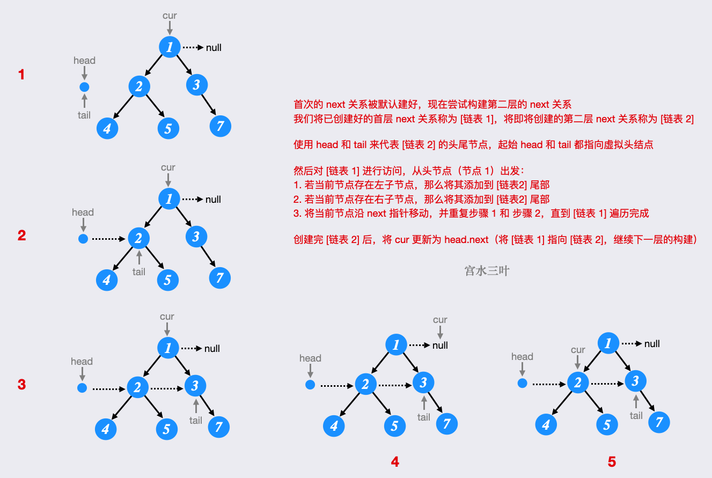
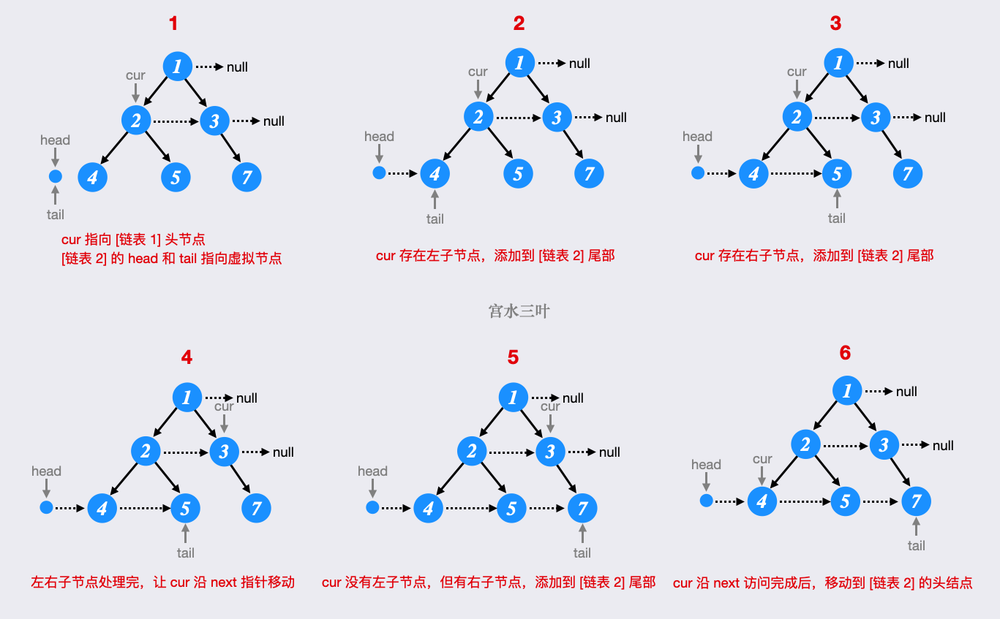

# [011.填充每个节点的下一个右侧节点指针 II](https://leetcode.cn/problems/populating-next-right-pointers-in-each-node-ii)

`时间：2023.11.4`

## 题目

给定一个二叉树：

```c++
struct Node {
  int val;
  Node *left;
  Node *right;
  Node *next;
}
```

填充它的每个 next 指针，让这个指针指向其下一个右侧节点。如果找不到下一个右侧节点，则将 next 指针设置为 `NULL`。

初始状态下，所有 next 指针都被设置为 `NULL`。

**进阶**：

- 你只能使用常量级额外空间。
- 使用递归解题也符合要求，本题中递归程序占用的栈空间不算做额外的空间复杂度。

**示例1：**


```
输入：root = [1,2,3,4,5,null,7]
输出：[1,#,2,3,#,4,5,7,#]
解释：给定二叉树如图 A 所示，你的函数应该填充它的每个 next 指针，以指向其下一个右侧节点，如图 B 所示。序列化输出按层序遍历顺序（由 next 指针连接），'#' 表示每层的末尾。
```

**示例2：**

```
输入：root = []
输出：[]
```

## 代码

#### 方法一：层次遍历

##### 思路

详见[117. 填充每个节点的下一个右侧节点指针 II - 力扣（LeetCode）](https://leetcode.cn/problems/populating-next-right-pointers-in-each-node-ii/solutions/2510505/gong-shui-san-xie-xiang-xi-tu-jie-o1-kon-d6vg/)解析

一个最直观的做法，是利用 `BFS` 对树进行「层序遍历」。

每个 `BFS` 回合中，对整层节点进行处理。

首先通过 `pop` 拿到当前节点，同时通过 `peek` 拿到当前层的下一节点，并建立 `next` 关系，注意需要跳过每层的最后一个节点。

##### 代码

```c++
#include <iostream>
#include <queue>

using namespace std;

// Definition for a Node.
class Node {
public:
    int val;
    Node* left;
    Node* right;
    Node* next;

    Node() : val(0), left(NULL), right(NULL), next(NULL) {}

    Node(int _val) : val(_val), left(NULL), right(NULL), next(NULL) {}

    Node(int _val, Node* _left, Node* _right, Node* _next)
        : val(_val), left(_left), right(_right), next(_next) {}
};

class Solution {
public:
    // 法一：队列层次遍历
    Node* connect(Node* root) {
        if (root == nullptr) {
            return root;
        }
        queue<Node*> myqueue;
        // 初始化，头节点入队列
        myqueue.push(root);
        // while循环迭代层数
        while (!myqueue.empty()) {
            // 队列大小
            int size = myqueue.size();
            for (int i = 0; i < size; i++) {
                Node* node = myqueue.front();
                myqueue.pop();
                // 连接
                if (i < size - 1) {
                    node->next = myqueue.front();
                }
                // 拓展下一层结点
                if (node->left != nullptr) {
                    myqueue.push(node->left);
                }
                if (node->right != nullptr) {
                    myqueue.push(node->right);
                }
            }
        }
        // 返回根节点
        return root;
    }
};
```

##### 复杂度分析

- 时间复杂度：O(n)，每个节点会被访问一次且只会被访问一次，即从队列中弹出，并建立 next 指针。

- 空间复杂度：O(n)。

#### 方法二：BFS使用已建立的 next 指针

##### 思路

详见[117. 填充每个节点的下一个右侧节点指针 II - 力扣（LeetCode）](https://leetcode.cn/problems/populating-next-right-pointers-in-each-node-ii/solutions/2510505/gong-shui-san-xie-xiang-xi-tu-jie-o1-kon-d6vg/)解析

上述解法中，每一层节点的 `next` 关系的构建都是独立的。我们构建第 `k` 层的 `next` 关系时，并没有利用已建好的到第 `k−1` 层的 `next` 关系。

实际上，每一层构建好的 `next` 关系都可看做「链表」，可参与到下一层 `next` 关系的构建，同时由于所有节点的起始 `next` 指向都是 `null`，相当于首层的 `next` 关系已经默认建好了。

我们使用图解方式，来感受逐层构建过程：







##### 代码

```c++
#include <iostream>
#include <queue>

using namespace std;

// Definition for a Node.
class Node {
public:
    int val;
    Node* left;
    Node* right;
    Node* next;

    Node() : val(0), left(NULL), right(NULL), next(NULL) {}

    Node(int _val) : val(_val), left(NULL), right(NULL), next(NULL) {}

    Node(int _val, Node* _left, Node* _right, Node* _next)
        : val(_val), left(_left), right(_right), next(_next) {}
};

class Solution {
public:
    // 法二：BFS使用已建立的 next 指针
    Node* connect(Node* root) {
        if (root == nullptr) {
            return root;
        }
        Node* cur = root;
        while (cur != nullptr) {
            Node* head = new Node(-1), *tail = head;
            for (Node* nownode = cur; nownode != nullptr; nownode = nownode->next) {
                if (nownode->left) {
                    tail->next = nownode->left;
                    tail = tail->next;
                }
                if (nownode->right) {
                    tail->next = nownode->right;
                    tail = tail->next;
                }
            }
            cur = head->next;
        }
        return root;
    }
};
```

##### 复杂度分析

- 时间复杂度：O(N)，每个节点只访问一次。
- 空间复杂度：O(1)，不需要存储额外的节点。