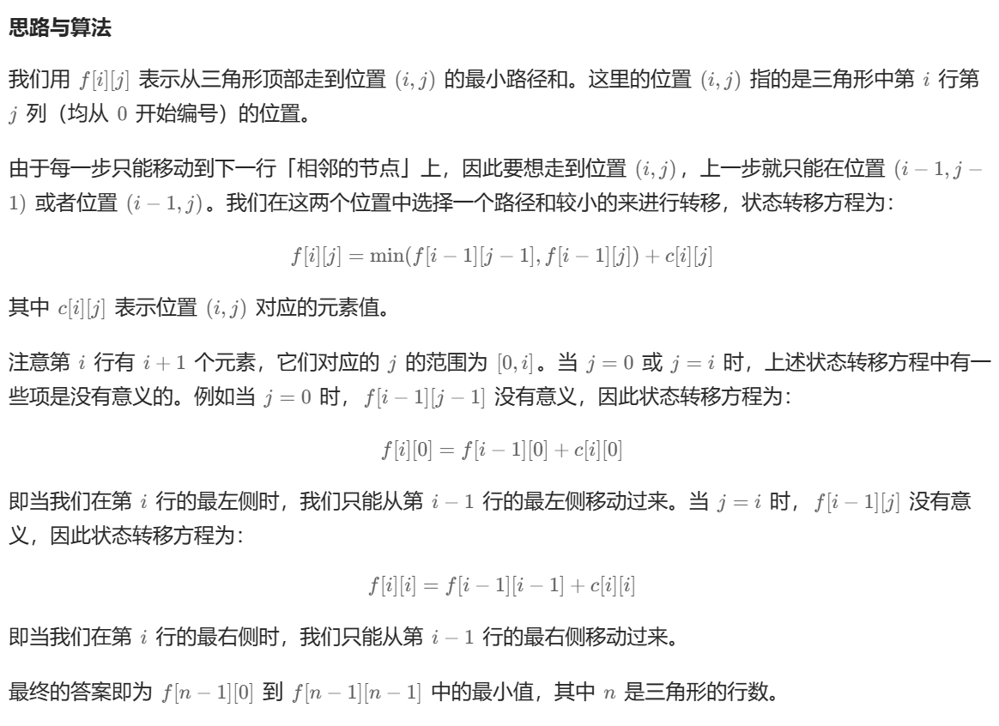

# [120.三角形最小路径和](https://leetcode.cn/problems/triangle/)

`时间：2023.8.14`

## 题目

给定一个三角形 `triangle` ，找出自顶向下的最小路径和。

每一步只能移动到下一行中相邻的结点上。**相邻的结点** 在这里指的是 **下标** 与 **上一层结点下标** 相同或者等于 **上一层结点下标 + 1** 的两个结点。也就是说，如果正位于当前行的下标 `i` ，那么下一步可以移动到下一行的下标 `i` 或 `i + 1` 。

**示例1：**

```
输入：triangle = [[2],[3,4],[6,5,7],[4,1,8,3]]
输出：11
解释：如下面简图所示：
   2
  3 4
 6 5 7
4 1 8 3
自顶向下的最小路径和为 11（即，2 + 3 + 5 + 1 = 11）。
```

**示例2：**

```
输入：triangle = [[-10]]
输出：-10
```

## 代码

#### 方法：动态规划 未优化时间复杂度情况

##### 思路



##### 代码

```java
import java.util.List;
import java.util.ArrayList;

class Solution {
    public int minimumTotal(List<List<Integer>> triangle) {
        List<List<Integer>> dp = new ArrayList<>();
        int length = triangle.size();
        // 第一行，边界情况
        List<Integer> rowOne = new ArrayList<>();
        rowOne.add(triangle.get(0).get(0));
        dp.add(rowOne);
        for (int i = 1; i < length; i++) {
            List<Integer> temp = new ArrayList<>();
            for (int j = 0; j < i + 1; j++) {
                // 头只能通过上一行的头得到
                if (j == 0) {
                    temp.add(triangle.get(i).get(j) + dp.get(i - 1).get(j));
                }
                // 尾只能通过上一行的尾得到
                else if (j == i) {
                    temp.add(triangle.get(i).get(j) + dp.get(i - 1).get(j - 1));
                }
                // 其他元素动规得到
                else {
                    temp.add(triangle.get(i).get(j) + Math.min(dp.get(i - 1).get(j - 1), dp.get(i - 1).get(j)));
                }
            }
            dp.add(temp);
        }
        int minSum = dp.get(length - 1).get(0);
        for (int i = 1; i < dp.get(length - 1).size(); i++) {
            minSum = Math.min(minSum, dp.get(length - 1).get(i));
        }
        return minSum;
    }
}
```

##### 复杂度分析

- 时间复杂度：O(n^2)。其中n是三角形的行数。
- 空间复杂度：O(n^2)。我们需要一个 n∗n 的二维数组存放所有的状态。