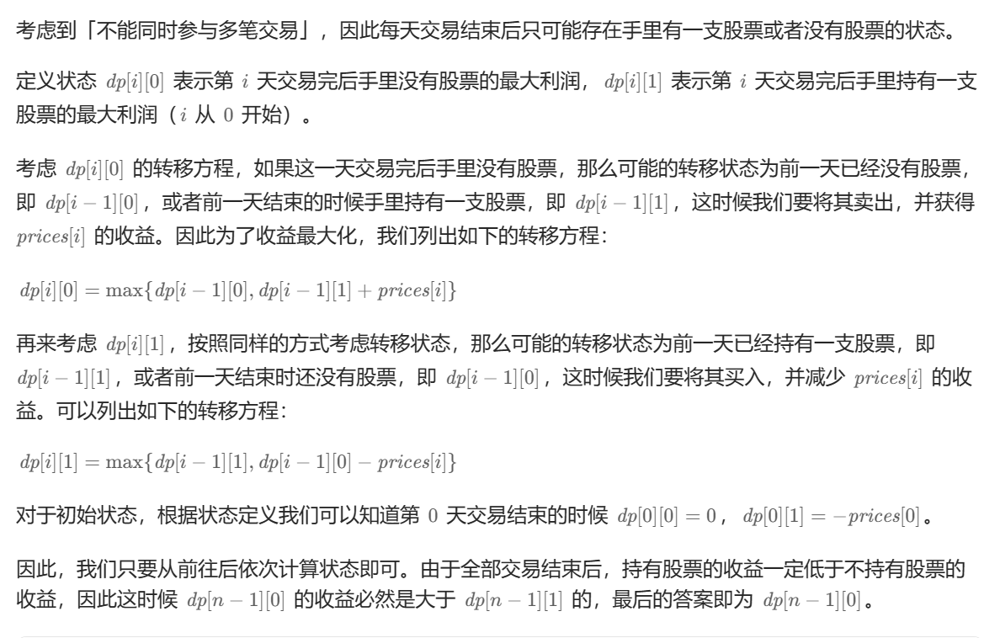
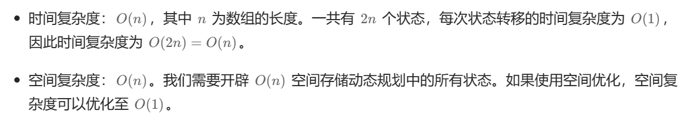

# [122.买卖股票的最佳时机 II](https://leetcode.cn/problems/best-time-to-buy-and-sell-stock-ii/)

`时间：2023.8.23`

## 题目

给你一个整数数组 `prices` ，其中 `prices[i]` 表示某支股票第 `i` 天的价格。

在每一天，你可以决定是否购买和/或出售股票。你在任何时候 **最多** 只能持有 **一股** 股票。你也可以先购买，然后在 **同一天** 出售。

返回 你能获得的 **最大** 利润 。

**示例1：**

```
输入：prices = [7,1,5,3,6,4]
输出：7
解释：在第 2 天（股票价格 = 1）的时候买入，在第 3 天（股票价格 = 5）的时候卖出, 这笔交易所能获得利润 = 5 - 1 = 4 。
     随后，在第 4 天（股票价格 = 3）的时候买入，在第 5 天（股票价格 = 6）的时候卖出, 这笔交易所能获得利润 = 6 - 3 = 3 。
     总利润为 4 + 3 = 7 。
```

**示例2：**

```
输入：prices = [1,2,3,4,5]
输出：4
解释：在第 1 天（股票价格 = 1）的时候买入，在第 5 天 （股票价格 = 5）的时候卖出, 这笔交易所能获得利润 = 5 - 1 = 4 。
     总利润为 4 。
```

**示例3：**

```
输入：prices = [7,6,4,3,1]
输出：0
解释：在这种情况下, 交易无法获得正利润，所以不参与交易可以获得最大利润，最大利润为 0 。
```

## 代码

#### 方法一：动态规划通用法

##### 思路



##### 代码

```java
class Solution {
    // 法一：动态规划通用法
    public int maxProfit(int[] prices) {
        int len = prices.length;
        if (len < 2) {
            return 0;
        }
        int[][] dp = new int[len][2];
        dp[0][1] -= prices[0];
        for (int i = 1; i < len; i++) {
            // 0：持有现金
            // 1：持有股票
            dp[i][0] = Math.max(dp[i - 1][0], dp[i - 1][1] + prices[i]);
            dp[i][1] = Math.max(dp[i - 1][1], dp[i - 1][0] - prices[i]);
        }
        return dp[len - 1][0];
    }
}
```

##### 复杂度分析



#### 方法二：贪心算法

##### 思路

依次判断当前股票价格与前一天大小关系，如果当天股票价格高于前一天，则将当天价格 - 前一天价格加入结果中。

##### 代码

```java
class Solution {
    // 法二：贪心算法
    public int maxProfit(int[] prices) {
        int len = prices.length;
        if (len < 2) {
            return 0;
        }
        int result = 0;
        for (int i = 1; i < len; i++) {
            if (prices[i] > prices[i - 1]) {
                result += prices[i] - prices[i - 1];
            }
        }
        return result;
    }

    public static void main(String[] args) {
        Solution sol = new Solution();
        int[] prices = {7,1,5,3,6,4};
        int result = sol.maxProfit(prices);
        System.out.println("result = " + result);
    }
}
```

##### 复杂度分析

- 时间复杂度：O(n)。其中 n 为数组的长度。我们只需要遍历一次数组即可。
- 空间复杂度：O(1)。只需要常数空间存放若干变量。