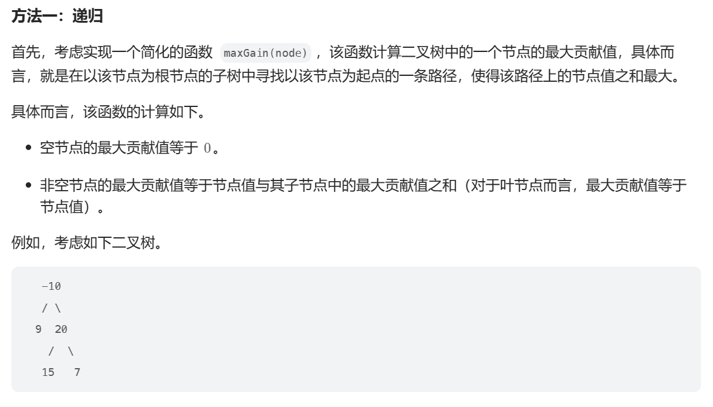
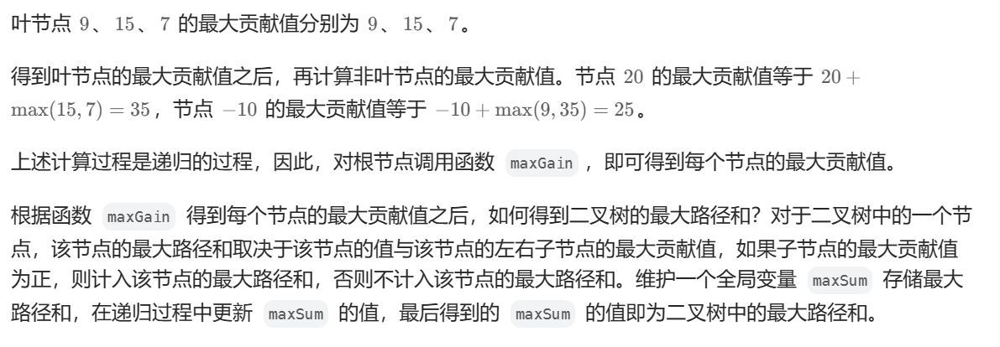
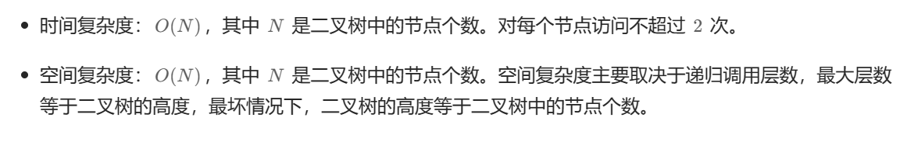

# [0124.二叉树中的最大路径和](https://leetcode.cn/problems/binary-tree-maximum-path-sum/)

`时间：2023.11.5`

## 题目

二叉树中的 **路径** 被定义为一条节点序列，序列中每对相邻节点之间都存在一条边。同一个节点在一条路径序列中 **至多出现一次** 。该路径 **至少包含一个** 节点，且不一定经过根节点。

**路径和** 是路径中各节点值的总和。

给你一个二叉树的根节点 root ，返回其 **最大路径和** 。

**示例1：**


```
输入：root = [1,2,3]
输出：6
解释：最优路径是 2 -> 1 -> 3 ，路径和为 2 + 1 + 3 = 6
```

**示例2：**


```
输入：root = [-10,9,20,null,null,15,7]
输出：42
解释：最优路径是 15 -> 20 -> 7 ，路径和为 15 + 20 + 7 = 42
```

## 代码

#### 方法一：动态规划

##### 思路





##### 代码

```c++
#include <iostream>
#include <climits>
#include <math.h>

using namespace std;

// Definition for a binary tree node.
struct TreeNode {
    int val;
    TreeNode *left;
    TreeNode *right;
    TreeNode() : val(0), left(nullptr), right(nullptr) {}
    TreeNode(int x) : val(x), left(nullptr), right(nullptr) {}
    TreeNode(int x, TreeNode *left, TreeNode *right) : val(x), left(left), right(right) {}
};

class Solution {
private:
    int maxSum = INT_MIN;
public:
    int maxPathSum(TreeNode* root) {
        helper(root);
        return maxSum;
    }

    int helper(TreeNode* node) {
        if (node == nullptr) {
            return 0;
        }
        // 计算左边分支最大值，左边分支如果为负数还不如不选择
        int leftGain = max(helper(node->left), 0);
        // 计算右边分支最大值，右边分支如果为负数还不如不选择
        int rightGain = max(helper(node->right), 0);

        // left->root->right 作为路径与已经计算过历史最大值做比较
        int priceNewpath = node->val + leftGain + rightGain;
        maxSum = max(maxSum, priceNewpath);
        // 返回经过root的单边最大分支给当前root的父节点计算使用
        return node->val + max(leftGain, rightGain);
    }
};
```

##### 复杂度分析

