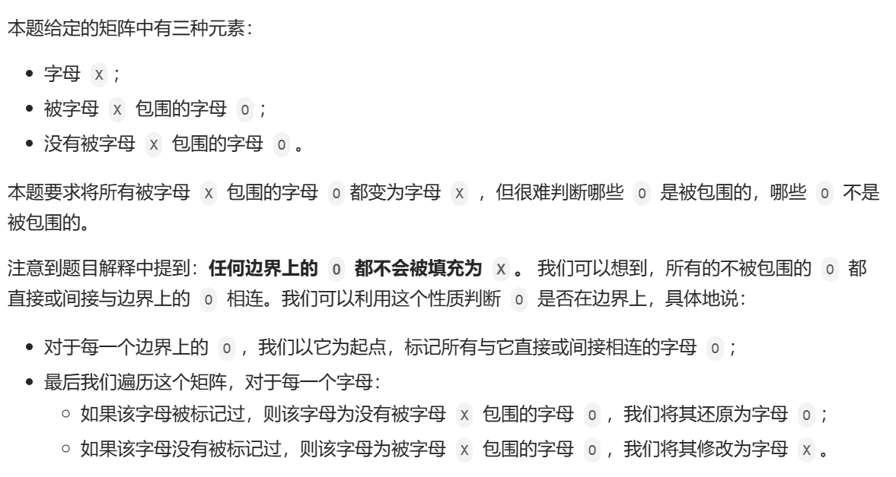
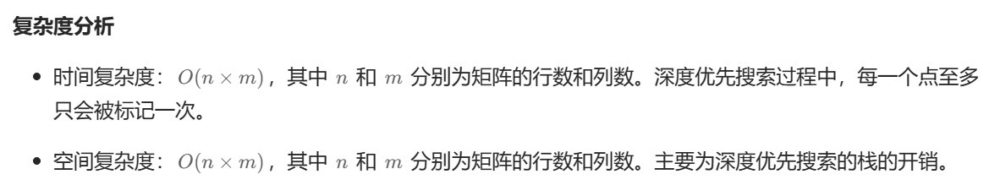

# [0130.被围绕的区域](https://leetcode.cn/problems/surrounded-regions/)

`时间：2023.11.6`

## 题目

给你一个 `m x n` 的矩阵 `board` ，由若干字符 `'X'` 和 `'O'` ，找到所有被 `'X'` 围绕的区域，并将这些区域里所有的 `'O'` 用 `'X'` 填充。

**示例1：**


```
输入：board = [["X","X","X","X"],["X","O","O","X"],["X","X","O","X"],["X","O","X","X"]]
输出：[["X","X","X","X"],["X","X","X","X"],["X","X","X","X"],["X","O","X","X"]]
解释：被围绕的区间不会存在于边界上，换句话说，任何边界上的 'O' 都不会被填充为 'X'。 任何不在边界上，或不与边界上的 'O' 相连的 'O' 最终都会被填充为 'X'。如果两个元素在水平或垂直方向相邻，则称它们是“相连”的。
```

**示例2：**

```
输入：board = [["X"]]
输出：[["X"]]
```

## 代码

#### 方法：dfs深度优先搜索

##### 思路



##### 代码

```c++
#include <iostream>
#include <vector>

using namespace std;

class Solution {
public:
    int n, m;

    void solve(vector<vector<char>>& board) {
        n = board.size(), m = board[0].size();
        if (n == 0) {
            return;
        }
        for (int i = 0; i < n; i++) {
            dfs(board, i, 0);
            dfs(board, i, m - 1);
        }
        for (int i = 1; i < m - 1; i++) {
            dfs(board, 0, i);
            dfs(board, n - 1, i);
        }
        for (int i = 0; i < n; i++) {
            for (int j = 0; j < m; j++) {
                if (board[i][j] == 'A') {
                    board[i][j] = 'O';
                }
                else if (board[i][j] == 'O') {
                    board[i][j] = 'X';
                }
            }
        }
    }

    void dfs(vector<vector<char>>& board, int x, int y) {
        if (x < 0 || x >= n || y < 0 || y >= m || board[x][y] != 'O') {
            return;
        }
        board[x][y] = 'A';
        dfs(board, x + 1, y);
        dfs(board, x - 1, y);
        dfs(board, x, y + 1);
        dfs(board, x, y - 1);
    }
};

int main() {
    Solution sol;
    vector<vector<char>> board = {
        {'X', 'X', 'X', 'X'},
        {'X', 'O', 'O', 'X'},
        {'X', 'X', 'O', 'X'},
        {'X', 'O', 'X', 'X'}
    };

    sol.solve(board);

    cout << "Updated board:" << endl;
    for (const vector<char>& row : board) {
        for (char cell : row) {
            cout << cell << " ";
        }
        cout << endl;
    }
    system("pause");
    return 0;
}
```

##### 复杂度分析

