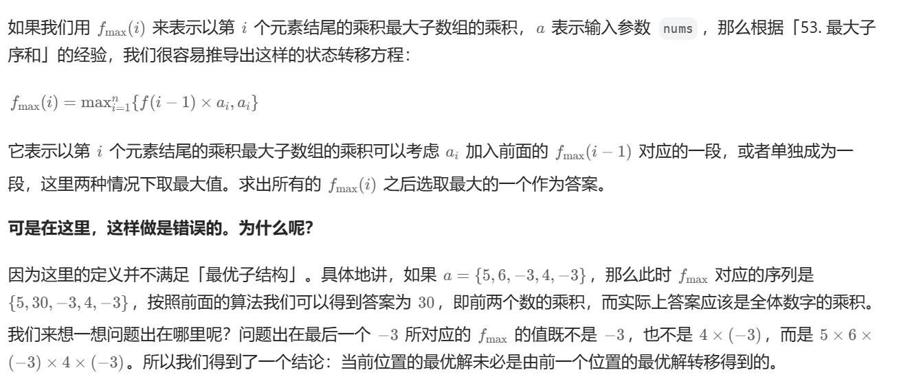
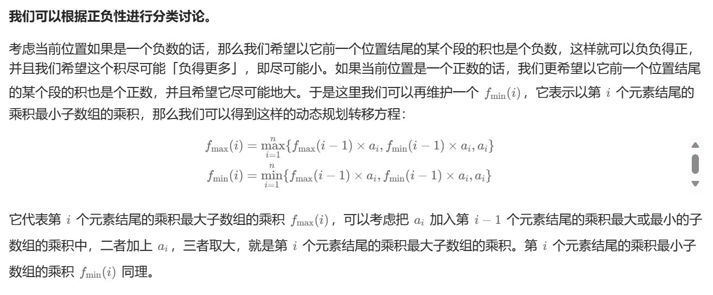

# [0152.乘积最大子数组](https://leetcode.cn/problems/maximum-product-subarray/)

`时间：2023.11.9`

## 题目

给你一个整数数组 `nums` ，请你找出数组中乘积最大的非空连续子数组（该子数组中至少包含一个数字），并返回该子数组所对应的乘积。

测试用例的答案是一个 **32-位** 整数。

**子数组** 是数组的连续子序列。

**示例1：**

```
输入: nums = [2,3,-2,4]
输出: 6
解释: 子数组 [2,3] 有最大乘积 6。
```

**示例2：**

```
输入: nums = [-2,0,-1]
输出: 0
解释: 结果不能为 2, 因为 [-2,-1] 不是子数组。
```

## 代码

#### 方法：dfs深度优先搜索

##### 思路





##### 代码

```c++
#include <iostream>
#include <vector>

using namespace std;

class Solution {
public:
    int maxProduct(vector<int>& nums) {
        vector<int> arrayMax(nums.size()), arrayMin(nums.size());
        arrayMax[0] = arrayMin[0] = nums[0];
        int MAX = nums[0];
        for (unsigned int i = 1; i < nums.size(); i++) {
            arrayMax[i] = max(max(arrayMax[i - 1] * nums[i], arrayMin[i - 1] * nums[i]), nums[i]);
            arrayMin[i] = min(min(arrayMax[i - 1] * nums[i], arrayMin[i - 1] * nums[i]), nums[i]);
            MAX = max(MAX, arrayMax[i]);
        }
        return MAX;
    }
};

int main() {
    Solution sol;
    vector<int> nums = {2,3,-2,4};
    int result = sol.maxProduct(nums);
    cout << "result = " << result << endl;
    system("pause");
    return 0;
}
```

##### 复杂度分析

- 时间复杂度：O(N)。
- 空间复杂度：O(N)。