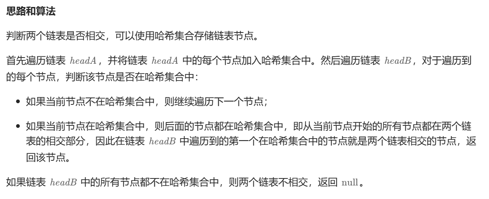

# [0160.相交链表](https://leetcode.cn/problems/intersection-of-two-linked-lists/)

`时间：2023.11.3`

## 题目

给你两个单链表的头节点 `headA` 和 `headB` ，请你找出并返回两个单链表相交的起始节点。如果两个链表不存在相交节点，返回 `null` 。

图示两个链表在节点 `c1` 开始相交：


题目数据 **保证** 整个链式结构中不存在环。

注意，函数返回结果后，链表必须 **保持其原始结构** 。

**示例1：**


```
输入：intersectVal = 8, listA = [4,1,8,4,5], listB = [5,6,1,8,4,5], skipA = 2, skipB = 3
输出：Intersected at '8'
解释：相交节点的值为 8 （注意，如果两个链表相交则不能为 0）。
从各自的表头开始算起，链表 A 为 [4,1,8,4,5]，链表 B 为 [5,6,1,8,4,5]。
在 A 中，相交节点前有 2 个节点；在 B 中，相交节点前有 3 个节点。
— 请注意相交节点的值不为 1，因为在链表 A 和链表 B 之中值为 1 的节点 (A 中第二个节点和 B 中第三个节点) 是不同的节点。换句话说，它们在内存中指向两个不同的位置，而链表 A 和链表 B 中值为 8 的节点 (A 中第三个节点，B 中第四个节点) 在内存中指向相同的位置。
```

**示例2：**


```
输入：intersectVal = 2, listA = [1,9,1,2,4], listB = [3,2,4], skipA = 3, skipB = 1
输出：Intersected at '2'
解释：相交节点的值为 2 （注意，如果两个链表相交则不能为 0）。
从各自的表头开始算起，链表 A 为 [1,9,1,2,4]，链表 B 为 [3,2,4]。
在 A 中，相交节点前有 3 个节点；在 B 中，相交节点前有 1 个节点。
```

**示例3：**


```
输入：intersectVal = 0, listA = [2,6,4], listB = [1,5], skipA = 3, skipB = 2
输出：null
解释：从各自的表头开始算起，链表 A 为 [2,6,4]，链表 B 为 [1,5]。
由于这两个链表不相交，所以 intersectVal 必须为 0，而 skipA 和 skipB 可以是任意值。
这两个链表不相交，因此返回 null 。
```

**进阶**：你能否设计一个时间复杂度 `O(m + n)` 、仅用 `O(1)` 内存的解决方案？

## 代码

#### 方法一：双指针法

##### 思路


##### 代码

```c++
#include <iostream>
#include <unordered_map>

using namespace std;

// Definition for singly-linked list.
struct ListNode {
    int val;
    ListNode *next;
    ListNode(int x) : val(x), next(NULL) {}
};

class Solution {
public:
    // 法一：双指针
    ListNode *getIntersectionNode(ListNode *headA, ListNode *headB) {
        if (headA == nullptr || headB == nullptr) {
            return nullptr;
        }
        ListNode *pA = headA, *pB = headB;
        while (pA != pB) {
            pA = pA == nullptr ? headB : pA->next;
            pB = pB == nullptr ? headA : pB->next;
        }
        return pA;
    }
};

int main() {
    // Create the intersected linked lists
    ListNode *listA = new ListNode(4);
    listA->next = new ListNode(1);
    listA->next->next = new ListNode(8);
    listA->next->next->next = new ListNode(4);
    listA->next->next->next->next = new ListNode(5);

    ListNode *listB = new ListNode(5);
    listB->next = new ListNode(6);
    listB->next->next = new ListNode(1);
    // Make them intersect at node with value 8
    listB->next->next->next = listA->next->next;

    Solution solution;
    ListNode *intersectionNode = solution.getIntersectionNode(listA, listB);

    if (intersectionNode != nullptr) {
        cout << "Intersected at '" << intersectionNode->val << "'" << endl;
    } else {
        cout << "No intersection found." << endl;
    }

    // Free memory by deleting the linked lists
    delete listA;
    delete listB;

    system("pause");

    return 0;
}
```

##### 复杂度分析

- 时间复杂度：O(m+n)，其中 m 和 n 是分别是链表 `headA` 和 `headB` 的长度。两个指针同时遍历两个链表，每个指针遍历两个链表各一次。
- 空间复杂度：O(1)。

#### 方法二：哈希集合

##### 思路



##### 代码

```c++
#include <iostream>
#include <unordered_map>

using namespace std;

// Definition for singly-linked list.
struct ListNode {
    int val;
    ListNode *next;
    ListNode(int x) : val(x), next(NULL) {}
};

class Solution {
public:
    // 法二：哈希表法
    ListNode *getIntersectionNode(ListNode *headA, ListNode *headB) {
        unordered_map<ListNode *, int> myMap;
        ListNode *temp = headA;
        while (temp != nullptr) {
            myMap[temp]++;
            temp = temp->next;
        }
        temp = headB;
        while (temp != nullptr) {
            if (myMap[temp] > 0) {
                return temp;
            }
            temp = temp->next;
        }
        return nullptr;
    }
};

int main() {
    // Create the intersected linked lists
    ListNode *listA = new ListNode(4);
    listA->next = new ListNode(1);
    listA->next->next = new ListNode(8);
    listA->next->next->next = new ListNode(4);
    listA->next->next->next->next = new ListNode(5);

    ListNode *listB = new ListNode(5);
    listB->next = new ListNode(6);
    listB->next->next = new ListNode(1);
    // Make them intersect at node with value 8
    listB->next->next->next = listA->next->next;

    Solution solution;
    ListNode *intersectionNode = solution.getIntersectionNode(listA, listB);

    if (intersectionNode != nullptr) {
        cout << "Intersected at '" << intersectionNode->val << "'" << endl;
    } else {
        cout << "No intersection found." << endl;
    }

    // Free memory by deleting the linked lists
    delete listA;
    delete listB;

    system("pause");

    return 0;
}
```

##### 复杂度分析

- 时间复杂度：O(m+n)，其中 m 和 n 是分别是链表 headA 和 headB 的长度。需要遍历两个链表各一次。
- 空间复杂度：O(m)，其中 m 是链表 headA 的长度。需要使用哈希集合存储链表 headA 中的全部节点。