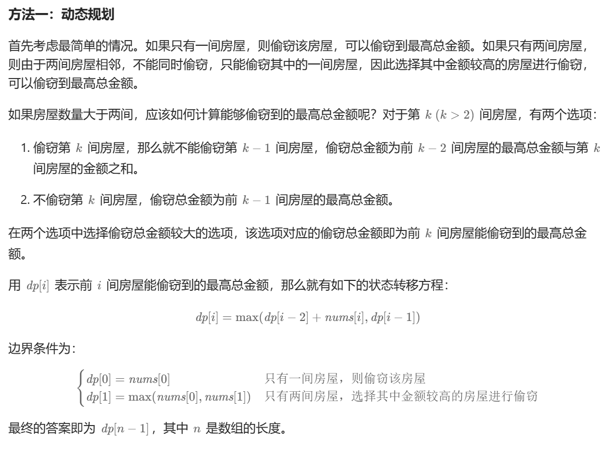

# [0198.打家劫舍](https://leetcode.cn/problems/house-robber/)

`时间：2023.11.12`

## 题目

你是一个专业的小偷，计划偷窃沿街的房屋。每间房内都藏有一定的现金，影响你偷窃的唯一制约因素就是相邻的房屋装有相互连通的防盗系统，**如果两间相邻的房屋在同一晚上被小偷闯入，系统会自动报警**。

给定一个代表每个房屋存放金额的非负整数数组，计算你 **不触动警报装置的情况下** ，一夜之内能够偷窃到的最高金额。

**示例1：**

```
输入：[1,2,3,1]
输出：4
解释：偷窃 1 号房屋 (金额 = 1) ，然后偷窃 3 号房屋 (金额 = 3)。
     偷窃到的最高金额 = 1 + 3 = 4 。
```

**示例2：**

```
输入：[2,7,9,3,1]
输出：12
解释：偷窃 1 号房屋 (金额 = 2), 偷窃 3 号房屋 (金额 = 9)，接着偷窃 5 号房屋 (金额 = 1)。
     偷窃到的最高金额 = 2 + 9 + 1 = 12 。
```

## 代码

#### 方法：动态规划

##### 思路



##### 代码

```c++
#include <iostream>
#include <vector>

using namespace std;

class Solution {
public:
    int rob(vector<int>& nums) {
        int length = nums.size();
        if (length == 0) {
            return 0;
        }
        if (length == 1) {
            return nums[0];
        }
        vector<int> dp = vector<int>(length, 0);
        dp[0] = nums[0];
        dp[1] = max(nums[0], nums[1]);
        for (int i = 2; i < length; i++) {
            dp[i] = max(dp[i - 1], dp[i - 2] + nums[i]);
        }
        return dp[length - 1];
    }
};

int main() {
    Solution sol;
    vector<int> nums = {2,7,9,3,1};
    int result = sol.rob(nums);
    cout << "result = " << result << endl;
    system("pause");
    return 0;
}
```

##### 复杂度分析

- 时间复杂度：O(n)。其中 n 是数组长度。只需要对数组遍历一次。
- 空间复杂度：O(n)。
