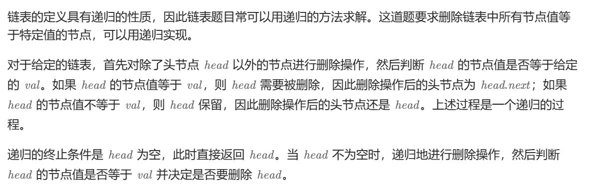
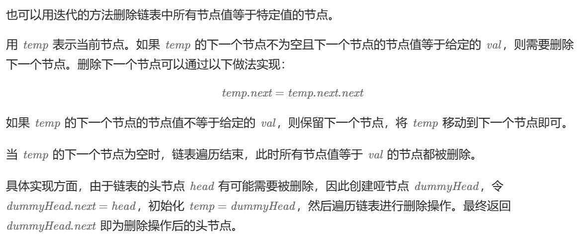

# [0203.移除链表元素](https://leetcode.cn/problems/remove-linked-list-elements/)

`时间：2023.11.13`

## 题目

给你一个链表的头节点 `head` 和一个整数 `val` ，请你删除链表中所有满足 `Node.val == val` 的节点，并返回 **新的头节点** 。

**示例1：**


```
输入：head = [1,2,6,3,4,5,6], val = 6
输出：[1,2,3,4,5]
```

**示例2：**

```
输入：head = [], val = 1
输出：[]
```

**示例3：**

```
输入：head = [7,7,7,7], val = 7
输出：[]
```

## 代码

#### 方法一：递归法

##### 思路



##### 代码

```c++
#include <iostream>

using namespace std;

// Definition for singly-linked list.
struct ListNode {
    int val;
    ListNode *next;
    ListNode() : val(0), next(nullptr) {}
    ListNode(int x) : val(x), next(nullptr) {}
    ListNode(int x, ListNode *next) : val(x), next(next) {}
};

class Solution {
public:
    // 法一：递归
    ListNode* removeElements(ListNode* head, int val) {
        if (head == nullptr) {
            return head;
        }
        head->next = removeElements(head->next, val);
        return head->val == val ? head->next : head;
    }
};
```

##### 复杂度分析

- 时间复杂度：O(n)，其中 n 是链表的长度。递归过程中需要遍历链表一次。
- 空间复杂度：O(n)。其中 n 是链表的长度。空间复杂度主要取决于递归调用栈，最多不会超过 n 层。

#### 方法二：迭代法

##### 思路



##### 代码

```c++
#include <iostream>

using namespace std;

// Definition for singly-linked list.
struct ListNode {
    int val;
    ListNode *next;
    ListNode() : val(0), next(nullptr) {}
    ListNode(int x) : val(x), next(nullptr) {}
    ListNode(int x, ListNode *next) : val(x), next(next) {}
};

class Solution {
public:
    // 法二：迭代
    ListNode* removeElements(ListNode* head, int val) {
        struct ListNode* dummyHead = new ListNode(0, head);
        struct ListNode* temp = dummyHead;
        while (temp->next != nullptr) {
            if (temp->next->val == val) {
                temp->next = temp->next->next;
            }
            else {
                temp = temp->next;
            }
        }
        return dummyHead->next;
    }
};
```

##### 复杂度分析

- 时间复杂度：O(⁡n)。其中 n 是链表的长度。递归过程中需要遍历链表一次。
- 空间复杂度：O(1)。