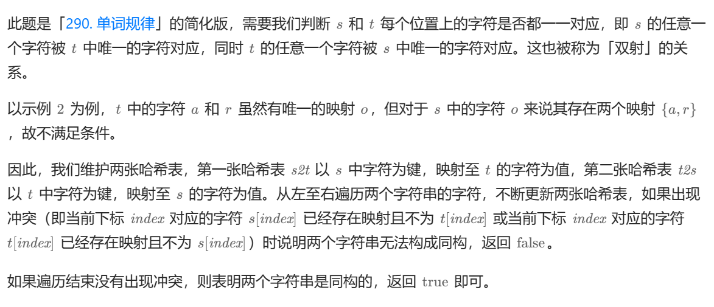
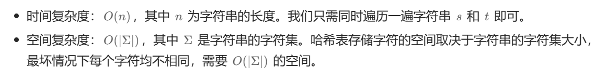

# [0205.同构字符串](https://leetcode.cn/problems/isomorphic-strings/)

`时间：2023.11.13`

## 题目

给定两个字符串 `s` 和 `t` ，判断它们是否是同构的。

如果 `s` 中的字符可以按某种映射关系替换得到 `t` ，那么这两个字符串是同构的。

每个出现的字符都应当映射到另一个字符，同时不改变字符的顺序。不同字符不能映射到同一个字符上，相同字符只能映射到同一个字符上，字符可以映射到自己本身。

**示例1：**

```
输入：s = "egg", t = "add"
输出：true
```

**示例2：**

```
输入：s = "foo", t = "bar"
输出：false
```

**示例3：**

```
输入：s = "paper", t = "title"
输出：true
```

## 代码

#### 方法：哈希表法

##### 思路



##### 代码

```c++
#include <iostream>
#include <unordered_map>

using namespace std;

class Solution {
public:
    // 哈希表法
    bool isIsomorphic(string s, string t) {
        unordered_map<char, char> s2t;
        unordered_map<char, char> t2s;
        int len = s.length();
        for (int i = 0; i < len; i++) {
            char x = s[i], y = t[i];
            if ((s2t.count(x) && s2t[x] != y) || (t2s.count(y) && t2s[y] != x)) {
                return false;
            }
            s2t[x] = y;
            t2s[y] = x;
        }
        return true;
    }
};

int main() {
    Solution sol;
    string s = "egg", t = "add";
    bool result = sol.isIsomorphic(s, t);
    cout << "result = " << result << endl;
    system("pause");
    return 0;
}
```

##### 复杂度分析


