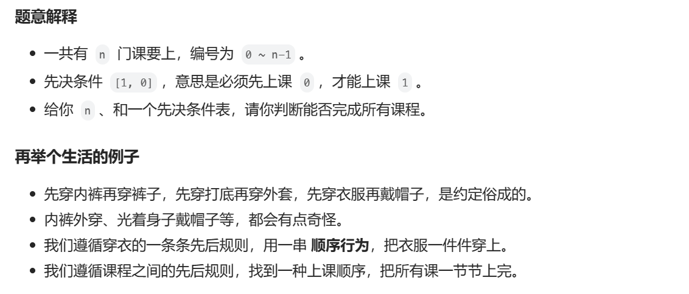
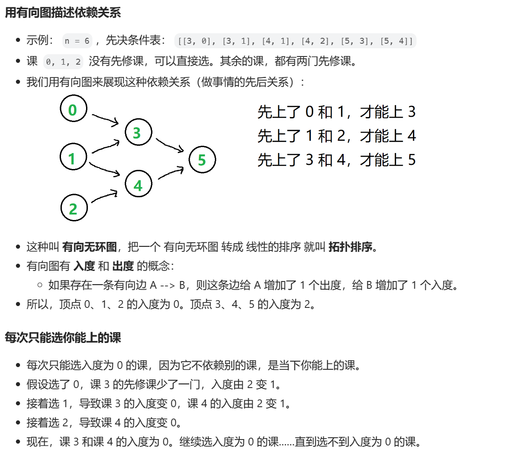
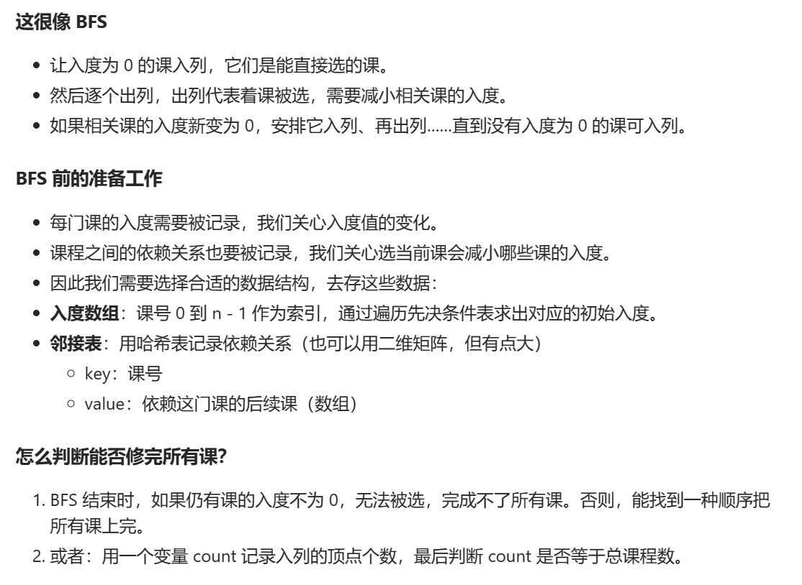
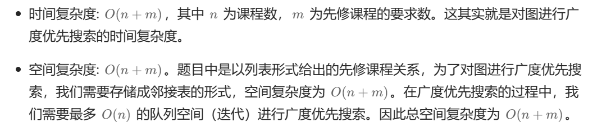

# [0207.课程表](https://leetcode.cn/problems/course-schedule/)

`时间：2023.12.9`

## 题目

你这个学期必须选修 `numCourses` 门课程，记为 `0` 到 `numCourses - 1` 。

在选修某些课程之前需要一些先修课程。 先修课程按数组 `prerequisites` 给出，其中 `prerequisites[i] = [ai, bi]` ，表示如果要学习课程 `ai` 则 **必须** 先学习课程 `bi` 。

- 例如，先修课程对 `[0, 1]` 表示：想要学习课程 `0` ，你需要先完成课程 `1` 。
请你判断是否可能完成所有课程的学习？如果可以，返回 `true` ；否则，返回 `false` 。

**示例1：**

```
输入：numCourses = 2, prerequisites = [[1,0]]
输出：true
解释：总共有 2 门课程。学习课程 1 之前，你需要完成课程 0 。这是可能的。
```

**示例2：**

```
输入：numCourses = 2, prerequisites = [[1,0],[0,1]]
输出：false
解释：总共有 2 门课程。学习课程 1 之前，你需要先完成​课程 0 ；并且学习课程 0 之前，你还应先完成课程 1 。这是不可能的。
```

## 代码

#### 方法：广度优先搜索

##### 思路







##### 代码

```c++
#include <iostream>
#include <vector>
#include <queue>

using namespace std;

class Solution {
public:
    bool canFinish(int numCourses, vector<vector<int>>& prerequisites) {
        vector<int> indegree(numCourses);
        vector<vector<int>> edge(numCourses);
        for (int i = 0; i < prerequisites.size(); i++) {
            indegree[prerequisites[i][0]]++;
            edge[prerequisites[i][1]].push_back(prerequisites[i][0]);
        }
        queue<int> myqueue;
        for (int i = 0; i < numCourses; i++) {
            if (indegree[i] == 0) {
                myqueue.push(i);
            }
        }
        int count = 0;
        while (!myqueue.empty()) {
            int selected = myqueue.front();
            myqueue.pop();
            count++;
            for (int i = 0; i < edge[selected].size(); i++) {
                if (indegree[edge[selected][i]] > 0) {
                    indegree[edge[selected][i]]--;
                    if (indegree[edge[selected][i]] == 0) {
                        myqueue.push(edge[selected][i]);
                    }
                }
            }
        }
        if (count == numCourses) {
            return true;
        }
        else {
            return false;
        }
    }
};

int main() {
    Solution sol;
    int numCourses = 3;
    vector<vector<int>> prerequisites = {{1,0},{1,2},{0,1}};
    bool result = sol.canFinish(numCourses, prerequisites);
    cout << "result = " << result << endl;
    system("pause");
}
```

##### 复杂度分析


