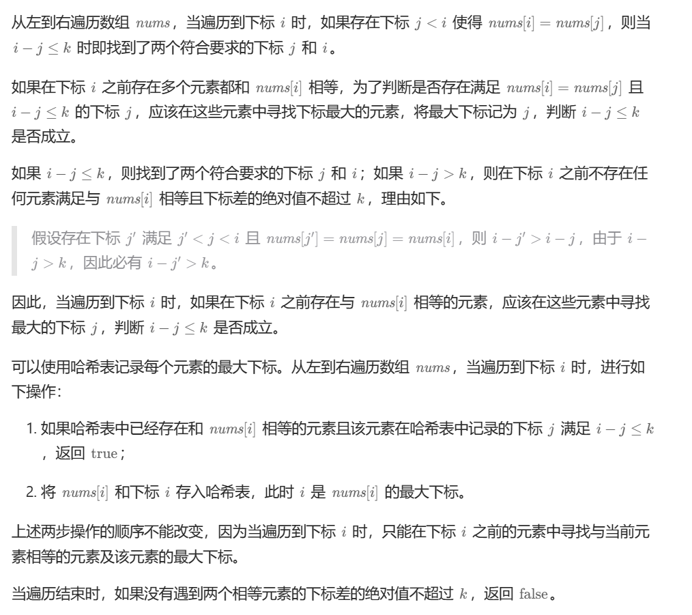
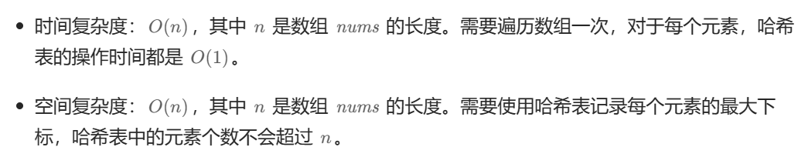

# [0219.存在重复元素 II](https://leetcode.cn/problems/contains-duplicate-ii/)

`时间：2023.11.17`

## 题目

给你一个整数数组 `nums` 和一个整数 `k` ，判断数组中是否存在两个 **不同的索引** `i` 和 `j` ，满足 `nums[i] == nums[j]` 且 `abs(i - j) <= k` 。如果存在，返回 `true` ；否则，返回 `false` 。

**示例1：**

```
输入：nums = [1,2,3,1], k = 3
输出：true
```

**示例2：**

```
输入：nums = [1,0,1,1], k = 1
输出：true
```

**示例3：**

```
输入：nums = [1,2,3,1,2,3], k = 2
输出：false
```

## 代码

#### 方法：哈希表法

##### 思路



##### 代码

```c++
#include <iostream>
#include <unordered_map>
#include <vector>

using namespace std;

class Solution {
public:
    bool containsNearbyDuplicate(vector<int>& nums, int k) {
        unordered_map<int, int> hashtable;
        int length = nums.size();
        for (int i = 0; i < length; i++) {
            if (hashtable.find(nums[i]) != hashtable.end()) {
                if (abs(hashtable[nums[i]] - i) <= k) {
                    return true;
                }
            }
            hashtable[nums[i]] = i;
        }
        return false;
    }
};

int main() {
    Solution sol;
    vector<int> nums = {1,2,3,1,2,3};
    bool result = sol.containsNearbyDuplicate(nums, 2);
    cout << "result = " << result << endl;
    system("pause");
    return 0;
}
```

##### 复杂度分析

